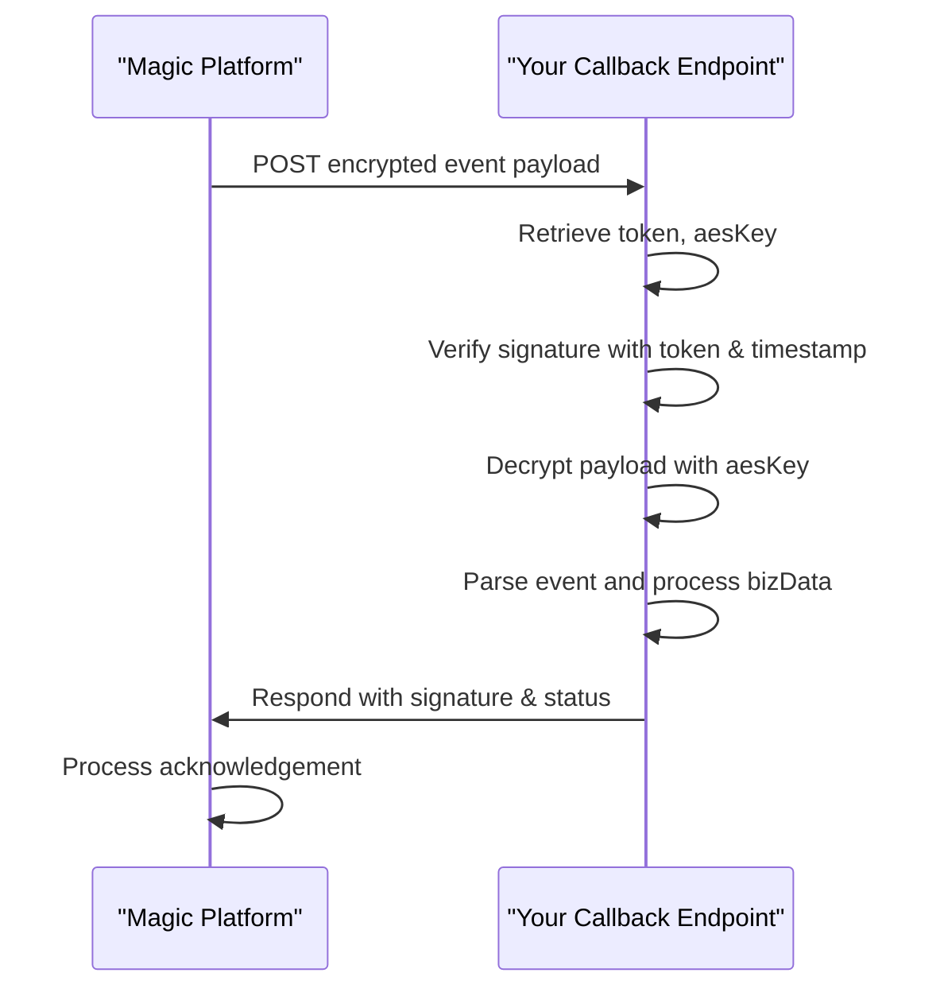

# Callback & Event Handling

Magic platform supports event-driven integrations via callback URLs (webhooks) to notify your application of critical events like message delivery, group creation, and error states. This document guides you through the configuration, consumption, security validation, and troubleshooting of callbacks — enabling you to reliably process real-time event notifications and keep your system in sync.

---

## Overview

Callbacks, often referred to as webhooks, enable Magic to push event data directly to your service endpoints. Events include, but are not limited to:

- Incoming/outgoing message delivery status
- Creation, update, or deletion of conversation groups
- System-generated error notifications

Receiving and correctly handling these callbacks is essential for maintaining an up-to-date view in your app, automating workflow responses, and providing seamless user experiences.

This page focuses specifically on how to **configure** callback endpoints, **consume and verify** incoming event payloads, **perform security checks** including signature validation, and **troubleshoot common webhook issues**.


---

## Configuring Callbacks

To start receiving callbacks, you need to:

1. **Set a callback URL** in your Magic integration configuration pointing to your receiving server.
2. Configure and store necessary credentials including tokens and encryption keys.

The tokens and keys necessary typically include:

- A `token` used for signature verification.
- An `AES key` for payload encryption/decryption.

### Configuration Parameters

These parameters are stored in the platform’s configuration layer (like `DingCallbackConfig`) and must be kept secure:

| Parameter | Description                                  |
|-----------|----------------------------------------------|
| token     | Shared secret token for signature validation |
| aes_key   | AES encryption key for securing webhook data |

Ensure your callback URL is reachable from the Magic platform and uses HTTPS to secure data in transit.


---

## Consuming Callbacks

When your callback URL receives an event notification, the payload will be encrypted and signed.

### Processing Steps

1. **Receive the HTTP POST** at your callback endpoint.
2. Extract the encrypted message, signature, timestamp, and nonce.
3. Use the Magic SDK’s callback client (`DingCallbackEndpoint`) to:
   - **Decrypt the payload message** using the AES key.
   - **Validate the signature** using the shared `token` and message components.
4. Upon successful verification, parse the **decrypted message JSON**, which contains event details under `bizData`.
5. Process the events according to your business logic (e.g., update group membership, log message receipts).
6. Respond appropriately to acknowledge receipt.


### Example flow to decrypt and verify callback message:

```php
<?php
use Dtyq\EasyDingTalk\OpenDev\Endpoint\DingCallback\DingCallbackMessage;
use Dtyq\EasyDingTalk\OpenDev\Endpoint\DingCallback\DingCallbackEndpoint;

// Populate the DingCallbackMessage from incoming request
$message = new DingCallbackMessage(
    $_GET['timestamp'] ?? '',
    $_GET['nonce'] ?? ''
);
$message->setSignature($_GET['msg_signature'] ?? '');
$message->setEncryptMessage(file_get_contents('php://input'));

// Use DingCallbackEndpoint with your configured token and aesKey
$callbackEndpoint = new DingCallbackEndpoint();
$callbackEndpoint->selectApp('your_app_name');

// Decrypt and validate the message
$callbackEndpoint->decryptMsg($message);

// Check if message is verified and decrypted
if (empty($message->getMessage())) {
    // Invalid signature or decryption failure
    http_response_code(400);
    echo 'Invalid callback';
    exit;
}

// Extract array event data
$eventData = $message->getArrayMessage();

// Process bizData events
$bizDataList = $message->createBizDataByEventSubscription();
foreach ($bizDataList as $bizData) {
    // Implement your event-specific logic here
}

// Respond with expected acknowledgement to Magic
$responsePayload = $message->toResponse();
header('Content-Type: application/json');
echo json_encode($responsePayload);
```


---

## Security Validation

### Signature Verification

Magic signs each callback request using a SHA1 signature calculated over:

- The shared `token`
- Timestamp
- Nonce
- Encrypted payload

Your endpoint must recompute this signature on receipt and reject messages where it does not match. This prevents replay and tampering attacks.

### Payload Encryption

The callback payloads are encrypted using AES encryption with the configured AES key, ensuring confidentiality of the events in transit.

Take care to:

- Use constant-time comparison when validating signatures.
- Protect your `token` and `aes_key` from leakage.
- Use HTTPS exclusively for all callback communications.


---

## Common Webhook Events

Typical event categories you may receive include:

| Event Type          | Description                                   |
|---------------------|-----------------------------------------------|
| `message_received`  | New message received by a bot or user         |
| `group_created`     | New conversation or group created              |
| `message_delivered` | Message delivery confirmation                   |
| `error_notification`| System or API generated error event            |

The exact fields and data schema are included in the decrypted `bizData` portion. Use the SDK’s helpers or parse manually per your needs.


---

## Troubleshooting Callback Issues

<AccordionGroup title="Common Problems and Solutions">
<Accordion title="Message Signature Verification Failed">

- Confirm your configured `token` matches the platform’s setting exactly.
- Check timestamp and nonce values are correctly passed and used.
- Verify you are computing the signature as SHA1 of the concatenated ordered parameters.
- Ensure no whitespace or encoding issues during signature calculation.

</Accordion>
<Accordion title="Cannot Decrypt Payload Successfully">

- Validate your configured `aes_key` matches exactly and is base64-encoded properly.
- Confirm your AES decrypt function aligns with Magic’s encryption method.
- Inspect the raw payload for completeness.
- Ensure your server is not altering input data (e.g., auto-formatting, line-ending conversions).

</Accordion>
<Accordion title="Callback Requests Not Reaching Endpoint">

- Verify your callback URL is publicly accessible over HTTPS.
- Check firewall or network security group rules.
- Confirm Magic platform’s IP whitelist (if any) allows your server to receive requests.
- Use logs or external tools to validate that POSTs arrive.

</Accordion>
<Accordion title="Incorrect or Missing Event Data">

- Confirm payload was decrypted and parsed without errors.
- Check SDK or manual JSON parsing logic.
- Review event subscription configuration to confirm enabled event types.

</Accordion>
</AccordionGroup>

---

## Best Practices

- **Validate all incoming requests** strictly before processing.
- Always **respond promptly** to callback requests to avoid retries or timeouts.
- Implement an **idempotency check** on event processing to avoid duplicate handling.
- Log incoming events securely for audit and debugging while avoiding PII leaks.
- Regularly rotate and update your tokens and AES keys.

---

## Related Resources

For deeper integration or alternative workflows, consult:

- [Authentication & Authorization](https://yourdocs.magic.com/api-reference/auth-rate-limits/api-authentication)
- [Third-Party Messaging Integration Guide](https://yourdocs.magic.com/guides/advanced-customization-integration/third-party-messaging-integration)
- [Send Messages & Conversations API Reference](https://yourdocs.magic.com/api-reference/im-conv-messaging/send-messages)
- [Event-Driven Extensibility Guide](https://yourdocs.magic.com/guides/advanced-customization-integration/event-driven-extensibility)

---

## Summary

This page walked you through the essentials of configuring callback endpoints within Magic, illustrating how to consume, verify, and securely process event-driven webhook data. By following secure handling patterns and troubleshooting key issues, you ensure reliable event propagation, enabling real-time synchronization and automation.


---

## Appendix: Callback Message Structure

The callback decrypted message format includes key fields to determine event context and payload.

```json
{
  "sessionWebhookId": "string",
  "subscriptionId": "string",
  "webhookId": "string",
  "msgId": "string",
  "bizData": [
    {
      "EventType": "string",
      "EventTime": "timestamp",
      // Additional event-specific fields
    }
  ]
}
```

You can use the SDK's `createBizDataByEventSubscription()` method to convert this raw JSON array into strongly typed event data objects for safe, convenient processing.

---

## Diagram: Callback Message Flow



This flow guarantees the authenticity and integrity of events before your application updates state or triggers workflows.
