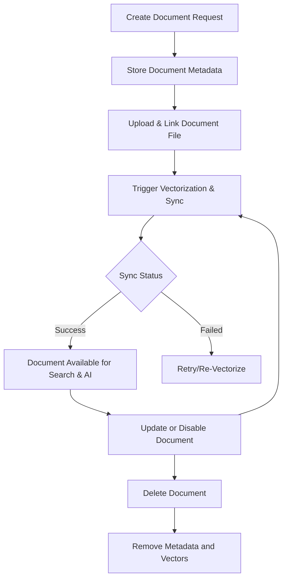

# Document CRUD & Versioning API Reference

Manage your knowledge base documents effectively by using the Document CRUD & Versioning API. This endpoint set enables you to create, update, retrieve, and delete documents along with their metadata, upload content files, handle document version control, and trigger re-vectorization workflows, ensuring your AI Q&A and search systems always have fresh, reliable knowledge.

---

## Overview

The Document CRUD & Versioning API allows seamless programmatic management of knowledge base documents. Users can:

- Add new documents and associated files to a knowledge base
- Update document metadata and enable/disable documents
- Retrieve lists of documents with filters and pagination
- Delete documents
- Handle document versions and trigger knowledge synchronization workflows (like re-vectorization) to keep AI responses accurate

This API serves as the backbone for dynamic content updates in your AI knowledge base, ideal for maintaining timely, relevant information.

---

## Base URL & Authentication

- **Base URL:** All requests are made to the Magic platform API base URL (e.g., `https://api.magicplatform.com`).
- **Authentication:** Requests require a valid access token following the platform's authentication scheme. Include it in headers as `Authorization: Bearer <token>`.
- For authentication details, see the [Authentication & Authorization guide](/api-reference/auth-rate-limits/api-authentication).

---

## Core Endpoints

### 1. Create Document

- **Method:** `POST`
- **Path:** `/knowledgebase/{knowledgeBaseCode}/documents`
- **Purpose:** Add a new document to your knowledge base.

#### Request Parameters

| Field              | Type            | Description                                 | Required |
|--------------------|-----------------|---------------------------------------------|----------|
| knowledgeBaseCode   | string (path)   | The unique identifier of the knowledge base | Yes      |
| name               | string          | Document name                               | Yes      |
| enabled            | boolean         | Whether the document is active for search/Q&A | Optional (default `true`) |
| document_file      | object          | Metadata about an uploaded file (name, key) | Optional |
| doc_type           | string          | Document format/type identifier (e.g., 'pdf') | Optional |
| fragment_config    | object          | Settings controlling text segmentation mode | Optional |

**Example Request Body:**
```json
{
  "name": "Product Manual.pdf",
  "enabled": true,
  "document_file": {
    "name": "Product Manual.pdf",
    "key": "uploads/documents/12345.pdf"
  },
  "doc_type": "pdf"
}
```

#### Response
- Returns created document metadata including generated document code, timestamps, and status.


### 2. Update Document

- **Method:** `PUT`
- **Path:** `/knowledgebase/{knowledgeBaseCode}/documents/{documentCode}`
- **Purpose:** Modify metadata or status of an existing document.

#### Request Parameters

| Field              | Type            | Description                                | Required |
|--------------------|-----------------|--------------------------------------------|----------|
| knowledgeBaseCode   | string (path)   | The knowledge base ID                      | Yes      |
| documentCode       | string (path)   | The target document's unique code         | Yes      |
| name               | string          | New document name                          | Optional |
| enabled            | boolean         | Enable or disable the document             | Optional |
| fragment_config    | object          | Updated fragmentation settings              | Optional |

**Example:**
```json
{
  "name": "Updated_Product_Manual.pdf",
  "enabled": false
}
```

#### Response
- Returns updated document details including the latest metadata and sync status.


### 3. Get Document List

- **Method:** `GET`
- **Path:** `/knowledgebase/{knowledgeBaseCode}/documents`
- **Purpose:** Retrieve a paginated list of documents in a knowledge base, with optional filtering.

#### Query Parameters

| Parameter     | Type     | Description                                  | Required |
|---------------|----------|----------------------------------------------|----------|
| name          | string   | Filter documents by partial or full name     | Optional |
| doc_type      | string   | Filter by document format/type (pdf, docx)  | Optional |
| sync_status   | int      | Filter by document sync state (e.g., enabled, disabled) | Optional |
| page          | integer  | Page number for pagination                    | Optional (default 1) |
| page_size     | integer  | Number of items per page                      | Optional (default 10) |

#### Response
- Paginated list of documents with metadata:
  - `code`: Document unique identifier
  - `name`: Document name
  - `doc_type`: Document type
  - `word_count`: Word count for the document
  - `created_at`: Creation timestamp
  - `sync_status`: Current vectorization/sync status
  - `enabled`: Whether document is active for search


### 4. Get Document Details

- **Method:** `GET`
- **Path:** `/knowledgebase/{knowledgeBaseCode}/documents/{documentCode}`
- **Purpose:** Retrieve full metadata and status for a single document.

#### Response
- Detailed document information including metadata, sync status, version info, and configured segmentation settings.


### 5. Delete Document

- **Method:** `DELETE`
- **Path:** `/knowledgebase/{knowledgeBaseCode}/documents/{documentCode}`
- **Purpose:** Permanently remove a document and associated data from the knowledge base.

#### Response
- HTTP 204 No Content on success.


### 6. Re-Vectorize Document

- **Method:** `POST`
- **Path:** `/knowledgebase/{knowledgeBaseCode}/documents/{documentCode}/revectorize`
- **Purpose:** Trigger a re-indexing and vectorization workflow for an individual document to update its knowledge representation.

#### Response
- HTTP 202 Accepted indicating the vectorization job has started.

---

## Document Versioning & Sync Status

Documents have a lifecycle managed by internal synchronizations to keep the knowledge base up to date for AI query services.

- **Sync Statuses:**
  - Pending: Document awaiting processing
  - Processing: Current vectorization or sync in progress
  - Success: Document successfully indexed and available
  - Failed: Vectorization or sync failed, requiring attention

- **Enabling/Disabling Documents:**
  - Enabled documents participate actively in knowledge search and AI queries.
  - Disabled documents remain in the system but are excluded from search results.

- **Version Control:**
  - Documents can be updated via the API, causing sync to trigger reindexing.
  - Re-vectorization endpoint allows manual re-processing to refresh content.

---

## Practical Usage Scenarios

### Adding a Document to Support AI Q&A
1. Upload the document file to your storage (external or internal).
2. Use the **Create Document** API with `document_file` referencing the uploaded file.
3. By default, the document is enabled and will begin processing automatically.
4. Confirm document status with **Get Document List** or **Get Document Details**.

### Updating a Document's Metadata or Disabling It
- Use the **Update Document** endpoint to rename or disable a document.
- Disabling excludes it from AI responses without deletion.

### Removing Outdated Documents
- Use **Delete Document** to permanently remove knowledge that is obsolete or irrelevant.

### Manual Re-Syncing of Document Data
- When updates occur outside the API (e.g., file updated separately), call **Re-Vectorize Document** to ensure AI knowledge is current.

---

## Common Error Handling

| HTTP Status | Cause                                       | Action                                   |
|-------------|---------------------------------------------|------------------------------------------|
| 400 Bad Request | Invalid parameters or missing fields        | Verify required parameters and retry    |
| 401 Unauthorized | Missing or invalid authentication token   | Obtain or refresh access token          |
| 404 Not Found  | Knowledge base or document code does not exist | Confirm correct identifiers            |
| 409 Conflict  | Conflicting document updates                | Retry after resolving conflicts          |
| 500 Internal Server Error | Server-side processing issue             | Retry or contact support                 |

---

## Code Examples

### Create Document Example (cURL)
```bash
curl -X POST "https://api.magicplatform.com/knowledgebase/KB123/documents" \
  -H "Authorization: Bearer YOUR_ACCESS_TOKEN" \
  -H "Content-Type: application/json" \
  -d '{
    "name": "User Guide.pdf",
    "enabled": true,
    "document_file": {
      "name": "User Guide.pdf",
      "key": "uploads/user-guide.pdf"
    },
    "doc_type": "pdf"
  }'
```

### Get Documents List Example
```bash
curl -X GET "https://api.magicplatform.com/knowledgebase/KB123/documents?page=1&page_size=20" \
  -H "Authorization: Bearer YOUR_ACCESS_TOKEN"
```

### Update Document Example
```bash
curl -X PUT "https://api.magicplatform.com/knowledgebase/KB123/documents/Doc456" \
  -H "Authorization: Bearer YOUR_ACCESS_TOKEN" \
  -H "Content-Type: application/json" \
  -d '{
    "name": "Updated_User_Guide.pdf",
    "enabled": false
  }'
```

### Delete Document Example
```bash
curl -X DELETE "https://api.magicplatform.com/knowledgebase/KB123/documents/Doc456" \
  -H "Authorization: Bearer YOUR_ACCESS_TOKEN"
```

### Re-Vectorize Document Example
```bash
curl -X POST "https://api.magicplatform.com/knowledgebase/KB123/documents/Doc456/revectorize" \
  -H "Authorization: Bearer YOUR_ACCESS_TOKEN"
```

---

## Best Practices & Tips

- Always validate uploaded files before associating them with a document.
- Use paginated queries and search filters to efficiently manage large document repositories.
- Disable documents temporarily instead of deleting if you anticipate re-enabling them.
- Monitor document sync status regularly to catch processing failures early.
- Make use of the re-vectorization API to keep content fresh after manual document updates.

---

## Troubleshooting

<AccordionGroup title="Common Issues in Document Management">
<Accordion title="Document Creation Fails with 400 Bad Request">
Verify that all required fields like `name` and `knowledgeBaseCode` are provided. Ensure the file reference in `document_file` is valid and accessible.
</Accordion>
<Accordion title="Document Does Not Appear in Search">
Check if the document is enabled and has a sync status of Success. Use the re-vectorize endpoint to trigger reprocessing if needed.
</Accordion>
<Accordion title="Versioning Conflicts or Update Does Not Reflect">
Wait for the auto-sync process to complete or manually trigger re-vectorization. Confirm the update request includes all necessary fields.
</Accordion>
<Accordion title="Unauthorized (401) Errors">
Check your access token's validity and expiration. Renew or reauthenticate as required.
</Accordion>
</AccordionGroup>

---

## See Also

- [Knowledge Search & Retrieval API](/api-reference/knowledge-documents/knowledge-search) for querying processed knowledge
- [Document Parsing Node Guide](docs/en/tutorial/basic/node/Document-parsing.md) for ingesting and extracting file content
- [Authentication & Authorization](/api-reference/auth-rate-limits/api-authentication) for token management
- [Workflow Automation & Magic Flow APIs](/api-reference/workflow-automation/flow-crud) for integrating document updates into your workflows

---

This API is your gateway to managing the lifeblood of your AI assistant: up-to-date and well-structured knowledge documents. Efficient document lifecycle control ensures your enterprise AI solutions stay accurate, relevant, and responsive to users' evolving needs.


---

## Appendix: Document Object Structure (Sample)

```json
{
  "code": "Doc456",
  "knowledge_base_code": "KB123",
  "name": "User Guide.pdf",
  "enabled": true,
  "doc_type": "pdf",
  "word_count": 4520,
  "fragment_config": {
    "mode": "General"
  },
  "sync_status": 3,          // e.g., 1=Pending, 2=Processing, 3=Success, 4=Failed
  "created_at": "2023-06-01T12:34:56Z",
  "updated_at": "2023-06-15T09:20:30Z"
}
```


---

## Diagram: Document Lifecycle Interaction




---