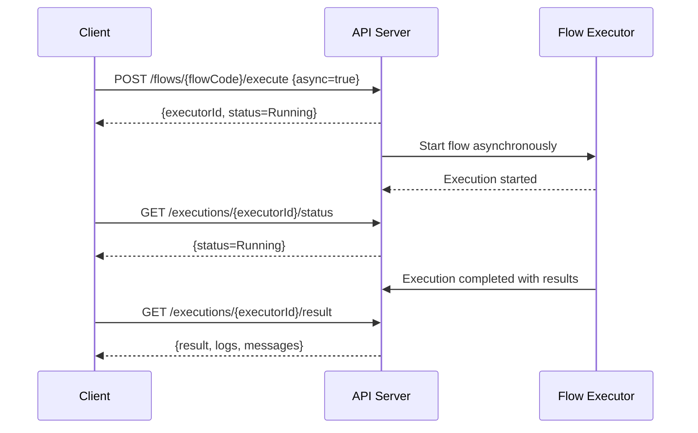

# Trigger & Monitor Flow Execution API Reference

This documentation details the APIs for initiating workflow (flow) executions, monitoring their status, and retrieving execution logs within the Magic platform. These APIs empower users and integrators to asynchronously start flows, track progress, handle timeouts, and fetch detailed results, enabling automation and observability of complex AI-driven workflows.

---

## Overview

The Trigger & Monitor Flow Execution APIs allow you to:

- **Start flow executions** either synchronously or asynchronously with custom trigger parameters.
- **Query the execution status** of running or completed flows.
- **Retrieve detailed execution logs and results**, including node-level diagnostics.
- **Handle streaming outputs for real-time progress updates.**

These capabilities help embed Magic Flow workflows into broader automation pipelines, with robust error handling and state management.

---

## Key Concepts

### What is a Flow?
A flow is a series of ordered, interconnected steps that automate business or operational processes. Each flow execution progresses through defined nodes, transforming input data into actionable results.

For a foundational understanding, see the [What Is a Flow? Guide](/docs/en/tutorial/basic/flow/what-is-flow.md).

### Execution Types Supported
- **Synchronous execution:** Waits for the flow run to complete and returns the final result.
- **Asynchronous execution:** Starts execution and returns an execution ID immediately; results are fetched later.
- **Streaming execution:** Provides partial progress and outputs as the flow runs.


---

## Authentication & Authorization

All Flow Execution APIs require valid authentication tokens with appropriate scopes as described in the [Authentication & Authorization](/api-reference/auth-rate-limits/api-authentication) documentation.

Ensure you have the `flow.execute` or equivalent permission granted.

---

## API Endpoints

### 1. Start Flow Execution

- **Method:** POST
- **URL:** `/api/v1/flows/{flowCode}/execute`

#### Description
Start an execution of the specified flow by its code. You can provide input data, trigger type, version, and execution mode.

This API supports both synchronous and asynchronous modes. For asynchronous calls, use the `async` parameter.

#### Parameters
| Name           | Type      | Required | Description                                              |
|----------------|-----------|----------|----------------------------------------------------------|
| `flowCode`     | string    | Yes      | Unique identifier of the flow to execute                  |
| `version`      | string    | Optional | Specific version of the flow to run (default: latest)    |
| `async`        | boolean   | Optional | Whether to execute asynchronously (default: false)       |
| `triggerType`  | string    | Optional | Trigger type, e.g., `ChatMessage`, `ParamCall` etc.       |
| `parameters`   | JSON obj. | Optional | Input parameters accessible within the flow's nodes      |

#### Request Example
```json
POST /api/v1/flows/order_approval/execute
Content-Type: application/json
Authorization: Bearer <token>

{
  "version": "v1.2.0",
  "async": true,
  "triggerType": "ParamCall",
  "parameters": {
    "orderId": "123456",
    "approverId": "user_789"
  }
}
```

#### Successful Response Examples
**Synchronous Mode:**
```json
{
  "status": "Completed",
  "result": { /* flow output data */ },
  "conversationId": "conv_xyz123",
  "messages": [ /* messages generated by nodes */ ]
}
```

**Asynchronous Mode:**
```json
{
  "executorId": "exec_abc123",
  "status": "Running"
}
```

#### Status Codes
- `200 OK`: Execution started or completed successfully.
- `400 Bad Request`: Missing or invalid parameters.
- `401 Unauthorized`: Invalid or missing auth token.
- `404 Not Found`: Flow code or version not found.
- `429 Too Many Requests`: Rate limit exceeded.
- `500 Internal Server Error`: Execution error or system issue.

---

### 2. Get Flow Execution Status

- **Method:** GET
- **URL:** `/api/v1/flows/executions/{executorId}/status`

#### Description
Retrieve the current status of a flow execution by its executor ID. Use this to poll for completion or check progress.

#### Parameters
| Name         | Type   | Required | Description                   |
|--------------|--------|----------|-------------------------------|
| `executorId` | string | Yes      | Unique identifier for execution |

#### Response Example
```json
{
  "executorId": "exec_abc123",
  "status": "Running",
  "startTime": "2024-04-27T12:00:00Z",
  "elapsedTime": "15s"
}
```

Possible statuses: `Pending`, `Running`, `Completed`, `Failed`.

---

### 3. Fetch Flow Execution Result and Logs

- **Method:** GET
- **URL:** `/api/v1/flows/executions/{executorId}/result`

#### Description
Fetch the detailed output, logs, and node-level execution details of a completed or running flow execution. Supports fetching partial data during streaming executions.

#### Parameters
| Name         | Type   | Required | Description                       |
|--------------|--------|----------|-----------------------------------|
| `executorId` | string | Yes      | Unique ID for the flow execution   |
| `stream`     | boolean| Optional | Whether to fetch streaming output |

#### Response Example
```json
{
  "executorId": "exec_abc123",
  "status": "Completed",
  "result": { "approved": true, "comments": "All checks passed" },
  "logs": [
    {
      "nodeId": "node_start",
      "status": "Success",
      "message": "Start node executed",
      "elapsedTimeMs": 123
    },
    {
      "nodeId": "node_approval",
      "status": "Success",
      "message": "Approval granted",
      "elapsedTimeMs": 450
    }
  ],
  "messages": [ /* reply messages generated during execution */ ]
}
```

---

## Best Practices

### Asynchronous Invocation
- Use asynchronous mode when flow executions are long-running.
- Poll status and results via dedicated endpoints using the returned executor ID.

### Streaming Results
- Enable streaming to receive progressive output for improved responsiveness.
- Properly handle termination signals like `[DONE]` to close streams gracefully.

### Timeout Handling
- Set appropriate client timeouts based on expected flow complexity and execution time.
- Implement retry logic for transient failures.

### Execution Context
- Include relevant trigger parameters and context payloads to guide flow logic.
- Validate inputs carefully to avoid runtime errors.

---

## Troubleshooting

<AccordionGroup title="Common Issues and Resolutions">
<Accordion title="Flow Execution Fails to Start">
- Ensure the flow code and version exist and are active.
- Verify authentication token and permissions.
- Check for rate limiting errors.
</Accordion>
<Accordion title="Long Running Flows Timeout">
- Use asynchronous execution to avoid client timeouts.
- Monitor execution status rather than waiting synchronously.
- Optimize flows to reduce execution time if possible.
</Accordion>
<Accordion title="No Results or Logs Returned">
- Confirm execution status is `Completed` before fetching results.
- For streaming, verify connection is maintained until `[DONE]` signal.
- Check server logs for internal errors.
</Accordion>
<Accordion title="Unauthorized Errors">
- Confirm valid OAuth tokens with correct scopes.
- Refresh tokens if expired.
</Accordion>
</AccordionGroup>

---

## Example Workflow



---

## Additional Resources

- [Authentication & Authorization](/api-reference/auth-rate-limits/api-authentication)
- [Building & Managing Flows API](/api-reference/workflow-automation/flow-crud)
- [Workflow Orchestration Guide](/guides/getting-started/workflow-orchestration)
- [What Is a Flow?](https://cdn.letsmagic.cn/static/img/markmap.png)

---

For a smooth integration and flow orchestration, combine this API reference with the Flow Creation APIs and Authentication guides to securely and reliably build automated AI workflows.

---

## Contact & Support

For issues or advanced questions, consult the [Error Handling & Status Codes](/api-reference/errors-tools-sdks/error-handling-status-codes) and [Getting Help & Additional Resources](/getting-started/validation-troubleshooting/resources-and-support).

---