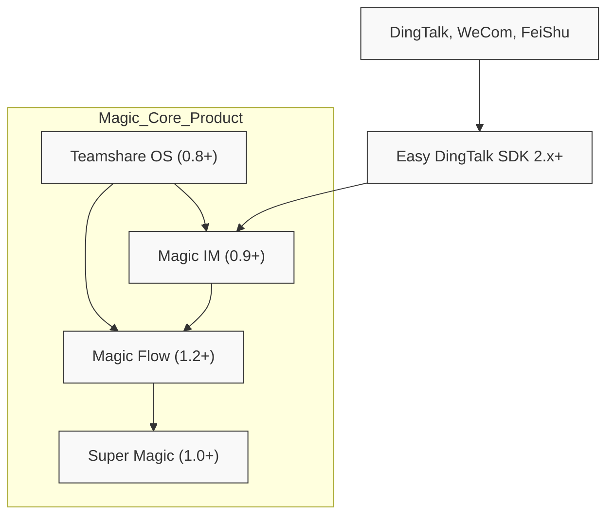

# Compatibility & Support Matrix

The **Compatibility & Support Matrix** provides a clear visualization of supported environments, integration boundaries, and version-dependent features across the Magic platform ecosystem. This page is designed to help your teams plan upgrades confidently, assess compatibility risks, and maintain long-term stability while deploying or scaling your Magic environment.

## Understanding the Matrix

Compatibility across Magic's product matrix involves multiple dimensions:

- **Environment Support**: Which operating systems, runtimes, and external systems Magic components support.
- **Version Dependencies**: How different versions of Magic's core products and extensions interact and depend on each other.
- **Cross-Product Compatibility**: Supported integration boundaries among flagship modules such as Super Magic (multi-agent engine), Magic IM (messaging), Magic Flow (workflow orchestration), and Teamshare OS (knowledge management and collaboration).

This matrix helps you identify safe upgrade paths by clearly marking version ranges and feature flags that impact interoperability.

## Key Features and Version Compatibility

| Component / Feature                    | Version Range / Support           | Notes on Compatibility & Impact
|--------------------------------------|---------------------------------|---------------------------------
| Super Magic (Multi-Agent Engine)     | 1.0.0 - latest                   | Core AI orchestration; must align with Magic Flow >=1.2.0 for flow-driven agents
| Magic IM (Instant Messaging)         | 0.9.x - latest                  | Requires compatible SDK versions; cross-check with third-party messaging integrations
| Magic Flow (Visual Workflow)         | 1.0.0 - latest                  | Visual workflows support nodes that depend on Magic IM and Super Magic APIs
| Teamshare OS (Collaboration Layer)  | 0.8.x - latest                  | Integrates knowledge stores with AI workflows, dependent on core document APIs
| Easy DingTalk SDK                    | 2.x - latest                   | Compatible with DingTalk API versions 2.0+; check callback and chatbot APIs for feature gaps

<Tip>
To ensure smooth interoperability, always verify that all components are updated within their compatible version windows as indicated. Mixed versions outside supported ranges can cause subtle integration failures.
</Tip>

## Supported Environments

Magic platform components support a variety of deployment targets:

- **Operating Systems:**
  - Linux (recommended for production)
  - macOS and Windows (development and testing)

- **Containers:**
  - Docker (fully supported with detailed deployment guides)
  - Kubernetes (requires custom orchestration, consult scaling docs)

- **External Integrations:**
  - DingTalk, WeCom, FeiShu for messaging
  - OpenAI-compatible AI models and plugins
  - Cloud storage providers and knowledge bases

<Note>
Review the [System Requirements](https://docs.magic.com/getting-started/prerequisites-installation/system-requirements) and [Installation Guide](https://docs.magic.com/getting-started/prerequisites-installation/installation-guide) in conjunction with this matrix for full environment compliance.
</Note>

## Cross-Product Compatibility Guidelines

Magic’s modular products are designed to work cohesively, but some dependency considerations apply:

- **Workflow Compatibility:** Magic Flow version must support the APIs of integrated Magic IM and Super Magic versions to enable node-level interoperability.
- **Messaging SDKs:** SDK versions must align with server-side API versions used by Magic IM to avoid communication mismatches.
- **Knowledge Management:** Teamshare OS features require consistent document API versions to ensure knowledge bases sync correctly across workflows and chats.

Review compatibility charts for detailed version pairings before upgrading any single product to minimize downtime risks.

## Planning Upgrades and Migrating

Use the matrix as a reference when planning upgrades:

1. Identify the current versions of all Magic core products and extensions in your environment.
2. Compare against the matrix to locate compatible target versions.
3. Evaluate if any breaking changes or deprecated interfaces exist between versions (linked separately under Breaking Changes & Deprecations).
4. Follow recommended migration guides to update components sequentially, respecting dependency order.

<Tip>
Always back up your configuration and data before major version upgrades. Testing on a staging environment mirroring your production setup is highly recommended.
</Tip>

## Troubleshooting Compatibility Issues

- **Mixed Versions:** Running components from incompatible versions may yield API failures, workflow errors, or message delivery disruptions.
- **Unsupported Environment:** Ensure all OS, container, and third-party service dependencies meet minimum supported versions.
- **Deprecated Features:** Check release notes for deprecated APIs that could affect integrations across components.

For detailed error handling, consult the [Error Handling & Status Codes](https://docs.magic.com/api-reference/errors-tools-sdks/error-handling-status-codes) and [SDK Best Practices](https://docs.magic.com/sdks/troubleshooting-bestpractices/sdk-best-practices).

## Related Documentation

- [Product Matrix & Component Overview](https://docs.magic.com/overview/architecture-glance/product-matrix)
- [Breaking Changes & Deprecations](https://docs.magic.com/changelog/breaking-changes-upgrades/breaking-changes)
- [Upgrade & Migration Guides](https://docs.magic.com/changelog/breaking-changes-upgrades/upgrade-instructions)
- [Integration Capabilities Overview](https://docs.magic.com/overview/architecture-glance/integration-points)
- [Easy DingTalk SDK Documentation](https://github.com/dtyq/magic)

---

## Example Compatibility Chart (Simplified)

| Component         | Minimal Version | Recommended Version | Notes                         |
|-------------------|-----------------|---------------------|-------------------------------|
| Magic Core        | 1.0.0           | 1.5.3               | Stable LTS release            |
| Magic Flow        | 1.2.0           | 1.6.0               | Includes visual node updates  |
| Magic IM          | 0.9.5           | 1.2.1               | Feature-rich messaging APIs   |
| Easy DingTalk SDK | 2.1.0           | 2.5.0               | Supports callback and bots    |
| Teamshare OS      | 0.8.5           | 1.0.0               | Knowledge Sync improvements   |

---

## Visual Diagram of Cross-Product Compatibility

This diagram illustrates the typical interaction dependencies and shows how version compatibility cascades between modules.

---

## Best Practices

- Align versions across Magic core products before deploying to production.
- Verify environment prerequisites to avoid runtime incompatibilities.
- Use official migration and upgrade guides when moving between major versions.
- Keep SDKs, especially messaging-related ones, updated to leverage latest bugfixes and protocol changes.
  
<Tip>
Maintenance teams should periodically review this matrix to anticipate upcoming support changes or deprecated features, minimizing disruption risks.
</Tip>

---

## Troubleshooting Quick Reference

| Issue                   | Likely Cause                       | Recommended Action                         |
|-------------------------|----------------------------------|------------------------------------------|
| API Failures            | Version mismatch, deprecated API | Check compatibility matrix and update   |
| Message Delivery Issues | SDK or Messaging platform version | Sync SDK with compatible Magic IM version|
| Workflow Errors         | Magic Flow node incompatibility   | Upgrade Magic Flow respecting dependencies|
| Deployment Failures     | Unsupported OS or container env.  | Confirm environment requirements         |

---

For detailed step-by-step migration instructions and a complete list of breaking changes, please visit the [Upgrade & Migration Guides](https://docs.magic.com/changelog/breaking-changes-upgrades/upgrade-instructions) and [Breaking Changes & Deprecations](https://docs.magic.com/changelog/breaking-changes-upgrades/breaking-changes) documentation pages.

 

---

_Last updated: June 2024_

---

<Check>
Always verify your full platform stack against the latest compatibility matrix prior to upgrades to ensure a smooth and supported upgrade path.
</Check>
