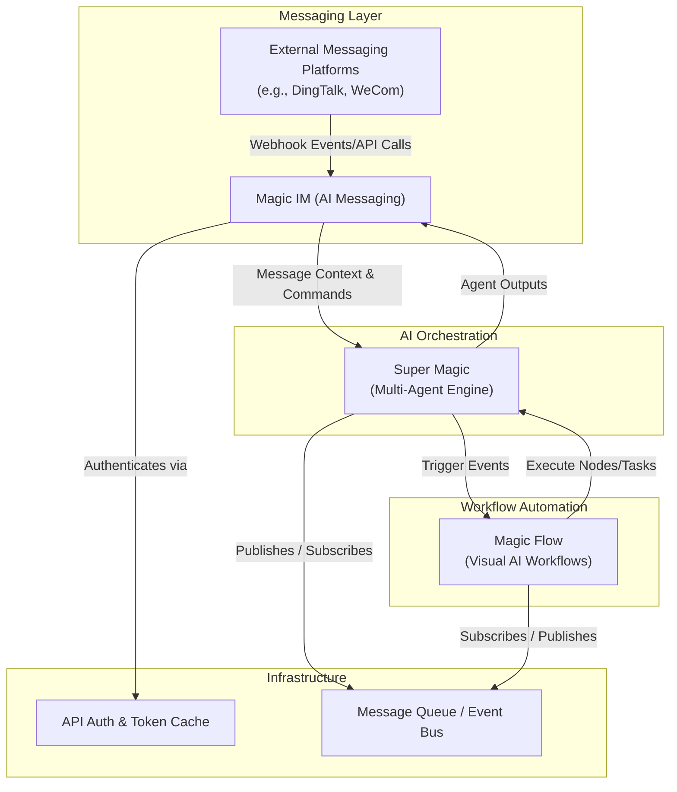

# Component & Service Matrix

Understanding the responsibilities, communication methods, and data flows of Magic’s major components is vital for developers and integrators aiming to build, extend, or maintain solutions within the Magic ecosystem. This guide breaks down the core components—**Super Magic**, **Magic IM**, **Magic Flow**, and the critical **Infrastructure Services**—and illustrates how they collaborate to deliver a unified AI productivity platform.

---

## 1. Overview of Major Components

### 1.1 Super Magic (Multi-Agent Engine)
Super Magic is the heart of collaborative AI intelligence in Magic. It orchestrates multiple AI agents that can work together to achieve complex goals, manage multi-turn conversations, and dynamically respond to tasks.

- **Core Responsibilities:**
  - Managing AI agent lifecycles
  - Facilitating multi-agent collaboration and communication
  - Processing agent instructions and tasks
  - Enabling customizations for specialized agent behaviors

### 1.2 Magic IM (AI-Powered Messaging)
Magic IM acts as the AI-enhanced enterprise messaging layer that enables seamless, real-time communication enriched with knowledge and AI assistance.

- **Core Responsibilities:**
  - Managing conversations and group chats
  - Integrating AI replies and intelligent message automation
  - Bridging external messaging platforms (e.g., DingTalk) for integration
  - Handling message delivery, notifications, and event tracking

### 1.3 Magic Flow (Visual AI Workflows)
Magic Flow enables users to create and run visual AI workflows composed of modular nodes representing AI agents, tools, and integrations.

- **Core Responsibilities:**
  - Providing a drag-and-drop interface for building AI workflows
  - Executing nodes in sequence or parallel with conditional branching
  - Triggering AI actions based on workflow logic
  - Monitoring execution state, errors, and results

### 1.4 Infrastructure Services
These foundational services provide essential platform capabilities like authentication, caching, message brokering, and API routing.

- **Core Responsibilities:**
  - Managing API authentication and authorization
  - Centralizing message queueing (e.g., RabbitMQ) for asynchronous communication
  - Caching tokens and transient data for performance
  - Providing configuration and environment management

---

## 2. Communication Protocols & Data Flow

Magic’s components communicate primarily through APIs and asynchronous message brokers, ensuring resilience and scalability.

### 2.1 Core Communication Channels

| Source      | Destination | Communication Method   | Purpose                                     |
|-------------|-------------|-----------------------|---------------------------------------------|
| Magic IM    | Super Magic | API calls & Event Bus  | Request AI assistance, send conversational context |
| Super Magic | Magic Flow  | Async Events          | Provide agent outputs for workflow nodes    |
| Magic Flow  | Super Magic | API Calls             | Trigger agent tasks within workflows         |
| External Platforms | Magic IM | Webhooks & API     | Receive/send messages, synchronize groups and users |

### 2.2 Typical Data Flow Example

Consider a user message in a conversational group:

1. **User sends message** in Magic IM interface (or external messaging platform like DingTalk).
2. Magic IM captures the message and forwards context to Super Magic for AI response.
3. Super Magic AI agents process the message, referencing contextual data or workflows.
4. Responses from Super Magic return to Magic IM, which then delivers the AI reply to the conversation.
5. If the flow requires backend logic, Magic Flow handles execution, triggered by Super Magic events.

Each step ensures data consistency and real-time interactive experience.

---

## 3. Understanding the Component Ecosystem

### 3.1 Developer Perspective: Reasoning About Magic Components

- **Extensibility:** Each product—Super Magic, Magic IM, Magic Flow—is designed as a modular service that can be independently extended and integrated.

- **Integration Points:** Developers can plug into APIs exposed by the components to add capabilities such as:
  - Custom AI agents in Super Magic
  - New message types or bots in Magic IM
  - Custom nodes or triggers in Magic Flow

- **Event-Driven Architecture:** Most cross-component interactions favor asynchronous event-driven communication to support scalability and loose coupling.

- **Third-Party Messaging Bridges:** Magic IM's integration with enterprise platforms like DingTalk is abstracted behind clean APIs and SDK interfaces, allowing consistent usage regardless of external platform details.

### 3.2 Key Services in the SDK & API Layers

The Easy DingTalk SDK—used by Magic IM for DingTalk integration—exposes endpoints to manage messaging, files, and chat groups programmatically. For example:

- **ChatBotEndpoint** handles:
  - Sending messages to individual (one-on-one) or group chats
  - Downloading files shared in messages

The SDK ensures robust token management and error handling, simplifying integration development.

---

## 4. Practical Tips & Best Practices

### 4.1 For Developers
- Use the SDK's factory patterns like `OpenDevFactory` to instantiate and manage API endpoint clients consistently.
- Cache tokens efficiently using built-in cache mechanisms provided in SDK to reduce redundant authentication calls.
- Capture and handle API errors gracefully, leveraging provided exceptions such as `BadRequestException`.

### 4.2 For Integrators
- Understand the separation of concerns: Magic IM is the messaging front, Super Magic handles AI logic, Magic Flow orchestrates workflows.
- Focus on event-driven flows to build scalable, reactive integrations.
- Utilize Magic Flow's visual tools to prototype workflows before coding custom nodes.

### 4.3 Common Pitfalls to Avoid
- Avoid tightly coupling AI agent logic directly inside Magic IM; instead, route through Super Magic to leverage multi-agent orchestration.
- Do not bypass token caching; frequent token requests can lead to rate limiting or degraded performance.
- Ensure external platform credentials and callback URLs are correctly configured to avoid message delivery failures.

---

## 5. Visualizing the Ecosystem



This diagram outlines the core Magic product ecosystem and communication flows.

---

## 6. Troubleshooting Common Integration Issues

| Issue                         | Cause                                                       | Solution                                      |
|-------------------------------|-------------------------------------------------------------|-----------------------------------------------|
| Message sending failures       | Invalid token or misconfigured access settings               | Verify access tokens, re-authenticate if expired |
| Missing AI responses           | Super Magic service unavailable or timeout                    | Confirm Super Magic is running, check logs for errors |
| Workflow execution stalls      | Node misconfiguration or missing dependencies                 | Review workflow node definitions and connectivity |
| Attachment download errors     | SDK call missing correct download code or permissions        | Ensure correct parameters, update SDK, check credentials |

Always monitor Magic platform service logs and enable debugging traces during development.

---

## 7. Summary

This Component & Service Matrix decomposes the Magic ecosystem into its major building blocks and explains how each part interacts, delivering AI-powered messaging, multi-agent orchestration, and visual workflow capabilities. Understanding these components helps users and developers smoothly integrate, customize, and extend Magic to suit varied enterprise AI productivity needs.


---

## Additional Resources
- [Product Matrix & Component Overview](/overview/architecture-glance/product-matrix) gives a higher-level summary of the product offerings.
- [System Architecture Diagram](/overview/architecture-glance/system-architecture-diagram) visualizes deployment and integration at a glance.
- [Easy DingTalk SDK Quickstart](https://github.com/dtyq/magic) for integrating Magic IM messaging with DingTalk.
- [Guides on Building AI Agents & Workflows](/guides/getting-started/first-ai-agent) and [Workflow Orchestration](/guides/getting-started/workflow-orchestration).


---

## Code Example: Using Easy DingTalk SDK to Send Group Messages

```php
use Dtyq\EasyDingTalk\OpenDevFactory;

$factory = new OpenDevFactory('default', $sdkBase); // $sdkBase initialized with config

$chatBot = $factory->chatBotEndpoint;

$sendGroupMsgParam = new \Dtyq\EasyDingTalk\OpenDev\Parameter\ChatBot\SendGroupMessageParameter();
$sendGroupMsgParam->setAccessToken($chatBot->getAccessToken());
$sendGroupMsgParam->setRobotCode('your_robot_code');
$sendGroupMsgParam->setOpenConversationId('target_group_id');
$sendGroupMsgParam->setMsgKey('text');
$sendGroupMsgParam->setMsgParam(['content' => 'Hello from Magic IM!']);

try {
    $result = $chatBot->sendGroupMessage($sendGroupMsgParam);
    echo "Message sent successfully with process key: " . $result->getProcessQueryKey();
} catch (\Exception $e) {
    echo "Failed to send message: " . $e->getMessage();
}
```

This snippet illustrates sending a group chat message leveraging Magic IM’s underlying DingTalk integration.

---

## Concluding Note
Understanding Magic’s component matrix and data flow empowers you to architect scalable, maintainable AI workflows and messaging solutions while leveraging the platform’s modular, extensible design principles effectively.


---


---

