# Deployment Topologies & Scaling

Magic supports flexible deployment architectures tailored to diverse operational needs, including fully cloud-based, on-premises, and hybrid models. This guide explains the core deployment topologies, scaling strategies for each service component, recommended configurations for high availability, and the architectural separation of stateful and stateless elements.

---

## 1. Supported Deployment Architectures

### 1.1 Cloud-Native Deployment

The cloud-native deployment mode runs all Magic platform components on cloud infrastructure—public or private cloud. This mode leverages managed services and container orchestration platforms like Kubernetes for elasticity and rapid scaling.

**Key Benefits:**
- Seamless horizontal scaling
- Simplified resource management and upgrades
- High availability through orchestrator features
- Managed persistence services reduce operational overhead

### 1.2 On-Premises Deployment

Deploying Magic fully on-premises gives enterprises complete control over hardware, networking, and security. This model fits organizations with strict data sovereignty or low-latency requirements.

**Key Considerations:**
- Requires manual scaling for resource changes
- Infrastructure provisioning and monitoring are fully the customer’s responsibility
- Can integrate with existing enterprise storage and identity systems

### 1.3 Hybrid Deployment

Hybrid topologies blend cloud and on-premises deployments—for example, running core AI and workflow orchestration services in the cloud while connecting to on-premises knowledge bases or messaging integrations.

**Benefits:**
- Flexibility to leverage cloud scalability while preserving local data control
- Incremental migration path from on-premises to cloud
- Enables compliance with organizational policies

---

## 2. Scaling Strategies for Core Services

Magic consists of multiple modular services, each with distinct scaling needs to maintain performance and reliability at scale.

### 2.1 Super Magic (Multi-Agent Engine)

- **Horizontal Scaling:** Deploy multiple instances behind a load balancer to handle concurrent agent workloads.
- **Vertical Scaling:** Assign more CPU and memory to instances for complex AI model usage.
- **High Availability:** Use orchestrator-managed replicas with automated failover.

### 2.2 Magic Flow (Workflow Orchestration)

- **Horizontal Scaling:** Add worker nodes to increase parallel process execution capacity.
- **Vertical Scaling:** Upgrade node capacity for workflows handling large data or high-throughput.
- **Persistence:** Use an external database with strong consistency for workflow state.

### 2.3 Magic IM (Instant Messaging & Collaboration)

- **Horizontal Scaling:** Scale stateless messaging services and API gateways with multiple instances.
- **State Management:** Offload session state and message persistence to scalable storage systems such as Redis or databases.
- **Load Balancing:** Employ sticky sessions or token-based routing to ensure correct user session routing.

### 2.4 Supporting Infrastructure

- **Databases, Cache, and Vector Stores:** Scale databases vertically or shard horizontally; use Redis clusters or managed services for caching.
- **Message Queues:** Scale RabbitMQ or equivalent messaging middleware with clustering and federation for load distribution.

---

## 3. Architectural Separation of Stateful and Stateless Components

Separating stateful components (which persist data) from stateless services (which process data on demand) is critical for scalable, maintainable deployments.

| Component       | Stateful/Stateless | Description                                    |
|-----------------|--------------------|------------------------------------------------|
| API Gateways    | Stateless          | Handle incoming requests, route to services    |
| AI Agents       | Stateless          | Execute AI model calls and process data        |
| Workflow Engine | Stateful           | Persist execution state, branching logic       |
| Message Service | Stateless          | Handle message routing and forwarding           |
| Database        | Stateful           | Store persistent workflow, user, and config data |
| Cache / Redis   | Stateful           | Cache session and temporary data for performance |
| Message Queue   | Stateful           | Buffer asynchronous events and inter-service messages |

**Advantages:**
- Stateless services can be scaled horizontally easily.
- Stateful components use persistent storage designed for reliability.
- Easier to perform rolling updates and service restarts without data loss.

---

## 4. Recommended Configurations for High Availability (HA)

### 4.1 Redundancy
- Deploy multiple replicas of stateless services with load balancers.
- Use clustered or replicated databases.
- Enable message queue clustering to avoid single points of failure.

### 4.2 Health Checks and Auto-Restart
- Configure readiness and liveness probes for containerized services.
- Enable orchestrator auto-restart on failure.

### 4.3 Backup and Restore
- Regular database backups with tested restore procedures.
- Backup of configuration files and secrets management.

### 4.4 Resource Monitoring
- Monitor CPU, memory, disk I/O of all critical components.
- Alerting mechanisms for service degradation and failures.

---

## 5. Example Deployment Scenarios

### Scenario A: Small-Medium Cloud Deployment
- One Kubernetes cluster with separate namespaces per component.
- Scaled-down instances for cost efficiency.
- Managed cloud database (e.g., AWS RDS) and Redis cache.

### Scenario B: Large Enterprise On-Premises
- Multiple physical servers with dedicated database and cache nodes.
- Load balancers in front of stateless services.
- Manual capacity planning for peak workloads.

### Scenario C: Hybrid with Sensitive Data on Premises
- Workflow and messaging services in cloud.
- Knowledge bases and sensitive data stores on-premises, connected via secure tunnels.

---

## 6. Practical Tips & Best Practices

- **Plan for Growth:** Start with a modest deployment but plan architecture to scale horizontally.
- **Isolate Critical Services:** Separate traffic and resource allocation for intensive AI processing.
- **Use Orchestration Tools:** Employ Kubernetes or Docker Swarm to simplify deployment, scaling, and recovery.
- **Monitor Proactively:** Use centralized monitoring tools to track health and capacity.
- **Back Up Regularly:** Ensure backup schedules for all persistent data — workflows, messages, knowledge stores.
- **Secure Network Boundaries:** Restrict inter-service communication to trusted networks;
- **Automate Deployment:** Use pipelines for repeatable, traceable deployments with configuration as code.

---

## 7. Troubleshooting Common Scaling Issues

- **Service Overload:** Symptoms include increased latency or failures under load. Solution: Scale out stateless services and increase resources.
- **Database Bottlenecks:** Slow queries or connection exhaustion. Solution: Optimize queries, increase DB resources, implement read replicas.
- **Message Queue Saturation:** Backlog of unprocessed messages. Solution: Add queue nodes, adjust prefetch counts.
- **State Inconsistency:** Workflow or session state loss after failover. Solution: Ensure persistent stores are resilient; enable backups.

---

## 8. Visual Overview of Deployment Topologies

```mermaid
flowchart TD
  subgraph "Cloud Deployment"
    CloudAPI["API Gateway (Stateless)"]
    CloudAgents["Super Magic Agents (Stateless)"]
    CloudFlow["Magic Flow Engine (Stateful)"]
    CloudDB[("Cloud Database")]
    CloudCache[("Cloud Redis Cache")]
    CloudQueue[("Cloud RabbitMQ")]
  end

  subgraph "On-Premises Deployment"
    OnPremAPI["API Gateway (Stateless)"]
    OnPremFlow["Magic Flow Engine (Stateful)"]
    OnPremDB[("On-Prem Database")]
    OnPremCache[("On-Prem Redis Cache")]
    OnPremQueue[("On-Prem RabbitMQ")]
  end

  subgraph "Hybrid Deployment"
    HybridCloudAgents["Super Magic Agents (Cloud)"]
    HybridOnPremFlow["Magic Flow Engine (On-Prem)"]
    HybridOnPremDB[("On-Prem Database")]
  end

  CloudAPI -->|Request| CloudAgents
  CloudAgents --> CloudFlow
  CloudFlow --> CloudDB
  CloudFlow --> CloudCache
  CloudAgents --> CloudQueue

  OnPremAPI -->|Request| OnPremFlow
  OnPremFlow --> OnPremDB
  OnPremFlow --> OnPremCache
  OnPremFlow --> OnPremQueue

  HybridCloudAgents --> HybridOnPremFlow
  HybridOnPremFlow --> HybridOnPremDB

  classDef stateful fill:#d9e8fb,stroke:#3a75c4,stroke-width:2px;
  classDef stateless fill:#e9f7df,stroke:#3c7a2e,stroke-width:2px;

  class CloudDB,CloudCache,CloudQueue,OnPremDB,OnPremCache,OnPremQueue,CloudFlow,OnPremFlow,HybridOnPremFlow,HybridOnPremDB stateful;
  class CloudAPI,CloudAgents,OnPremAPI,HybridCloudAgents stateless;
```

---

## 9. Additional Deployment Considerations

- **Configuration Management:** Use environment variables and centralized config stores to manage settings across environments.
- **Secret Management:** Secure storage for API keys, database passwords, and private keys with least privilege.
- **Logging & Auditing:** Deploy centralized logging with severity and correlation IDs to trace problems.
- **Network Security:** Use VPNs, firewalls, and zero-trust principles for all external and internal connections.

---

For ongoing success, align deployment topology with organizational policy, adjust scale proactively, and integrate monitoring early.

---

# See Also
- [System Architecture Deep Dive](https://docs.magic.com/concepts/architecture-overview/system-architecture)
- [Component & Service Matrix](https://docs.magic.com/concepts/architecture-overview/component-ecosystem)
- [Scaling & High Availability](https://docs.magic.com/deployment/scaling-monitoring-and-resilience/scaling-and-high-availability)
- [Monitoring & Logging Overview](https://docs.magic.com/deployment/scaling-monitoring-and-resilience/monitoring-and-logging-overview)
- [Backup & Disaster Recovery](https://docs.magic.com/deployment/scaling-monitoring-and-resilience/backup-and-disaster-recovery)

---

# References
- Kubernetes and container orchestration best practices
- Cloud provider managed services for databases and caching
- Enterprise security and network architecture guides

---

This guide empowers platform architects, IT administrators, and DevOps engineers to design robust, scalable Magic AI platform deployments tailored to enterprise needs.