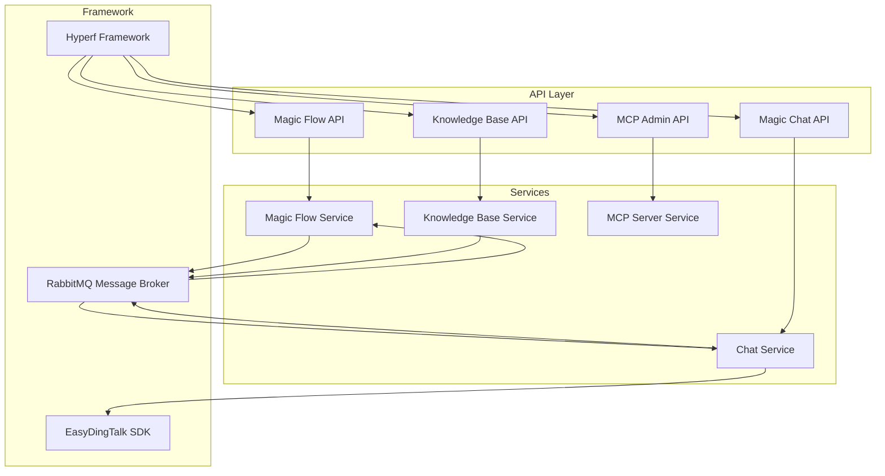

# System Architecture Deep Dive

Magic is built on a modular, microservices-based platform architecture designed to empower enterprises with extensible AI productivity capabilities. This page illuminates the conceptual boundaries of core components, how they interact through well-defined APIs, and the architectural patterns enabling flexibility, scalability, and maintainability.

---

## Architecture Overview

At its core, Magic embraces a layered architecture featuring separate but integrated systems for AI workflow orchestration, chat and conversation management, knowledge base handling, and supporting infrastructure components. This modular design ensures each product and service operates within clean boundaries, improving fault isolation and enabling independent evolution.

### Core Products and Boundaries

- **Super Magic**: The AI agent orchestration layer that coordinates intelligent agents to execute complex tasks.
- **Magic Flow**: Visual workflow engine supporting drag-and-drop AI workflow creation and automation.
- **Magic IM**: Real-time multi-party conversational platform enriched with AI and knowledge integration.
- **Teamshare OS**: Collaboration and knowledge management platform supporting semantic document storage and retrieval.

Each product exposes its own API facade and communicates over RESTful or async message protocols. This strong separation lets teams deploy and scale components independently while reusing core infrastructure.

## Inter-Service Communication

Services interact through carefully scoped APIs and asynchronous messaging layers. For example, the Magic Flow API endpoints handle requests related to flow executions, while chat-related APIs reside in the Chat service interfaces.

### API Layer

- The API routes, such as `/api/v1/open-api/chat` and `/api/v1/mcp/server`, provide structured access points into core capabilities.
- Open API groups enable external and internal clients to invoke chat sessions, flow executions, and asynchronous calls.

### Message Brokers and Async Processing

- The architecture employs RabbitMQ (indicated in operational docs and config) for asynchronous event handling, workflow triggers, and task queues.
- This asynchronous backbone ensures responsiveness despite complex AI computations or IO-bound integration tasks.

## Supporting Frameworks and Libraries

Magic leverages extensible frameworks:

- **Hyperf**: A high-performance PHP coroutine framework providing HTTP server, routing, and middleware support.
- **Dtyq EasyDingTalk SDK**: Enables seamless integration with enterprise messaging platforms, extending conversation and chat bot capabilities.

Abstract API classes and middleware traits ensure cross-cutting concerns like authentication, authorization, and request validation are handled consistently across service facades.

## Architectural Patterns Ensuring Flexibility

Magic's architecture follows several proven design principles:

- **Microservices with Clear Boundaries**: Each domain (chat, flow, knowledge) is encapsulated, mitigating coupling.
- **Facade Pattern**: API facades provide stable, abstracted entry points hiding internal complexity.
- **Event-Driven Design**: Enables reactive workflows and extensibility without blocking the user-facing experience.
- **Strategy Pattern**: For example, knowledge base access employs pluggable strategy interfaces to support multiple data sources and retrieval methods.
- **Progressive Enhancement**: Base API classes and service layers allow incremental capability expansion without disruption.

## Adding New Capabilities: A User-Centric Path

Extending Magic starts with identifying the domain and capability:

1. **Define the Service Scope**: Choose whether to enrich an existing product (e.g., Magic Flow) or add a supporting service.
2. **Create API Facade**: Implement an abstract API interface extending base classes, enforcing security and authorization.
3. **Implement Business Logic Layer**: Leverage service classes and strategy patterns for domain logic.
4. **Register Routes**: Add new routes within relevant route groups, ensuring APIs are discoverable and versioned.
5. **Integrate with Event System**: Hook into Magic’s event dispatcher for automation, monitoring, or triggering downstream workflows.

This approach guarantees consistency with platform conventions while enabling rapid iteration.

## Mermaid Diagram: High-Level Component Interaction

## Best Practices and Tips

- **Respect Service Boundaries**: When developing features, integrate at API facades rather than direct service calls to maintain loose coupling.
- **Use Async Calls Where Possible**: For long-running AI processing or integration tasks, utilize message brokers rather than synchronous blocking.
- **Leverage Strategy Interfaces**: Abstract complex integrations (e.g., knowledge base backends) with pluggable strategies to support future upgrades.
- **Follow Naming Conventions and Versioning**: Define routes and APIs under versioned groups (`/api/v1`) to support backward compatibility.
- **Secure API Facades**: Use built-in authorization traits and middleware consistently to safeguard sensitive operations.
- **Align with Framework Conventions**: Use Hyperf's middleware, routing, and dependency injection patterns for maintainability.

## Troubleshooting Common Architecture Issues

- **Service Communication Failures**: Verify message broker health and queue configurations; validate API endpoint availability.
- **Latency in AI Responses**: Confirm async task queues function; review service resource limits and horizontal scaling options.
- **API Route Conflicts or Missing Endpoints**: Check route group registrations and versioning adherence in route config files.
- **Integration Errors with Enterprise Messaging**: Validate EasyDingTalk SDK usage, including token management and endpoint binding.

---

This architectural deep dive equips platform integrators, developers, and IT architects with a mental model to confidently understand Magic’s modular AI ecosystem, how core products work together, and how to extend capabilities within a robust, future-ready framework.

---