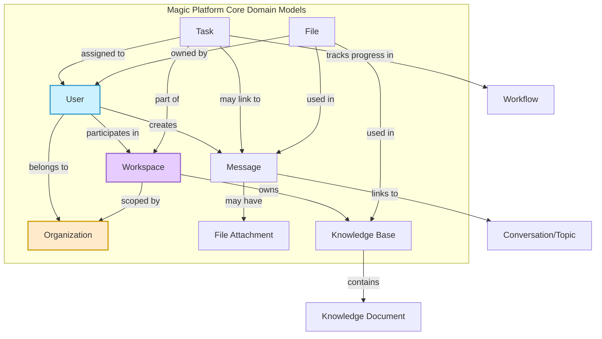

# Core Domain Models

This document provides a comprehensive understanding of the foundational data entities within Magic: Users, Organizations, Workspaces, Messages, Knowledge Bases, Tasks, and Files. These models form the backbone of Magic's unified permissioning, auditing, and sharing capabilities across all products and services.

---

## Introduction

In the Magic platform, efficient collaboration, secure access, and seamless integration depend on well-defined core domain models. These entities serve as building blocks that support feature-rich experiences such as multi-agent workflows, AI-assisted chat, knowledge management, and team collaboration.

This guide explains the purpose and interactions of each core model, helping you grasp how Magic organizes and manages complex business data to facilitate unified user experiences.

---

## User

### Overview

A **User** in Magic represents an individual account entitled to access platform services. The User model encapsulates personal profiles, authentication credentials, status, and organizational context.

### Key Attributes

- Unique user ID
- Nickname and avatar
- Associated phone number
- Status (active/inactive)
- Organization code for scoped access

### Purpose & Usage

Users are the primary actors within Magic, enabling:

- Authentication and personalized access
- Role and permission enforcement within organizations
- Activity tracking and audit logging

### Interactions

Users belong to one or more **Organizations** and participate in **Workspaces**. They create and modify Messages, Tasks, and Files, making their identity central across Magic's collaborative ecosystem.

---

## Organization

### Overview

An **Organization** models a company or business unit. It scopes users, resources, permissions, and data access.

### Key Attributes

- Unique organization code
- Name and descriptive metadata

### Purpose & Usage

Organizations provide:

- Multi-tenancy and secure isolation of data
- Centralized management of memberships and policies
- Context for auditing and governance controls

### Interactions

Organizations aggregate Users and define access scopes for all other domain models, including Workspaces, Messages, Knowledge Bases, Tasks, and Files.

---

## Workspace

### Overview

A **Workspace** is a logical container within an organization where users collaborate on projects, workflows, and agent tasks.

### Key Attributes

- Workspace ID
- Associated organization code
- Name and description

### Purpose & Usage

Workspaces enable segmented collaboration and resource grouping, helping teams manage AI agents, conversations, flows, and document sets in an organized manner.

### Interactions

Users participate in Workspaces, which host conversations, workflows, knowledge bases, and collaborative files. This model supports enforcing permissions and sharing boundaries within organizations.

---

## Message

### Overview

Messages are the basic units of communication in Magic's IM and chat components.

### Key Attributes

- Message ID
- Sender (User) ID
- Conversation or topic context
- Content payload (text, attachments)
- Creation and update metadata

### Purpose & Usage

Messages serve real-time and historical conversational data, facilitating interactive AI chats, notifications, and workflow comments.

### Interactions

Messages relate to Users (senders), Conversations or Chat Topics, and may link to Attachments or Tasks. They support audit trails and conversation history for AI-driven collaboration.

---

## Knowledge Base

### Overview

The Knowledge Base aggregates organized document collections and semantic data to empower AI search and assistants.

### Key Attributes

- Knowledge base ID
- Associated Workspace and Organization
- Metadata about documents, vectors, and retrieval configs

### Purpose & Usage

Used to ingest, store, and query enterprise knowledge, enabling contextual and semantic search for AI agents.

### Interactions

Knowledge Bases interface with Documents, Agents, and Workflows to provide contextual awareness and support dynamic conversations.

---

## Task

### Overview

Tasks represent discrete units of work or AI operations orchestrated within Magic, especially in multi-agent workflows.

### Key Attributes

- Task ID
- Assigned User or Agent
- Status (pending, running, completed)
- Related workflow or topic context

### Purpose & Usage

Tasks allow granular tracking and management of AI-powered activities such as data retrieval, document processing, or approval steps.

### Interactions

Tasks tie to Workspaces, Users (or Agents), and sometimes to Messages and Files, enabling coordinated multi-step operations.

---

## File

### Overview

Files store user-uploaded or system-generated documents and assets linked throughout Magic.

### Key Attributes

- File ID
- Owner User ID
- Linked Resource (such as Message, Knowledge Document)
- Metadata (name, type, size)
- Organization context

### Purpose & Usage

Files facilitate storage, versioning, sharing, and retrieval of documents for collaboration, approval, and knowledge enrichment.

### Interactions

Files connect with Messages, Knowledge Bases, Tasks, and Users, supporting secure access and audit logs.

---

## Model Interaction and Unified Permissioning

Magic’s core domain models are designed to interact seamlessly:

- **Users** are scoped within **Organizations**, which ensures data and permission isolation.
- **Workspaces** organize resources and coordinate user collaboration.
- Communication is centralized through **Messages** that link users and conversations.
- **Knowledge Bases** power AI-driven retrieval across user and workflow contexts.
- **Tasks** track AI and user activities, driving workflows and progress.
- **Files** support document sharing and knowledge ingestion across the platform.

Together, these models enforce unified permissioning and audit mechanisms that underpin secure, scalable enterprise usage.

---

## Practical Tips and Best Practices

- Always associate domain entities with the correct organization code early to maintain strict multi-tenancy security.
- Use workspace boundaries to logically group projects and limit user exposure when scaling collaboration.
- Leverage message metadata and linking to attachments to enable rich conversation experiences.
- Employ task status and linkage to monitor complex AI multi-agent workflows accurately.
- Maintain file metadata rigorously for audit compliance and retrieval performance.

---

## Troubleshooting Common Issues

- **Missing or incorrect organization code association:** leads to access errors or data leakage.
  - *Resolution:* Verify all creation API calls include correct organization code.

- **Users unable to access workspaces:** often due to missing membership assignments.
  - *Resolution:* Confirm user membership and permission settings in the organization model.

- **Message attachments not appearing:** typically caused by file linkage or storage misconfigurations.
  - *Resolution:* Check attachment target bindings and storage driver configurations.

- **Tasks stuck or failing in workflows:** may indicate broken status transitions or missing dependencies.
  - *Resolution:* Inspect task execution logs and verify relationships with flow nodes.

---

## Summary Diagram

---

## Additional Resources

- [Core Concepts](https://docs.magic.com/overview/key-concepts-and-terminology/core-concepts) — Understand the broader conceptual framework.
- [System Architecture Diagram](https://docs.magic.com/overview/architecture-glance/system-architecture-diagram) — Visualize how domain models fit into the product architecture.
- [Permission & Access Control](https://docs.magic.com/concepts/security-permission-design/permission-system) — Deep dive into how permissions are enforced across these models.
- [API Reference: User & Group Management](https://docs.magic.com/api-reference/im-conv-messaging/user-and-group-lookup) — Learn how to manage user data programmatically.
- [Getting Started Guides](https://docs.magic.com/guides/getting-started/quickstart-workspace) — Practical workflows for engaging with core Magic functionality.

---

Understanding these core domain models empowers you to build, integrate, and extend Magic’s AI-driven productivity tools confidently, ensuring secure, efficient, and scalable collaboration within your organization.

---