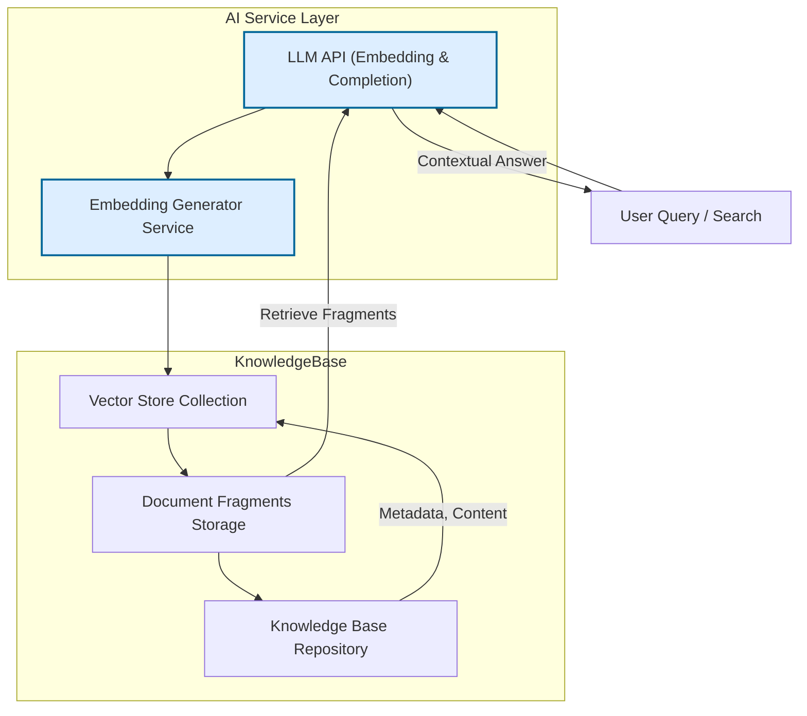

# Knowledge Base & Vector Store Model

## Introduction

In the Magic platform, the ability to manage knowledge bases, store fragmented documents, and efficiently handle vector embeddings forms the backbone of semantic search and information retrieval. This page unpacks the data schema and operational model underlying these capabilities, focusing on how Magic integrates embeddings and vector storage into its AI-powered workflows and instant messaging products. Additionally, it highlights the extensibility of the system to support various vector store backends.

This guide is designed to help users and system integrators understand the conceptual and practical aspects of how Magic leverages vector stores and knowledge bases to power semantic retrieval and AI augmentation.

---

## Core Concepts

### Knowledge Bases

A knowledge base in Magic is a structured repository designed to contain domain-specific information for later retrieval. It consists of:

- **Document Fragments:** Smaller, semantically meaningful pieces of text extracted or chunked from larger documents.
- **Metadata:** Associated data such as source, creation date, business IDs, and tags that provide context and enable filtering.
- **Vector Representations:** Each fragment is embedded into a high-dimensional vector space using embedding models to enable semantic similarity search.

Users create knowledge bases to capture company proprietary data, technical manuals, or any textual corpus that AI models can draw from during semantic search or AI response generation.

### Document Fragments

Documents are often too large to embed as a whole. Magic breaks them down into manageable fragments:

- Fragments are stored with their associated metadata.
- Each fragment is embedded into a vector and linked to its source knowledge base.
- Fragments allow fine-grained retrieval of relevant content during queries.

### Vector Embeddings & Storage

Vectors represent the semantic meaning of text chunks. Magic supports embedding generation and storage via:

- **Embedding Models:** Text inputs are transformed into vector embeddings using AI models (e.g., OpenAI-compatible or custom embeddings).
- **Vector Stores:** Specialized databases optimized for storing vector embeddings and performing nearest neighbor searches efficiently.

Magic currently supports backends such as [Qdrant](https://qdrant.tech/), with the capability to add new vector store integrations.

---

## Operational Model

### Embedding Generation

1. **Model Selection:** Depending on the knowledge base's configuration, a specific embedding model is chosen for vectorization.
2. **Text Input:** User queries or document fragments are passed to the embedding generator.
3. **Embedding Call:** The Magic LLM API processes embedding requests via the embedding service layer.
4. **Response Handling:** Embeddings are extracted and passed downstream for storage or search.

### Vector Store Management

- **Collections:** Each knowledge base corresponds to a vector store collection that holds embeddings.
- **Operations:** Collections can be created, updated, or deleted as needed.
- **Points:** Embeddings and their metadata are stored as points in collections.
- **Filters:** Metadata filters can restrict searches to specific subsets of data within the collection.

### Semantic Search Workflow

When a semantic search is initiated:

1. **Query Embedding:** The search query is embedded using the designated model.
2. **Vector Similarity Search:** The vector store backend searches its collection for closest embeddings matching the query vector within a given threshold.
3. **Result Aggregation:** Matching document fragments are retrieved along with metadata and similarity scores.
4. **(Optional) Reranking:** Retrieved results can be optionally reranked by relevance score to improve accuracy.

This process ensures that users receive relevant, semantically matched content rather than simple keyword matches.

---

## Integration with Magic Products

### Integration with IM and Workflow

- **Magic IM:** Uses knowledge base retrieval to supplement AI chat responses with domain-specific data.
- **Magic Flow:** Supports vector search nodes within workflows to automate knowledge retrieval and trigger AI reasoning or business actions.

This tight integration enables workflows and chatbots to use enterprise knowledge effectively, powering intelligence and context-awareness.

### Extensibility for Vector Stores

- Magic defines a vector store interface, allowing the integration of custom vector databases.
- The preconfigured Qdrant driver is implemented as an example.
- Developers can add new drivers by implementing storage, retrieval, and filtering capabilities aligned with the interface.

---

## Configuration Highlights

- Vector store endpoints and API keys are configurable in the magic_flows.php config file.
- Embedding models can be switched or customized via Magic’s admin backend or environment variables.
- Thresholds and limits on semantic similarity searches can be adjusted programmatically or in workflow node configurations.

---

## Practical Example: Semantic Similarity Search Flow

1. User input arrives at the system (e.g., a question in Magic IM).
2. The query text is embedded using the configured embedding model.
3. The vector store is queried to find fragment points with high cosine similarity.
4. Matching fragments with scores above a threshold (e.g., 0.4) are collected.
5. Results are optionally reranked to improve relevance.
6. Top fragments are passed to a large language model to provide enriched, context-aware answers.

---

## Best Practices

- **Choose the Right Embedding Model:** Match embedding models to your domain for better semantic matches.
- **Maintain Updated Knowledge Bases:** Regularly update documents and re-embed fragments to ensure freshness.
- **Tune Similarity Thresholds:** Adjust similarity scores per application (e.g., higher for precise tech docs, lower for exploratory queries).
- **Use Metadata Filters:** Narrow searches by applying document source, date, or business-specific tags.
- **Scale Collections:** For very large knowledge bases, partition collections logically for performance.

---

## Common Pitfalls & Troubleshooting

- **Mismatch Vector Sizes:** Embedding output size must match the vector dimension expected by the vector store collection. Check embedding model and collection vectorSize alignment.
- **Empty Search Results:** Verify knowledge base contents and embedding freshness. Consider lowering similarity threshold or broadening metadata filters.
- **Slow Searches:** Limit the number of collections searched or reduce result count to improve query times.
- **Configuration Errors:** Ensure embedding models and vector store endpoints are properly configured in environment and config files.

---

## Glossary

| Term | Description |
| --- | --- |
| Embeddings | Numeric vector representations of text for semantic comparison |
| Fragment | A piece of a document stored with metadata |
| Knowledge Base | A collection of documents/fragments with vector indices |
| Vector Store | A database optimized for storing and searching vectors |
| Semantic Search | Search based on meaning and vector similarity rather than keywords | 

---

## Example Mermaid Diagram: Knowledge Base & Vector Store Interactions

---

## Further Learning & Next Steps

- Review the [Vector Search Node guide](https://docs.letsmagic.cn/basic/node/Vector-search.md) for practical usage within workflows
- Explore [Knowledge Search & Retrieval API](https://docs.letsmagic.cn/api-reference/knowledge-documents/knowledge-search.mdx) for API-level interaction
- Consult [Embedding Model Configuration](https://docs.letsmagic.cn/en/tutorial/quick-start/manage-llm/llm2.md) to customize your embedding services
- Understand [System Architecture](https://docs.letsmagic.cn/concepts/architecture-overview/system-architecture.mdx) to see integrations

---

## References

- [`OdinQdrantVectorStore.php`](https://github.com/dtyq/magic/blob/main/backend/magic-service/app/Infrastructure/Core/Embeddings/VectorStores/OdinQdrantVectorStore.php) — Vector store driver implementation
- [`BaseSemanticSimilaritySearch.php`](https://github.com/dtyq/magic/blob/main/backend/magic-service/app/Application/KnowledgeBase/VectorDatabase/Similarity/Driver/BaseSemanticSimilaritySearch.php) — Core semantic search logic
- [magic_flows.php](https://github.com/dtyq/magic/blob/main/backend/magic-service/config/autoload/magic_flows.php) — Configuration file for vector storage and embedding models
- [`MiscEmbeddingModel.php`](https://github.com/dtyq/magic/blob/main/backend/magic-service/app/Infrastructure/Core/Hyperf/Odin/Model/MiscEmbeddingModel.php) — Embedding model class example

---

This documentation empowers users and integrators to effectively manage and leverage Magic’s knowledge base and vector store capabilities, driving rich semantic AI applications with extendable backend support.