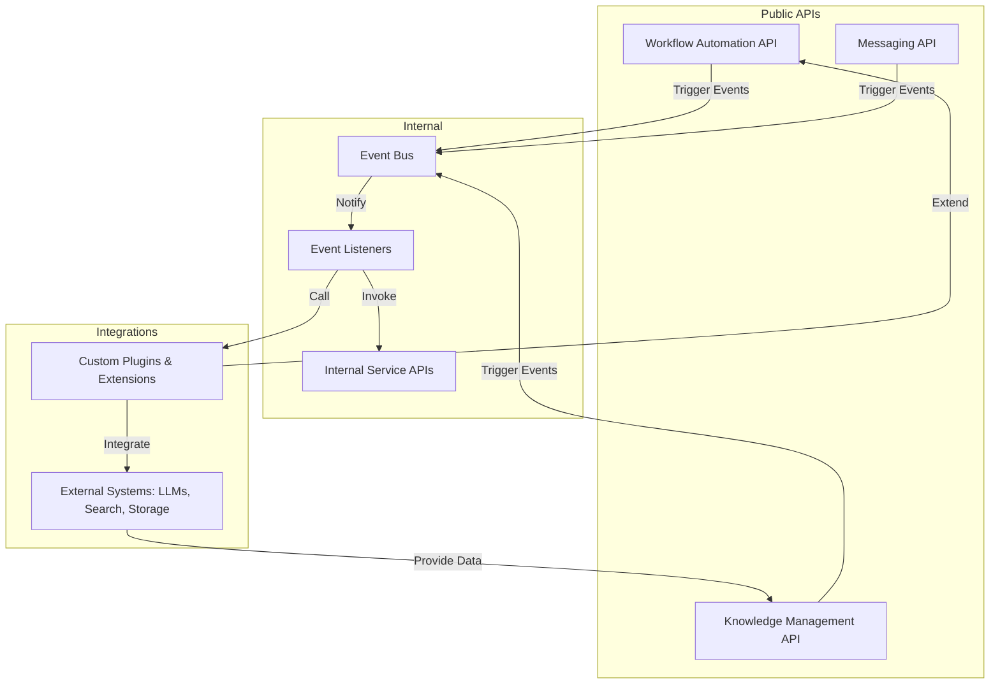

# Extensible API & Event System

Magic embraces an API-first philosophy that permeates every component, empowering users and developers to interact seamlessly with the platform. This page details Magic's approach to public and internal APIs, event publishing and subscribing mechanisms, and how you can build custom integrations connecting Magic with internal LLMs, search providers, file storage, or third-party systems.

---

## API-First Philosophy Across Magic Components

Magic is architected as a modular platform that exposes well-defined APIs for every capability—whether it's workflow orchestration, AI agent chat, knowledge management, or messaging. This API-first approach delivers several key benefits:

- **Interoperability:** Every Magic component can be accessed programmably, enabling integrations across different languages, platforms, and enterprise systems.
- **Extensibility:** Users can extend the platform by adding new API endpoints or customizing behaviors without modifying core code.
- **Decoupled Architecture:** The UI, backend services, and AI engines interact exclusively through APIs, enabling independent scaling and deployment.

### Types of APIs in Magic

| API Type       | Description                                                | Access Level       |
|----------------|------------------------------------------------------------|--------------------|
| Public REST APIs | Exposed for user integrations, SDK consumption, and workflow automation | Available to authenticated clients |
| Internal APIs  | Used between Magic services for inter-component communication | Restricted to system services |
| SDK APIs       | Wrappers around REST endpoints to simplify integration in client apps (PHP, TypeScript, Python) | Public but with SDK abstractions |

### User Intent Behind Using Magic APIs

Users primarily want to:

- Automate and control workflows programmatically.
- Manage knowledge documents and perform semantic queries.
- Send and receive messages in AI-assisted chatbots and group conversations.
- Customize and extend functionality via plugins and event-driven integrations.

All APIs are designed to enable these tasks fluidly and securely.

---

## Public & Internal Endpoints Design

Magic organizes APIs into logically grouped endpoints reflecting functional domains:

- **Workflow Automation Endpoints:** Manage visual AI workflow creation, flow execution, and monitoring.
- **Knowledge Base Endpoints:** CRUD operations on documents, semantic search, versioning, and metadata management.
- **Messaging Endpoints:** Sending messages, managing users and groups, handling attachments.
- **Authentication & Authorization Endpoints:** Token issuance, permission checks, multi-tenant isolation logic.
- **Integration & Extensibility Endpoints:** Custom tool registration, event subscription, plugin management.

These endpoints follow RESTful principles, provide detailed error codes, and support rich query parameters for flexibility.

### Endpoint Characteristics

- **Idempotence:** Write operations ensure clients can safely retry.
- **Pagination & Filtering:** List APIs support filtering for scalability.
- **Versioning:** Stable versioning allows backward-compatible evolution.
- **Rate Limiting:** Protects the system and ensures fair usage.

### Internal APIs

Internal endpoints facilitate:

- Microservice-to-microservice communication.
- Event dispatch and subscription handling.
- Secure crossing of organizational boundary controls.

They are usually not exposed to external clients but critical for core system functioning.

---

## Event Publishing & Subscribing

Magic's event system is a foundational mechanism that allows reactive and extensible behaviors through event-driven architecture.

### What Are Events in Magic?

An event is a discrete occurrence or state change in the system, such as:

- A workflow node execution completes.
- A new AI agent response is generated.
- A document is uploaded or updated.
- A message is received or sent.

### How Users and Integrations Use Events

- **Trigger automation:** Respond to workflow progress or external system inputs.
- **Extend Platform:** Build custom listeners that perform additional logic or notifications.
- **Integrate Third Parties:** Connect with monitoring, auditing, or enterprise messaging systems.

### Event System Components

| Component      | Role                                                        |
|----------------|-------------------------------------------------------------|
| Event Producers | Emit events when system state changes or user actions occur |
| Event Bus      | Central conduit routing events asynchronously or synchronously |
| Event Listeners| Modules or plugins that subscribe to and handle events      |

### Subscribing to Events

Users create event listeners that:

- Specify event types of interest.
- Define handlers in code or declaratively.
- Can chain with other events for complex workflows.

Magic supports dynamic event registration for runtime flexibility.

---

## Building Custom Integrations

Magic is designed to be extended and integrated easily with external AI models, knowledge stores, file providers, and enterprise systems.

### Integration Patterns

1. **Internal LLM Providers:**
   - Replace or augment default AI engines with custom language models.
   - Inject proprietary domain knowledge or compliance rules.

2. **Custom Knowledge and Search Systems:**
   - Connect external knowledge bases or vector stores.
   - Trigger re-indexing workflows programmatically.

3. **Third-Party File Storage:**
   - Integrate with cloud file providers.
   - Listen for file upload events to start processing or AI workflows.

4. **Enterprise Messaging Platforms:**
   - Extend Magic IM capabilities.
   - Dispatch messages conditionally based on workflow events.

### Developing a Custom Integration

- **Step 1: Define API Extensions or Plugins**
  - Use Magic’s plugin framework to encapsulate logic.
  - Register new REST endpoints if needed.

- **Step 2: Subscribe to Events**
  - Listen for relevant system triggers.
  - Implement handlers to invoke external API calls or internal logic.

- **Step 3: Secure & Test**
  - Apply proper authentication and authorization.
  - Validate integration in staging before production.

- **Step 4: Deploy & Monitor**
  - Use Magic’s observability tools to track performance and errors.

---

## Practical Example: Extending with a Custom Search Provider

Imagine your organization uses a proprietary semantic search engine for confidential documents. You want Magic workflows and AI agents to leverage this search.

1. **Create a plugin that listens for a document upload event.**
2. **On event trigger, call your search engine’s indexing API.**
3. **Extend the query API endpoints to route certain queries to your engine.**
4. **Configure AI prompts to include results from your search provider dynamically.**

This approach removes friction, ensures your data is current in Magic, and enriches AI responses with your trusted knowledge.

---

## Tips and Best Practices

- **Understand user intent:** Design APIs and events around what users seek to achieve.
- **Use progressive disclosure:** Start with basic event subscriptions; add complex workflows gradually.
- **Secure your integrations:** Use token-based authentication and respect tenant boundaries.
- **Monitor integrations:** Leverage Magic’s logging and metrics to detect failures early.
- **Avoid tight coupling:** Use events and asynchronous messaging to keep integrations loosely bound for maintainability.

---

## Troubleshooting Common Issues

| Problem                                | Possible Cause                             | Solution                                      |
|--------------------------------------|-------------------------------------------|----------------------------------------------|
| API calls failing with authentication errors | Missing or expired token                   | Refresh tokens, verify credentials            |
| Event handlers not triggering        | Incorrect event subscription configuration | Verify event type and listener registration   |
| Custom integration timing out        | Network or API rate limits                 | Check connectivity, implement retries with exponential backoff |
| Data inconsistency due to caching    | Stale caches or delayed event processing | Clear caches, verify event sequence integrity |

---

## Visualizing the API & Event Ecosystem

---

Magic’s extensible API and event system enables you to unlock powerful, seamless AI-driven workflows that integrate deeply with your enterprise environment. By leveraging flexible APIs and a responsive event-driven architecture, your teams benefit from automation, collaboration, and intelligence tightly aligned with your needs.

---

## Related Documentation

- [API Authentication & Authorization](/api-reference/auth-rate-limits/api-authentication) — Manage secure access tokens and scopes.
- [Workflow Automation API Reference](/api-reference/workflow-automation/flow-crud) — Program workflow creations and executions.
- [Event-Driven Extensibility Guide](/guides/advanced-customization-integration/event-driven-extensibility) — In-depth guidance on creating event listeners and custom triggers.
- [Third-Party Messaging Integration](/guides/advanced-customization-integration/third-party-messaging-integration) — Extend Magic's chat with enterprise platforms.
- [SDK Usage & Examples](/api-reference/errors-tools-sdks/sdk-usage-examples) — Quickstart for integrating with Magic APIs.

---

## Next Steps

- Explore the Event-Driven Extensibility guide to begin creating custom event listeners.
- Review SDK guides to integrate Magic’s APIs into your applications efficiently.
- Consider implementing plugins or custom endpoints to tailor Magic’s behavior to your environment.
- Use monitoring and logging tools for observability of your integrations.

Unlock the full value of Magic by mastering its extensible API and event-driven core—enabling innovative AI productivity across your organization.
