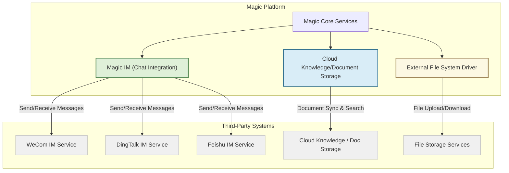

# Enterprise Integrations (IM, Knowledge, File)

Magic empowers your organization with built-in and extensible integrations that seamlessly connect enterprise instant messaging platforms, cloud knowledge/document storage services, and external file systems. This page details how Magic leverages third-party APIs and robust integration strategies to bring your data, communications, and workflows under one intelligent AI-powered umbrella.

---

## Introduction to Enterprise Integrations

In modern enterprises, data and collaboration occur across diverse systems: instant messaging platforms like WeCom, DingTalk, or Feishu; cloud knowledge repositories and document management systems; and multiple file storage backends. Magic’s integration architecture bridges these silos, enabling AI-driven workflows, enhanced communication, and centralized knowledge access.

This guide covers:

- Supported third-party IM platforms and how they connect
- Integration with cloud knowledge and document storage
- External file system connectors
- Best practices to ensure scalability, security, and robustness

---

## Third-Party Instant Messaging Integrations

Magic’s immersive AI communication experience depends on live, secure integrations with leading enterprise messaging platforms.

### Supported Platforms

- **WeCom** (WeChat Work)
- **DingTalk**
- **Feishu**

These platforms provide APIs for messaging, user and group management, and file attachments, all of which Magic leverages to offer real-time collaboration with AI agents.

### Integration Capabilities

- **Sending Messages:**
  Magic can send direct one-on-one messages and group chat messages via bots. This enables AI agents to interact naturally with users inside their existing chat apps.

- **User & Group Management:**
  Magic accesses user lists, department structures, and administrators to dynamically route conversations or automate tasks.

- **Attachment Handling:**
  Download and process files sent within chats to include them in AI workflows or knowledge bases.

### Typical User Workflow

1. Configure Magic with credentials and permissions for your chosen IM platform.
2. Grant chatbot permissions following platform-specific onboarding guidelines.
3. Use Magic’s APIs or SDK to send messages, create conversation threads, and handle incoming events.
4. Automate replies, alerts, and AI-driven notifications without leaving your messaging app.

### Practical Example: Sending a One-on-One Chat Message (DingTalk)

```php
use Dtyq\EasyDingTalk\OpenDev\Parameter\ChatBot\SendOneOnOneChatMessagesParameter;

$param = new SendOneOnOneChatMessagesParameter($accessToken);
$param->setRobotCode('yourBotCode');
$param->setUserIds(['user-id-123']);
$param->setMsgKey('sampleMarkdown');
$param->setMsgParam(json_encode([
    'title' => 'AI Notification',
    'text' => 'Your workflow has completed successfully!'
], JSON_UNESCAPED_UNICODE));

$result = $chatBotEndpoint->sendOneOnOneChatMessages($param);
```

### Error Handling and Best Practices

- Always validate access tokens and bot credentials before sending messages.
- Protect API keys and tokens to avoid unauthorized access.
- Monitor API rate limits and handle retries gracefully.
- Log message send failures and inspect API error codes for rapid troubleshooting.

### References for Messaging Integration

- [Third-Party Messaging Integration Guide](/guides/advanced-customization-integration/third-party-messaging-integration)
- [Send Messages & Conversations API Reference](/api-reference/im-conv-messaging/send-messages)
- [User, Department, and Group Management API](/api-reference/im-conv-messaging/user-and-group-lookup)

---

## Cloud Knowledge & Document Storage Integration

Magic facilitates secure, up-to-date access to your enterprise knowledge and documents by integrating with cloud storage platforms and managing document lifecycles.

### Core Features:

- **Document CRUD:** Add, update, retrieve, and delete documents within knowledge bases
- **Version Control:** Manage multiple versions with metadata for auditing
- **Sync & Vectorization Triggers:** Automate content re-indexing for search and AI contextualization

### User Intent Scenario

You want to enrich AI conversations with the latest company policies stored in your cloud knowledge base.

1. Upload or ingest the documents via Magic’s API.
2. Trigger vectorization and semantic indexing workflows.
3. Allow AI agents to retrieve and respond based on document content dynamically.

### Example Workflow

- Uploading a new document triggers a background job for vectorization
- AI workflows use semantic search APIs to respond accurately
- Knowledge administrators manage document status (enabled/disabled, sync) to control availability

### Best Practices

- Structure document metadata to enhance discoverability
- Use sync triggers carefully to avoid unnecessary vectorization load
- Keep sensitive documents access-controlled with Magic’s permission system

### References for Knowledge and Document Management

- [Document CRUD & Versioning API](/api-reference/knowledge-documents/document-management)
- [Knowledge Search & Retrieval API](/api-reference/knowledge-documents/knowledge-search)
- [Building a Smart Knowledge Assistant Guide](/guides/real-world-examples/knowledge-assistant)

---

## Integration with External File Systems

Magic supports connecting to external file storages to manage files securely across organizations and workflows.

### Supported Capabilities

- Secure file storage and retrieval with organization-aware access controls
- Upload and download operations via APIs
- Tenant and user-scoped file isolation

### Integration Strategy

Magic separates file management concerns from core workflow and messaging to ensure scalability and security. Files are handled via pluggable drivers supporting cloud or local filesystems.

### User Scenario

An HR team uploads onboarding documents stored in an external file system. Magic workflows access these files during automation while enforcing strict access permissions, ensuring compliance.

### Best Practices

- Select file storage drivers appropriate for your environment: cloud (e.g., AWS S3), network shares, or local storage
- Use Magic’s permission framework to gate file access based on user roles and tenant membership
- Monitor file storage usage and audit access logs regularly

### Related Documentation

- [Securing and Isolating Your AI Deployment](/guides/best-practices-optimization/secure-deployment)
- [Core Domain Models (Files)](/concepts/data-and-schema-foundations/domain-models)

---

## Architectural Considerations for Robust Integrations

When designing and deploying integrations, bear in mind Magic’s principles of security, scalability, and reliability.

### Security

- Use encrypted tokens and credentials stored securely
- Leverage tenant isolation to prevent cross-organization data leaks
- Validate webhook callbacks and messages from third-party platforms

### Scalability

- Cache frequently used tokens such as access tokens for IM platforms
- Employ asynchronous processing for large document ingestion or file transfers
- Use exponential backoff for retrying failed API calls

### Reliability

- Include comprehensive error handling and logging
- Monitor API usage limits and implement rate limiting
- Provide fallback behaviors or alerts when third-party services are unavailable

---

## Summary Diagram



This diagram highlights the primary integration components communicating with external services through dedicated adapters and APIs.

---

## Troubleshooting Common Integration Issues

| Symptom                                    | Cause                                              | Resolution                                              |
|--------------------------------------------|----------------------------------------------------|---------------------------------------------------------|
| Message not delivered to users              | Invalid or expired access token                    | Refresh token and ensure bot permissions                 |
| API calls fail with authentication errors  | Incorrect API key or misconfigured secrets         | Verify API keys and update environment variables         |
| Document sync does not trigger              | Missing or malformed sync trigger event            | Check ingestion pipelines and logs                        |
| File download URL expired                    | Temporary URLs expired or invalidated by storage   | Generate fresh URLs and review storage access policies   |
| Rate limit exceeded                          | Too many requests in a short period                 | Implement retry with backoff and monitor usage rates     |

---

## Next Steps

- Configure your Magic instance for your chosen IM platforms using the respective SDKs and API references.
- Explore practical messaging integrations in the [Third-Party Messaging Integration Guide](/guides/advanced-customization-integration/third-party-messaging-integration).
- Connect and manage your corporate knowledge bases with the [Document CRUD & Versioning API](/api-reference/knowledge-documents/document-management).
- Secure file operations by reviewing Magic’s [Secure Deployment Best Practices](/guides/best-practices-optimization/secure-deployment).

For detailed API usages and code samples, see:
- [Easy DingTalk SDK Usage Examples](https://github.com/dtyq/magic/tree/main/backend/easy-dingtalk)
- [Messaging API Reference](/api-reference/im-conv-messaging/send-messages)

---