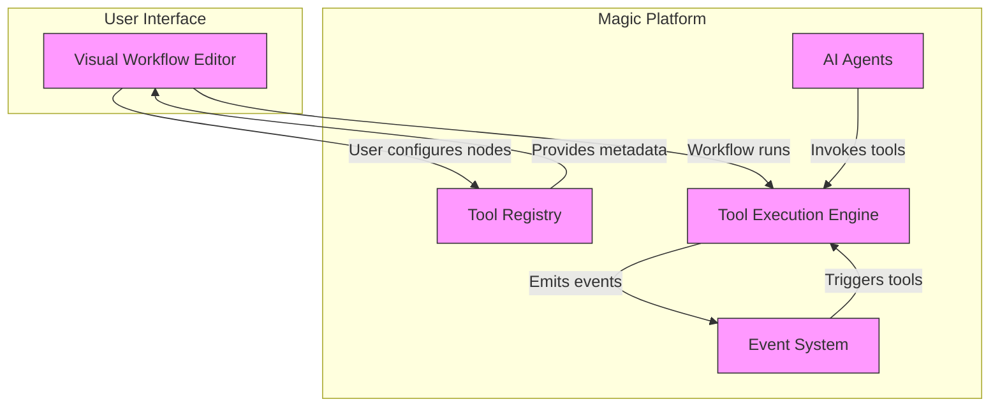

# Tool/Node and Plugin Architecture

Magic’s extensible platform empowers teams and integrators to amplify AI workflows by creating custom AI tools (often called plugins) and new visual workflow nodes. This architecture provides a seamless way to add deeply domain-specific capabilities, tailor behavior, and integrate external services—all within Magic’s rich event-driven environment.

---

## Introduction to Tools and Nodes

At its core, Magic separates logical functionality into modular building blocks:

- **Tools/Plugins:** Independent AI-powered capabilities or external service integrations that can be invoked programmatically by AI agents.
- **Workflow Nodes:** Visual components in Magic Flow's drag-and-drop environment that represent discrete actions, data transformations, or interactions with Tools and APIs.

This separation allows you to encapsulate complex business logic in reusable Tools while enabling users to orchestrate these through intuitive workflow nodes for high-level automation.

### Why Extend with Tools and Nodes?

- Unlock AI agents to perform domain-specific tasks beyond generic text generation.
- Integrate proprietary APIs and services directly into AI workflows.
- Build sharable components that non-developers can drag and configure visually.
- Enhance collaboration between developers, knowledge managers, and business users.


## Conceptual Overview

### Tools as AI Extensions and Plugins

Think of a Tool as a smart plugin your AI agents can access when they need to perform a task — such as querying a custom database, performing calculations, or connecting to third-party APIs. Tools:

- Are registered independently and can be updated without redeploying core platform code.
- Expose clearly defined input/output interfaces to ensure seamless integration.
- Leverage event-driven triggers to react dynamically within workflows.

### Visual Workflow Nodes

Nodes are the building blocks users see and work with in Magic Flow’s visual editor. Each node:

- Maps to an underlying Tool, API, or native platform function.
- Can be customized with parameters, conditions, and outputs.
- Connects to other nodes via directed edges to build automated pipelines.

Together, Tools and Nodes empower modular design of AI applications from low-code environments while preserving extensibility.

## Lifecycle of a Custom Tool

1. **Design & Development:**
   - Define the functionality and API of your Tool.
   - Implement input parameters, output formats, and error handling.
2. **Registration:**
   - Register the Tool with Magic’s tool registry to make it discoverable.
   - Provide metadata such as descriptions, input schemas, and categories.
3. **Testing:**
   - Validate behavior independently and within workflows.
4. **Publishing:**
   - Deploy and version the Tool for consumption by AI agents and workflow nodes.
5. **Invocation:**
   - Invoked dynamically by AI during runtime or manually by users in workflow nodes.
   - Supports event-driven activation when certain system events occur.

## Registering and Managing Plugins

Magic maintains a robust plugin management framework:

- **Centralized Registry:** Each registered plugin is listed with details like version, author, and capabilities.
- **Sandboxing:** Plugins run in controlled environments to ensure security and stability.
- **Versioning:** Multiple versions can coexist to support backward compatibility.
- **Extension APIs:** The platform provides APIs to register, update, disable, or uninstall plugins programmatically.

## Event-Driven Agent Tools

Tools can subscribe to events, enabling agents to trigger them based on specific workflow states or external signals. This event-driven model allows:

- Dynamic responses tailored to user interactions.
- Scheduled executions or reactive behavior upon data changes.
- Complex orchestrations spanning multiple tools and nodes.

## Practical Example: Creating a Custom Tool and Node

Imagine you want to add a "Sales Data Query" tool that extracts records from a proprietary sales database.

### Step 1: Define the Tool

- Inputs: Product ID, Date Range
- Outputs: Sales summary JSON
- Implementation: Queries your internal API and formats results

### Step 2: Register the Tool

- Provide metadata:
  ```json
  {
    "name": "SalesDataQuery",
    "description": "Fetches sales data for products.",
    "inputs": {"productId": "string", "startDate": "date", "endDate": "date"},
    "outputs": {"salesSummary": "json"}
  }
  ```

### Step 3: Create a Visual Workflow Node

- Node links to this Tool by name.
- Parameters are exposed visually for easy configuration.
- Node outputs can be wired into downstream processing or AI prompts.

### Step 4: Use the Node in a Workflow

- Users drag the node into their Magic Flow editor.
- Configure parameters such as selecting products and date ranges.
- AI agents combine output with messaging or analytics nodes.

## Best Practices and Tips

- **Clear Interface Definition:** Precisely define input/output schemas to avoid runtime errors.
- **Isolate Side Effects:** Keep Tools idempotent and minimize external dependencies.
- **Error Handling:** Implement robust error signaling so workflows can handle failures gracefully.
- **Documentation:** Publish detailed metadata and usage instructions for each Tool.
- **Security:** Validate and sanitize all inputs; use authentication where external calls are made.
- **Testing:** Rigorously test both standalone Tools and their integration within workflows.

## Common Pitfalls

- Overloading Tools with too many responsibilities reduces reusability.
- Neglecting version management can cause unexpected behavior in workflows.
- Insufficient error transparency leads to silent failures and user frustration.
- Ignoring event-driven capabilities limits dynamic, responsive designs.

## Troubleshooting

- **Tool Not Found:** Verify registration status and correct naming.
- **Invalid Parameters:** Check input schema compliance and parameter formats.
- **Permission Errors:** Ensure plugins have appropriate access rights.
- **Runtime Failures:** Review logs for exception traces and timeouts.
- **Event Trigger Issues:** Confirm event subscription and firing logic are correctly implemented.

## Integration with Other Components

This architecture works hand-in-hand with Magic's broader ecosystem:

- **Workflow Orchestration:** Tools and nodes form the action layer in Magic Flow.
- **AI Agent Extensibility:** Allows AI agents to invoke advanced capabilities dynamically.
- **Third-Party Messaging Integration:** Custom tools can integrate with communication platforms like DingTalk.
- **Event System:** Plugins participate actively in Magic's event-driven workflows.

---

## Diagram: Tool and Node Interaction Overview



## Next Steps and Further Learning

- Explore the [Event-Driven Extensibility](https://docs.magic.com/guides/advanced-customization-integration/event-driven-extensibility) guide to master reactive automation.
- Review [Workflow Orchestration](https://docs.magic.com/guides/getting-started/workflow-orchestration) for detailed node creation and management techniques.
- Consult the [Third-Party Messaging Integration](https://docs.magic.com/guides/advanced-customization-integration/third-party-messaging-integration) for practical use cases connecting Tools with IM platforms.

---

For developers ready to extend Magic’s capabilities, mastering Tool and Node architecture unlocks powerful, scalable, and maintainable AI-driven workflows tailored to any business domain.


