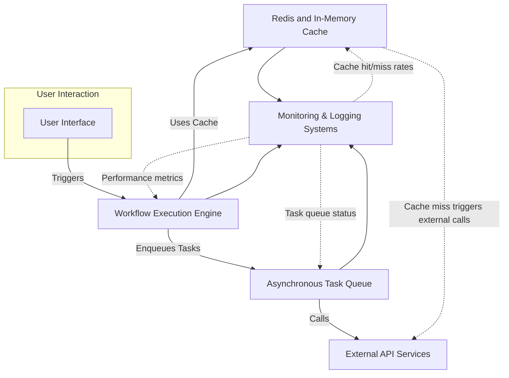

# Performance Optimization Strategies

## Introduction

As your usage of Magic scales, ensuring optimal system responsiveness becomes critical. This guide dives into key strategies focused on caching, asynchronous processing, workflow execution efficiency, scalable task queues, and real-time monitoring. Whether you're tuning performance for a small team or architecting for large-scale enterprise use, these concepts empower you to maintain fast, reliable operations.

---

## Caching Mechanisms

### Why Cache?
Caching is essential to reduce redundant computation, lower external API load, and speed up user interactions. It stores frequently accessed data close to where it is needed.

### Types of Caches Used
- **Redis Cache**: Used extensively across Magic for distributed, networked caching. Redis stores transient data such as tokens, API responses, and computed workflow results.
- **In-Memory Cache**: Used locally within services for ultra-fast data retrieval during short lifecycle activities and to complement Redis.

### Practical Example: ASR Token Caching
The ASR Token API implements a Redis-based cache keyed by a user’s Magic ID. Tokens are cached with a reduced TTL to avoid edge expiry issues, ensuring token validity and minimizing redundant refresh requests.

### Best Practices
- Use Redis for cross-instance caching to maintain consistency in distributed deployments.
- Employ in-memory caches for ephemeral or per-request data to avoid network overhead.
- Set cache expiration slightly earlier than actual data expiry to mitigate stale data.
- Always have fallback mechanisms for cache misses.

---

## Asynchronous Processing

### Enhancing Responsiveness
Heavy or long-running tasks—for example, API calls or complex AI model invocations—are offloaded to asynchronous workers. This keeps the user interface responsive and prevents bottlenecks in workflow execution.

### Scalable Task Queues
Magic leverages task queues that support scaling out by adding workers. This design ensures that as demand grows, you can scale horizontally by deploying more workers to maintain throughput.

### Key Advantages
- Decouples request submission from execution, allowing for load smoothing.
- Enables retry and failure handling policies without blocking user flow.
- Supports parallel execution of independent tasks.

### Usage Insight
When configuring workflow nodes, enabling asynchronous mode for network calls or heavy computation improves overall system responsiveness by delegating these tasks to workers running separately.

---

## Workflow Execution Performance

### Performance Bottlenecks
Typical bottlenecks arise from slow external API calls, heavy computations, unoptimized queries, or serialized workflow steps.

### Optimization Techniques
1. **Request Deduplication**
   - Identifies and coalesces identical API calls within a short timeframe.
   - Prevents redundant calls, reducing latency and resource consumption.
   - Implemented transparently with unique request keys.

2. **Parallel Tool Invocations**
   - Enables simultaneous execution of independent workflow nodes.
   - Controlled with timeouts to avoid indefinite waits.

3. **Asynchronous Node Execution**
   - Allows nodes to start tasks without blocking the entire workflow.

4. **Caching Workflow Outputs**
   - Stores results of commonly executed nodes to reuse instead of recomputing.

### Example: HTTP Request Node
Using the HTTP Request Node in asynchronous mode with deduplication reduces workflow wait times when multiple identical external calls occur.

---

## Monitoring & Logging

### Importance
Continuous monitoring and logging provide insights into workflow execution times, resource usage, error patterns, and throughput.

### Strategies
- **Centralized Logging**: Aggregated logs from services to simplify troubleshooting.
- **Real-Time Metrics**: Track workflow start/end times, queue lengths, task latencies, and cache hit rates.
- **Alerting**: Setup alerts on performance degradation or error spikes.

### Practical Tips
- Instrument workflow nodes and service endpoints to emit key performance metrics.
- Monitor Redis cache usage and evictions for potential tuning.
- Track asynchronous queue backlogs to identify scaling needs.

---

## Tuning for Scalability and Responsiveness

### Horizontal Scaling
Deploy more instances of workflow executors and asynchronous workers based on load.

### Adaptive Timeout and Retry Policies
Configure timeouts for slow external calls, with exponential backoff retries for transient failures.

### Configuration Best Practices
- Tune Redis eviction policies and connection pool sizes.
- Adjust task queue worker count and concurrency per instance.
- Optimize database and external API connection settings.

### Continuous Improvement
Regularly profile system performance, identify bottlenecks, and tune configuration iteratively.

---

## Troubleshooting Common Issues

<AccordionGroup title="Common Performance-Related Issues">
<Accordion title="High Workflow Latency">
- Check if external API calls are slow or timing out.
- Confirm if caching is enabled for frequently requested data.
- Validate asynchronous mode is enabled where applicable.
- Review parallel tool execution configurations.
</Accordion>
<Accordion title="Cache Misses and Token Expiry Problems">
- Ensure Redis is healthy and reachable.
- Confirm cache keys are generated consistently.
- Check cache expiration settings, especially with tokens like ASR JWT.
- Use forced refresh to bypass stale caches during debugging.
</Accordion>
<Accordion title="Task Queue Backlog or Worker Starvation">
- Monitor queue size for build-up.
- Scale out worker instances as needed.
- Check for stuck or failed tasks blocking the queue.
- Tune worker concurrency to match hardware capability.
</Accordion>
<Accordion title="Duplicate API Requests Leading to Rate Limits">
- Verify request deduplication mechanism is active.
- Implement rate limiting strategies in custom nodes.
- Consider caching API responses to reduce calls.
</Accordion>
</AccordionGroup>

---

## Summary
Effective performance optimization in Magic hinges on a holistic approach embracing caching, asynchronous processing, workflow parallelism, and vigilant monitoring. Leveraging Redis for distributed caching, enabling async task processing, and configuring workflow nodes for concurrency ensures responsiveness even as load scales. Continuous monitoring and tuning complete the cycle, enabling reliable, performant AI-driven workflows.

---

## Additional Resources
- [ASR Token API Documentation](backend/magic-service/app/Interfaces/Asr/README.md): Understand token caching and refresh strategies.
- [HTTP Request Node Guide](/docs/en/tutorial/basic/node/HTTP-request.md): Learn how to configure external API calls with performance in mind.
- [Workflow Performance Tuning Guide](/guides/best-practices-optimization/workflow-performance-tuning.mdx): Deep dive into workflow optimization.
- [Scalability Foundations](/concepts/performance-scalability/scalability-foundations.mdx): Learn about deployment scaling strategies.
- [Monitoring & Logging Overview](/deployment/scaling-monitoring-and-resilience/monitoring-and-logging-overview): Best practices for observability.
- [System Architecture Overview](/concepts/architecture-overview/system-architecture.mdx): Context on component interactions affecting performance.

---

## Visual Overview of Key Optimization Concepts

---

## Practical Tips
- Enable request deduplication in HTTP nodes to prevent redundant API calls.
- Leverage asynchronous processing for long-running nodes to prevent UI timeouts.
- Use Redis caching for tokens, frequently fetched data, and intermediate workflow results.
- Monitor Redis and task queue metrics to anticipate scaling needs.
- Set sensible timeouts and retries for external calls in workflow nodes.
- Utilize logging to trace problematic nodes and failed calls swiftly.

---

# End of Performance Optimization Strategies
