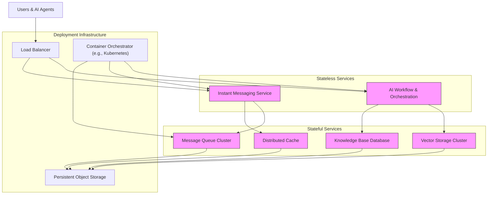

# Scalability & Distributed Design

Magic is built to support the horizontal scaling of its key services, enabling reliable performance and responsiveness even in large enterprise environments. This guide explains how Magic leverages stateless and stateful service patterns, details strategies for scaling knowledge retrieval and vector storage, and shares best practices to help you deploy and operate Magic effectively at scale.

---

## Understanding Magic's Scaling Principles

Scaling Magic involves thoughtful division of responsibilities between stateless and stateful services, ensuring each component can grow elastically with demand. This design underpins Magic's ability to handle increasing loads on AI workflows, knowledge searches, and real-time collaboration.

### Stateless vs Stateful Services

- **Stateless Services**: These components process requests independently without retaining client-specific state between interactions. They are easily duplicated and balanced across multiple instances, providing rapid horizontal scaling.

- **Stateful Services**: These include services that hold persistent information such as databases, caches, vector stores, and messaging queues. Scaling these components requires replication, partitioning, or sharding strategies with coordination to maintain consistency and availability.

By isolating stateless service layers, Magic achieves flexible scaling for compute-heavy AI tasks, while robust stateful layers ensure data integrity and responsiveness.

## Key Components and Scaling Strategies

### 1. AI Workflow and Orchestration Services

Magic’s visual workflow engine and multi-agent orchestration components are designed as stateless microservices.

- **Scaling Approach:** Deploy multiple identical instances behind load balancers to handle concurrent user requests.
- **Benefit:** This model enables seamless scaling out by simply adding more service containers or nodes.

### 2. Knowledge Retrieval and Vector Storage

Semantic knowledge search relies on vector stores which inherently maintain large datasets and require high-performance retrieval.

- **Scaling Vector Stores:** Use distributed vector databases or index sharding to spread data across nodes.
- **Caching:** Implement local caching mechanisms to reduce retrieval latency for frequent queries.
- **Vectorization Workloads:** Offload embedding computations to dedicated compute nodes that can be independently scaled.

### 3. Messaging and Collaboration Services

Magic IM leverages messaging queues and persistence stores that require high availability and horizontal scalability.

- **Message Queues (e.g., RabbitMQ):** Scale through clustering and federation ensuring message durability and load distribution.
- **Session and State Management:** Use external shared stores or distributed caches (e.g., Redis clusters) to maintain session continuity across stateless app instances.

### 4. Data Storage and Persistence

- **Databases:** Employ master-slave replication, clustering, or cloud-managed solutions for fault tolerance and scalability.
- **Object Storage:** Integrate with scalable file storage solutions that support multi-tenant access and backup.

## Deployment Patterns for Large Enterprises

### Cloud-Native & Container Orchestration

Utilize Kubernetes or similar container orchestration platforms to manage stateless and stateful components:

- **Auto-scaling:** Enables on-demand resource scaling based on workload metrics
- **Service Discovery & Load Balancing:** Ensures efficient routing and failover
- **Configuration Management:** Centralizes environment-specific parameterization

### Multi-Region and Multi-AZ Deployments

To enhance availability and resilience:

- Deploy critical services across multiple availability zones
- Use geo-distributed vector stores for localized knowledge access
- Implement synchronization and eventual consistency strategies

### Isolation by Tenant or Organization

Support data isolation and workload partitioning through namespace segmentation and access controls to ensure performance and security at scale.

## Best Practices to Maximize Scalability

- **Plan Service Boundaries:** Keep services stateless where possible to enable easy replication.
- **Optimize Vector Store Usage:** Balance update frequency and retrieval speed, leveraging incremental re-vectorization rather than full rebuilds.
- **Use Observability Tools:** Monitor critical metrics such as CPU, memory, queue length, and search latencies to proactively scale.
- **Implement Caching Layers:** Cache common queries and AI results at multiple levels to reduce load.
- **Automate Deployment Pipelines:** Establish CI/CD workflows supporting blue-green or canary releases for smooth scaling transitions.

## Troubleshooting Common Scaling Challenges

- **Performance Bottlenecks:** Identify slow AI workflows or knowledge queries using logs and tracing; scale corresponding compute or storage nodes.
- **Cache Invalidation Issues:** Ensure cache TTLs and invalidation policies stay aligned with knowledge base update rates.
- **Message Queue Overflows:** Monitor queue backlogs and tune consumers or add consumer instances.
- **Database Locks or Deadlocks:** Examine transaction patterns and shard data where feasible.

Use Magic’s monitoring dashboards along with infrastructure monitoring to gain visibility and respond swiftly.

---

## Visual Overview of Scalability Architecture

---

## Next Steps

Now that you understand the scalability and distributed design principles of Magic, consider the following to deepen your implementation:

- Explore [System Architecture Deep Dive](https://docs.magic.com/concepts/architecture-overview/system-architecture) for comprehensive architectural insights.
- Review [Scaling & High Availability](https://docs.magic.com/deployment/scaling-monitoring-and-resilience/scaling-and-high-availability) for deployment-specific best practices.
- Consult [Monitoring & Logging Overview](https://docs.magic.com/deployment/scaling-monitoring-and-resilience/monitoring-and-logging-overview) to effectively track performance metrics.

This structured approach will help you design a Magic deployment that scales efficiently, reliably serving growing enterprise AI needs.

---

## Troubleshooting & Tips

- When scaling vector stores, choose distributed databases explicitly designed for vector operations to avoid performance degradation.
- Regularly audit cache effectiveness; stale caches can cause outdated AI suggestions.
- Automate scaling triggers based on relevant metrics like queue length or CPU usage to avoid manual intervention.
- Use rolling upgrades and health checks to ensure zero downtime during scaling events.

---