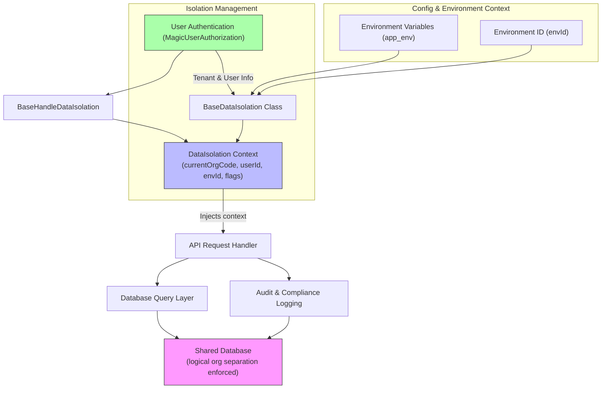

# Multi-Tenant Data Isolation

Multi-tenant data isolation is a foundational security and architectural principle in the Magic platform designed to ensure strong logical separation of data, configurations, and access across different organizations (tenants). This approach safeguards each organization's privacy, maintains compliance readiness for regulated industries, and enables secure multi-tenancy without risk of accidental or malicious data leakage.

---

## Why Multi-Tenant Data Isolation Matters

Imagine a scenario where your enterprise manages sensitive workflows, messages, and documents alongside many other organizations using the same platform. Without explicit and robust isolation, confidential information could become accessible to unauthorized parties, jeopardizing business trust and compliance with regulations like GDPR or HIPAA.

Magic addresses this challenge by enforcing strict boundaries in all key areas—from database storage and API authentication to runtime configuration and auditing—so organizations operate independently and securely within a shared environment.

---

## Key Concepts of Data Isolation

### 1. Logical Separation in Databases

Magic employs logical data partitioning to keep each organization's data siloed within shared databases. This means:

- All data queries are scoped by the organization's unique identifier (organization code).
- Official or system organizations can be optionally included or excluded in cross-organization queries.
- Data access layers explicitly enforce organizational boundaries rather than relying on implicit assumptions.

For example, the `BaseDataIsolation` class encapsulates an organization's context including:

- **Current Organization Code:** Identifier for the tenant context.
- **Current User ID:** Identifies the user within the tenant.
- **Environment ID:** Differentiates deployments or stages.
- **Flags for Official Organizations:** Logic to handle system-wide organizations.

This separation ensures that when your application executes database queries, every operation is filtered or marked with the organization’s code, preventing cross-tenant data access.

### 2. Scoped API Tokens and Authentication

API tokens and user authorizations are scoped specifically to organizations. Magic uses authorization classes like `MagicUserAuthorization` to capture not only the user identity but also the tenant context. This context then initializes data isolation using handlers such as `BaseHandleDataIsolation`, which sets necessary realms and IDs.

This scoped token approach:

- Limits API access strictly to the user’s organization.
- Supports third-party platforms by also tracking external tenant codes and user identities.
- Enables fine-grained permission enforcement without risking cross-tenant token misuse.

### 3. Organization-Specific Configuration

Beyond data and authentication, Magic maintains environment and operational configurations per organization:

- The runtime environment variable `app_env()` combined with an organization-specific environment ID (`envId`) enables differentiation of tenant deployments.
- Functions in `BaseDataIsolation` and derived classes explicitly manage these config values ensuring each tenant’s configuration context is respected.

This ensures tenant uniqueness even within shared infrastructure, aiding debugging, compliance segregation, and auditing.

---

## How It Works: User Flow Example

1. **User Signs In** 
   - The user authenticates with credentials associated with their organization.
   - Authentication returns a `MagicUserAuthorization` object encapsulating user and organization identifiers.

2. **Data Isolation Context Established**
   - The platform creates a `DataIsolation` instance using tenant data from authorization.
   - `BaseHandleDataIsolation` applies this authorization context, establishing scoped IDs like organization code, user ID, and environment ID.

3. **API Calls and Data Access**
   - Every API call internally injects the current `DataIsolation` information.
   - Database queries, cache key formation, and service calls enforce tenant-scoped access.

4. **Audit and Compliance**
   - Operations are logged with tenant and user context.
   - Official organizational boundaries are respected where configurations specify.

This consistent and explicit handling prevents any data bleed or unauthorized access across tenants.

---

## Practical Tips & Best Practices

- **Always pass explicit tenant context objects** to data or service layers rather than relying on implicit session or global state.
- **Use the `BaseDataIsolation` class or tenant-specific subclasses** (e.g., `KnowledgeBaseDataIsolation`, `ProviderDataIsolation`) to track context explicitly.
- **Enable or disable official organization inclusion carefully**, depending on query requirements.
- **Leverage scoped API tokens** tightly bound to user and organization to restrict external access.
- **Audit logs and monitoring** should capture tenant identifiers for traceability.
- **Test multi-tenant scenarios extensively**, including edge cases of environment switching and official organization querying.

---

## Troubleshooting Common Issues

| Issue | Symptom | Resolution |
|---|---|---|
| Cross-tenant data visibility | Users can see or modify data from other organizations | Verify `DataIsolation` context is correctly passed and applied in queries
Check API token scopes and reauthorize
| Missing tenant context | API requests fail or return empty data sets | Ensure the authorization middleware properly sets tenant data
Confirm `BaseHandleDataIsolation` initializes `envId` and organization code
| Official organization data leaking | Queries unintentionally include official organization data | Review flags `containOfficialOrganization` and `onlyOfficialOrganization` in isolation objects
Test queries explicitly for official org inclusion
| Environment confusion | Data or configs mix between environments | Verify `envId` setting matches deployment and tenant context
Confirm environment variables and isolation state coherence

---

## Summary Diagram

---

## Additional Resources
- [Security Architecture Overview](/concepts/security-permission-design/security-architecture) — Understand how isolation fits into the broader platform security model.
- [Authentication Methods](/security/authentication-and-access/authentication-methods) — Learn about token scopes and user authorization.
- [Secure Deployment Best Practices](/guides/best-practices-optimization/secure-deployment) — Strategies for securing multi-org deployments.
- [System Architecture Diagram](/overview/architecture-glance/system-architecture-diagram) — Visualize how components interact in a multi-tenant environment.

By mastering these data isolation principles, you ensure a secure, compliant Magic deployment ready to scale across diverse organizations safely and efficiently.