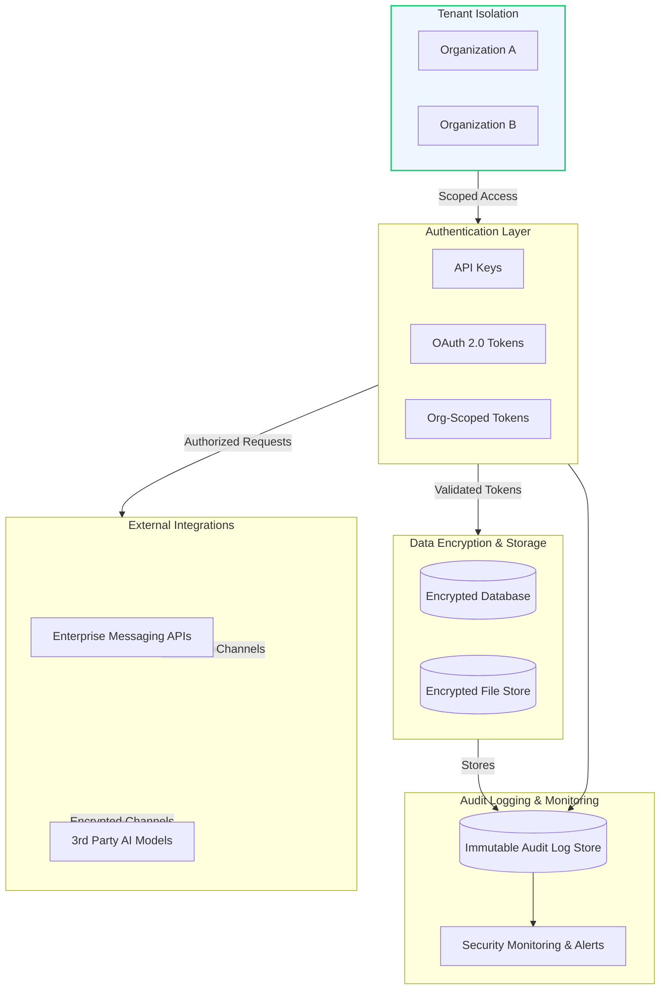

# Security Architecture Overview

Magic’s Security Architecture Overview presents a comprehensive, high-level view of the platform’s security design. This guide is aimed at users, administrators, and integrators who need a clear understanding of how Magic enforces security boundaries, protects data, and mitigates threats within a multi-tenant AI productivity ecosystem.

---

## Introduction

Security is foundational to Magic’s promise of a robust, enterprise-ready platform supporting sensitive AI workflows, knowledge assets, and collaboration. This overview explains core design principles, organizational boundaries, authentication schemes, data protection mechanisms, audit capabilities, and defense layering.

Users will learn the typical attack surfaces Magic addresses and the layered controls implemented to safely enable AI productivity across multiple organizations and integrations.

---

## Organizational Boundaries & Tenant Isolation

Magic is designed as a multi-tenant platform by default, meaning it securely partitions data, resources, and user activities by organization (also called tenants). Each organization operates within its own isolated environment context, ensuring strict data separation and access control.

### How Tenant Isolation Works

- **Scoped Access:** User sessions, API tokens, and workflow executions carry organization context to scope resource access.
- **Data Partitioning:** Databases and file stores logically segment data by organization identifiers to prevent unauthorized cross-tenant visibility.
- **Environment Separation:** Runtime environments and caches respect tenant boundaries to avoid any leakage.

This safeguards against data crossover and unauthorized operations between tenants, complying with enterprise governance and regulatory requirements.

<Check>
Understanding and verifying tenant isolation is critical when onboarding organizations to ensure compliance and data confidentiality.
</Check>

---

## API Authentication Schemes

Magic employs robust authentication methods to validate and authorize API calls and user actions.

### Supported Authentication Methods

- **API Keys:** Secure, static keys issued to clients for service-to-service or SDK authentication with scoped permissions.
- **OAuth 2.0 Tokens:** Dynamic tokens issued via standard OAuth flows, supporting organizational authorization delegation.
- **Organization-Aware Tokens:** API tokens scoped with organization context to enforce tenant boundaries.

### Best Practices for API Authentication

- Safely store and rotate API keys and tokens regularly.
- Enforce TLS encryption for all token transmission.
- Limit token lifetime and scope privileges per principle of least privilege.
- Validate token states and permissions on every request.

<Note>
Detailed information on obtaining, using, and managing authentication tokens is available in the Authentication & Authorization reference.
</Note>

---

## Encrypted Storage & Data Protection

Protecting sensitive data at rest is a core requirement.

### Data Encryption

- **Encryption at Rest:** All stored data, including databases and file systems, are encrypted using industry-standard algorithms.
- **Key Management:** Encryption keys are securely managed, rotated, and isolated from application data.

### Sensitive Information Handling

- Access to secrets such as API keys, tokens, and certificates is strictly controlled using environment variables and secret management solutions.
- Passwords and credentials are never stored in plaintext and use established hashing algorithms when applicable.

### Example: Secure Configuration with Environment Variables

Configuration sensitive data such as `JWT_SECRET` and API keys are injected through `.env` environments and never embedded in code.

```bash
JWT_SECRET=your-secret-key-change-me
MAGIC_GATEWAY_API_KEY=your-gateway-api-key-here
OPENAI_API_KEY=sk-xxxx
```

<Warning>
Always verify production deployments do not expose sensitive configuration files publicly.
</Warning>

---

## Audit Logging and Monitoring

To maintain accountability and detect suspicious activity, Magic aggressively logs significant events.

### Audit Logging Includes:

- User login/logout attempts and results.
- API token usage, including failures and rate limiting.
- Workflow executions and triggers.
- Administrative actions such as permission changes.

Logs are timestamped, immutable, and stored securely for an appropriate retention period.

### Monitoring

Magic integrates monitoring for runtime health, authentication anomalies, and potential security incidents.

<Info>
Administrators should regularly review audit logs and integrate with SIEM or alerting tools for real-time defense.
</Info>

---

## External Integrations and Security Considerations

Magic facilitates integrations with trusted external systems such as enterprise messaging platforms (DingTalk, WeCom, Feishu) and AI model providers (OpenAI, Azure).

### Securing Integrations

- All API calls to third-party services use encrypted channels (HTTPS/TLS).
- Credentials and secrets for external services are stored encrypted and scoped to prevent misuse.
- Callbacks and webhooks are validated through tokens and signatures to prevent spoofing.

### Typical Attack Surfaces Mitigated

- **API Key Leakage:** Mitigated by secure storage and scoped token usage.
- **Unauthorized Access:** Controlled by strict authentication and tenant scoping.
- **Injection and CSRF Attacks:** Prevented by input validation and secure APIs.
- **SSRF Attacks:** Defensive checks against server-side request forgery through careful external request handling.

For example, integration components like Easy DingTalk SDK implement secure token exchange and cache access tokens safely in-memory to limit exposure.

<Note>
Consult external integrations and API security documentation for detailed configuration and securing callbacks.
</Note>

---

## Layered Defense Strategy

Magic implements security in overlapping layers to reduce risk and increase resilience.

1. **Organizational Isolation:** Prevent unauthorized data sharing across tenants.
2. **Authentication and Authorization:** Verify identity and enforce permissions.
3. **Data Encryption:** Protect data privacy at rest and in transport.
4. **Audit and Logging:** Detect and record security-relevant events.
5. **Secure Integrations:** Harden interfacing with external platforms.

This layered approach ensures that if one control is compromised, others continue to protect the system.

---

## Troubleshooting Common Security Issues

### Authentication Failures
- Verify API keys or tokens are valid, not expired or revoked.
- Check request headers and payload for correct authorization parameters.

### Access Denied Errors
- Confirm the user's organization context matches the resource being accessed.
- Review role and permission assignments within organization scopes.

### Unexpected Token Expiration
- Validate token caching mechanisms and configuration TTL values.
- Ensure system clocks are synchronized to avoid timestamp mismatches.

### Audit Log Gaps
- Verify logging configuration and storage availability.
- Check retention policies and archival status.

---

## Summary

Magic’s Security Architecture is intentionally designed to deliver enterprise-grade protections through tenant isolation, strong authentication, encrypted storage, comprehensive audit logging, and secure external integrations. By understanding this layered model and following best practices, users and administrators can confidently deploy, extend, and operate Magic in secure AI environments.

---

## Additional Resources

- [Authentication & Authorization API Reference](/api-reference/auth-rate-limits/api-authentication)
- [Multi-Organization and Tenant Isolation](/security/authentication-and-access/multi-organization-and-tenant-isolation)
- [Data Encryption and Storage](/security/data-protection-and-privacy/data-encryption-and-storage)
- [Callback & Event Handling](/api-reference/im-conv-messaging/callback-handling)
- [Third-Party Messaging Integration Guide](/guides/advanced-customization-integration/third-party-messaging-integration)
- [Secure Deployment Best Practices](/guides/best-practices-optimization/secure-deployment)

<Check>
Regularly review and update your security configurations aligned with newer platform releases and documented guidelines.
</Check>

---

## Diagram: High-Level Security Components and Data Flow



---

## Practical Tips & Best Practices

- **Manage Secrets Carefully:** Use environment variables and secret stores to avoid accidental exposure.
- **Enforce Minimum Privileges:** Only grant users and tokens the access required.
- **Regularly Rotate Keys and Tokens:** To limit damage in case of leakage.
- **Monitor Logs and Alerts:** Active monitoring catches incidents early.
- **Test Integrations Securely:** Validate webhook configurations and callback authenticity thoroughly.
- **Ensure Time Synchronization:** Tokens depend on accurate timestamps for TTL enforcement.

---

By internalizing Magic’s Security Architecture Overview and adhering to the layered defenses and recommended operational practices, users will maintain a secure environment that enables AI-driven innovation without compromising confidentiality or control.
