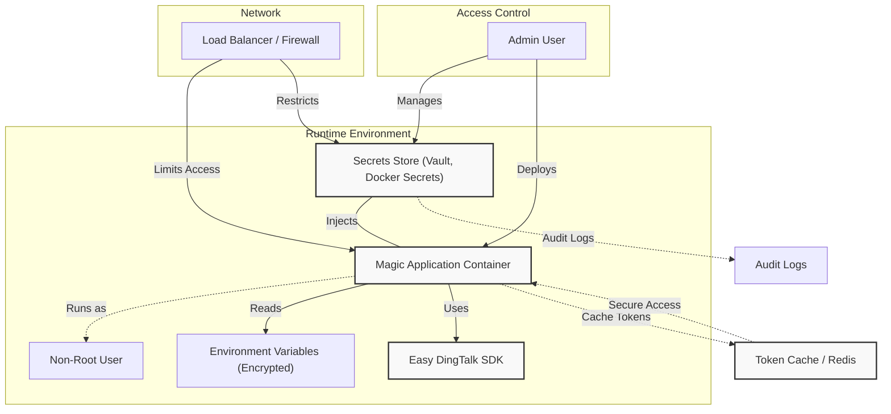

# Runtime Hardening & Secrets Management

In deploying Magic, securing your runtime environment is paramount to safeguarding sensitive configuration, API keys, and operational data. This guide focuses on empowering you with practical strategies to harden your deployment by enforcing strong configuration hygiene, isolating container and user privileges, and managing secrets securely. By implementing these best practices, you ensure your Magic platform runs resiliently, safely, and compliant with security principles.

---

## 1. Establishing Strong Configuration Practices

Proper configuration management forms the foundation of runtime security. Consider these essential steps:

- **Use Encrypted Environment Variables:** Rather than storing secrets such as `app_key`, `app_secret`, or API tokens in plain `.env` files or code, leverage environment-level encryption solutions offered by your container orchestration or deployment environment (e.g., Docker secrets, Kubernetes Secrets, HashiCorp Vault). This reduces risk of accidental leakage.

- **Apply Principle of Least Privilege:** Restrict what each deployment environment can access. For example, applications should only read environment variables or secret stores essential for their operation.

- **Isolate Configuration Files:** Store sensitive configuration, like OAuth tokens or DingTalk callback credentials, separately from application binaries and with strict filesystem permissions.

- **Use Typed Configuration Objects:** Following Magic’s SDK patterns, configuration is encapsulated in classes like `OpenDevEndpointConfig` and `DingCallbackConfig`. This encourages immutable and centralized access to secrets, preventing ad-hoc mutation or exposure.

<Note>
Adopting centralized configuration management helps you audit changes, control access, and minimize accidental secrets exposure.
</Note>

---

## 2. Container and User Isolation

Securing the runtime container or host environment ensures that even if application vulnerabilities are exploited, the attack surface remains tightly contained.

- **Run Containers with Non-Root Users:** Avoid running Magic service containers as root. Allocate dedicated users with limited permissions to run the app processes inside containers.

- **Leverage Seccomp and AppArmor Profiles:** Harden container runtimes by restricting system calls and capabilities that containers can invoke.

- **Separate Concerns by Deploying Multiple Containers:** Split components such as API services, workers, and caching into isolated containers with minimal permissions and network exposure.

- **Secure Inter-Container Networks:** Use private Docker networks or Kubernetes network policies to restrict service communication paths only to necessary endpoints.

<Warning>
Avoid exposing unsecured admin interfaces or debug ports publicly. Use VPNs or internal network restrictions where applicable.
</Warning>

---

## 3. Secrets Management

Handling sensitive data such as API keys, tokens, and certificates requires explicit controls:

- **Avoid Hardcoding Credentials:** Never embed `app_key` or `app_secret` directly in source code or public repositories.

- **Use Secret Stores:** Integrate with tools like Docker Secrets, Kubernetes Secrets, Vault, or cloud provider KMS to inject secrets at runtime securely.

- **Rotate Secrets Regularly:** Establish scheduled secret rotation workflows to limit potential impact if secrets are compromised.

- **Audit Secret Access:** Maintain logs of secret retrieval to detect unauthorized or anomalous usage.

- **Use SDK Configuration for Access Tokens:** The Easy DingTalk SDK internally caches access tokens with TTL management. You should secure the initial `app_key` and `app_secret` used during token acquisition appropriately.

<Tip>
Combine secret management with strong authentication and authorization policies for comprehensive protection.
</Tip>

---

## 4. Encrypted Environment Variables in Docker

When deploying Magic using Docker, secure your deployment environment by:

- **Using `docker secret` for Sensitive Values:** For example, store your DingTalk `app_key` and `app_secret` as Docker secrets rather than ENV variables.

- **Mount Secrets as Files:** Configure your container entrypoint or application initialization to read secret values from file mounts instead of environment variables.

- **Configure `.env` Files Securely:** If you use `.env` files for non-sensitive variables, keep them out of source control and restrict file permissions.

Example snippet using Docker secrets for your Magic container:

```yaml
services:
  magic-app:
    image: magic-ai-platform:latest
    secrets:
      - app_key_secret
      - app_secret_secret
    environment:
      APP_KEY_FILE: /run/secrets/app_key_secret
      APP_SECRET_FILE: /run/secrets/app_secret_secret
secrets:
  app_key_secret:
    file: ./secrets/app_key.txt
  app_secret_secret:
    file: ./secrets/app_secret.txt
```

In your application, modify startup scripts to read these files and set variables appropriately.

---

## 5. Enforcing Principle of Least Privilege

At every layer—system users, processes, containers, network policies, and application roles—grant the minimum necessary privileges.

- **File System Permissions:** Limit read/write on configuration, logs, and data directories only to authorized users.

- **Service Accounts:** Use distinct service accounts with scoped access for Magic platform components.

- **API Access Control:** Secure tokens and authenticate external API requests strictly as designed by the SDK, avoiding overly permissive scopes.

- **Network Exposure:** Restrict Magic services and secrets management ports to trusted networks only.

<Check>
Review your deployment’s user and permission mappings periodically to detect privilege creep.
</Check>

---

## 6. Handling API Keys and Authentication Secrets

Magic leverages tokens such as those managed by the Easy DingTalk SDK and OAuth tokens. Protect these by:

- **Cache Management:** Tokens like access tokens retrieved by the SDK are cached securely with TTL. Limit access to cache stores.

- **Secure Transmission:** Always transmit keys and tokens over HTTPS.

- **Rotate and Revoke:** Have processes to rotate and revoke keys/tokens if suspicious activity is detected.

- **SDK Configurations:** Use classes like `OpenDevEndpointConfig` and follow SDK best practices to handle tokens.

---

## 7. Troubleshooting Common Secrets & Runtime Security Issues

<AccordionGroup title="Troubleshooting Runtime Secrets Management">
<Accordion title="Access Denied Errors Reading Secrets or Configuration">
- Verify container user permissions and file ownership.
- Check mounted secrets paths versus expected application paths.
- Ensure that secrets are injected correctly by your container orchestration system.
</Accordion>
<Accordion title="Tokens Not Refreshing or Expiring Prematurely">
- Inspect cache persistence and TTL settings.
- Confirm environment variables and configurations used on each service instance.
- Validate that no multiple token sources conflict or override each other.
</Accordion>
<Accordion title="Configuration Changes Not Reflecting at Runtime">
- Ensure that configuration reload or container restart processes happen after secret updates.
- Review layering of environment variables versus files and SDK configuration overrides.
</Accordion>
</AccordionGroup>

---

## Summary

By implementing strong runtime hardening and robust secrets management, you solidify your Magic deployment’s security posture and operational resilience. Use encrypted environment variables, container isolation, principle of least privilege, and dedicated secret stores to protect sensitive credentials and configuration. Regularly audit and rotate secrets, restrict network and user access, and apply SDK best practices for token handling to maintain a hardened deployment environment.

---

## Additional Resources

- [Magic SDK Authentication & Credential Management](https://docs.magic.com/sdks/configuration-auth/authentication-methods)
- [Environment Variables Configuration](https://docs.magic.com/deployment/advanced-environment-configuration/configuring-environment-variables)
- [Secure Deployment & Isolation Best Practices](https://docs.magic.com/guides/best-practices-optimization/secure-deployment)
- [Docker Secrets & Runtime Configuration](https://docs.docker.com/engine/swarm/secrets/)
- [Easy DingTalk SDK GitHub Repository](https://github.com/dtyq/magic)

---

## Diagram: Secrets and Runtime Security Overview



This diagram illustrates how secrets flow securely into the Magic runtime environment, emphasizing container user isolation, token caching, controlled network access, and auditing.
