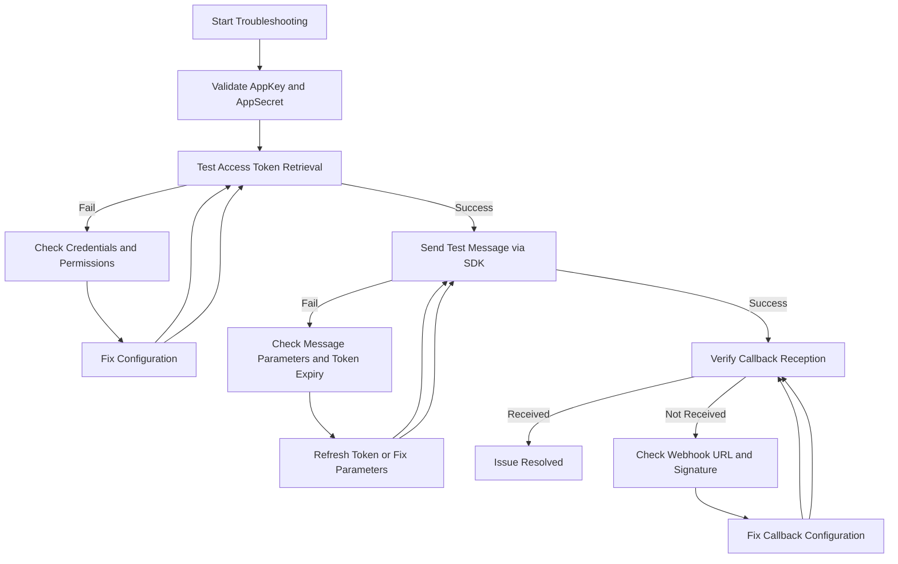

# Integration & Extension Troubleshooting

This troubleshooting guide is designed to help you diagnose and resolve issues encountered when integrating third-party instant messaging services (IMs) such as WeCom, DingTalk, and Feishu, connecting large language model (LLM) providers, or extending Magic with custom tools and plugins. It focuses specifically on the integration and extension points and explains where to find logs, how to proceed through diagnostic steps, and how to apply common fixes.

---

## 1. Common Troubleshooting Scenarios

### 1.1 Third-Party IM Integration Issues

**Symptoms:**
- Messages failing to send or receive
- Authentication errors with external IM platforms
- Callbacks (webhooks) from platforms not triggering
- Attachment downloads failing

**Typical Causes:**
- Misconfigured API keys or secrets
- Incorrect callback URLs or tokens
- Network connectivity or firewall blocking
- Token caching or expiration issues

**Diagnostic Steps:**
- Verify your application configuration includes correct `app_key` and `app_secret` values as required by the external IM platform.
- Confirm that callback URLs are reachable and configured exactly in the third-party platform settings.
- Check logs for error messages indicating authorization failures or network errors.
- Confirm token caching behavior—expired or missing tokens are a common cause of authentication failures.

### 1.2 Large Language Model Provider Connectivity Problems

**Symptoms:**
- No response or slow responses from AI models
- Authentication or API key validation failures
- Invalid or malformed request errors

**Typical Causes:**
- Incorrect or missing API keys in environment setup
- Connectivity restrictions (firewalls, proxies)
- Model provider configuration errors or rate limiting

**Diagnostic Steps:**
- Check environment variables or configuration files for valid API tokens.
- Use direct API client/test tools to verify connectivity.
- Review logs for request failures or timeouts.

### 1.3 Custom Tool and Plugin Extension Failures

**Symptoms:**
- Custom nodes fail during execution
- Plugins do not load or respond
- Events from extensions do not trigger

**Typical Causes:**
- Misconfigured registration or loading
- Coding errors or missing dependencies
- Improper event listener attachments

**Diagnostic Steps:**
- Verify tool/plugin registration steps have been followed correctly.
- Check extension logs and error messages.
- Review event wiring in custom code against platform event system guidelines.

---

## 2. Logging Locations and Debugging Tools

### 2.1 Platform Logs

Magic platform logs are the primary source of diagnostic information. Logs typically include:
- API error responses
- Internal exceptions
- Successful and failed token fetches
- Callback webhook processing results

#### Accessing Logs
- Use the CLI or your container orchestration tool to view Magic service logs.
- Centralized log aggregators (e.g., ELK, Loki) may be configured in production for easier access.

### 2.2 SDK Debug Logs

When using the Easy DingTalk SDK or other SDKs:
- Enable verbose or debug logging in your SDK client configuration to capture HTTP requests/responses.
- Look for errors in token retrieval methods (`getAccessToken()`, `getCorpAccessToken()`).
- SDK exceptions and error messages reveal context like missing credentials or bad requests.

### 2.3 Callback Request Logs

- Capture incoming webhook requests from IM platforms.
- Validate signature and payload using SDK or built-in verification utilities.
- Confirm that your endpoint URL is publicly accessible and returns proper HTTP status codes.

---

## 3. Recommended Debug Flow

To efficiently resolve integration and extension issues, follow this pragmatic workflow:

<Steps>
<Step title="Validate Configuration">
Confirm all key configuration parameters are set correctly:
- `app_key` and `app_secret` for IM integration
- Callback URLs and tokens
- API keys for LLM providers or other extensions
</Step>
<Step title="Check Connectivity and API Responses">
Test connectivity manually or through SDK calls:
- Use SDK methods (e.g., Easy DingTalk's `getAccessToken()`) to verify token generation.
- Send test messages or API requests to external services.
- Review immediate API responses for error codes or messages.
</Step>
<Step title="Inspect Logs for Errors or Warnings">
Review application and service logs from recent attempts:
- Identify authentication failures, timeout errors, missing permissions.
- Pinpoint any exceptions in custom code or unexpected failures.
</Step>
<Step title="Validate Callbacks and Webhook Processing">
Ensure the platform receives and processes external callbacks correctly:
- Confirm access and signature validation.
- Confirm that callback handlers execute without exceptions and update system state accordingly.
</Step>
<Step title="Debug Custom Extensions and Tools">
Use SDK debugging features and platform tracing for custom plugins:
- Enable detailed error reporting.
- Test extensions in isolation if possible.
- Check event wiring and lifecycle hooks conformity.
</Step>
<Step title="Consult Documentation and Community Resources">
Search for known issues, patch notes, or hints from Magic’s documentation and community forums.
</Step>
</Steps>

---

## 4. Practical Tips & Best Practices

- **Cache Tokens Correctly:** Avoid frequent token fetching by leveraging SDK caching. Expired tokens cause most authorization failures.
- **Use SDKs for Auth and API Calls:** SDKs abstract complex requests and token handling and provide clearer error messages.
- **Test with Minimal Configurations:** Simplify your environment variables and configuration when debugging to eliminate noise.
- **Secure Your Callback Endpoints:** Use strong tokens and encryption to protect inbound webhooks.
- **Log with Context:** Include timestamps, request IDs, and parameters in logs to correlate issues across systems.
- **Monitor Rate Limits & Quotas:** Exceeding provider limits may cause silent failures.

---

## 5. Common Error Messages and How to Respond

| Error Message                            | Cause                                       | Resolution                                 |
|----------------------------------------|---------------------------------------------|--------------------------------------------|
| '获取access_token失败' (Failed to get access token) | Invalid app_key or app_secret               | Check credentials and environment variables|
| '发送失败' (Send failed)                | Invalid message params or expired token     | Validate parameters; refresh tokens          |
| Callback signature verification failed  | Incorrect token or URL mismatch               | Correct callback token and verify webhook URL|
| '下载失败' (Download failed)             | File ID invalid or permission issues         | Verify file access rights and parameters     |

---

## 6. Troubleshooting Examples

### Example: Token Expiration Causing Message Sends to Fail

**Situation:** Messages sent via Easy DingTalk SDK return failures.

**Steps to Fix:**
- Confirm your `app_key` and `app_secret` are valid.
- Inspect SDK logs to see if `getAccessToken()` is called repeatedly.
- If token cache is missing or expired, clear cache or increase TTL.
- Restart the service and retry message sending.

### Example: Callback Messages Not Received

**Situation:** Your system receives no events from DingTalk or WeCom callbacks.

**Steps to Fix:**
- Verify callback URL is publicly reachable and returns HTTP 200.
- Confirm your callback verification token and encryption keys match those configured in Easy DingTalk.
- Ensure your firewall or reverse proxy forwards requests correctly.
- Check logs for webhook processing errors.

---

## 7. Where to Find Further Help

- **Official Docs:** Review the [Third-Party Messaging Integration Guide](https://docs.magic.com/guides/advanced-customization-integration/third-party-messaging-integration) and [Custom LLM Integration Guide](https://docs.magic.com/guides/advanced-customization-integration/custom-llm-integration).
- **SDK Debugging:** Use the Easy DingTalk SDK README and SDK troubleshooting guides.
- **Community Forums:** Engage with the Magic user community to share experiences and solutions.
- **Support Channels:** Contact official Magic support for urgent or complex issues.

---

## 8. Summary Diagram of Typical IM Integration Debug Flow

---

For detailed API references and SDK usage examples, please see related documentation pages for sending messages, user and group lookups, and callback handling APIs.

---

_Last updated: main branch_

---

### Links to Related Documents

- [Easy DingTalk SDK Quickstart](https://github.com/dtyq/magic/blob/main/backend/easy-dingtalk/README.md)
- [Third-Party Messaging Integration Guide](https://docs.magic.com/guides/advanced-customization-integration/third-party-messaging-integration)
- [Custom LLM Integration Guide](https://docs.magic.com/guides/advanced-customization-integration/custom-llm-integration)
- [SDK Usage & Code Samples](https://docs.magic.com/api-reference/errors-tools-sdks/sdk-usage-examples)
- [Callback & Event Handling API](https://docs.magic.com/api-reference/im-conv-messaging/callback-handling)
- [Troubleshooting Common Runtime Errors](https://docs.magic.com/faq/platform-troubleshooting/troubleshooting-runtime-errors)

---