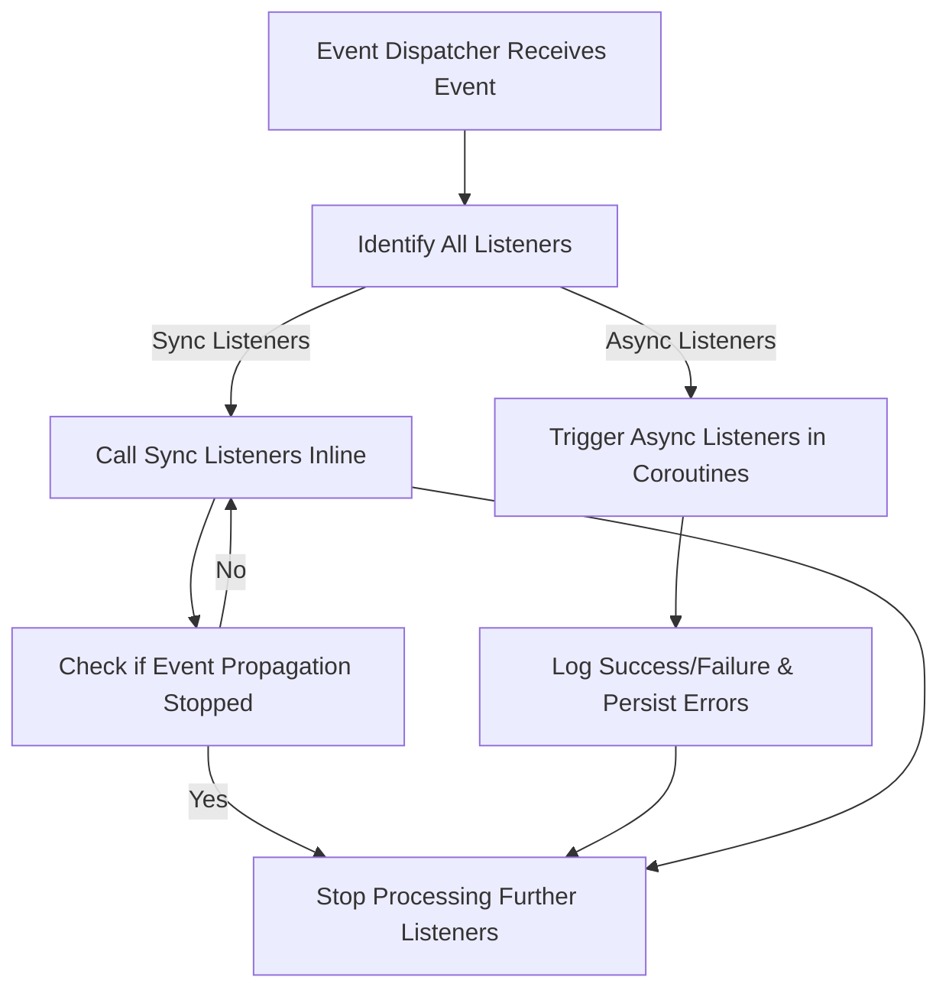

# Using and Extending the Event System

Harness the full power of Magic's event-driven architecture to create custom triggers, automations, and notifications that seamlessly integrate across Magic Flow and Super Magic. This guide empowers you to understand, implement, and extend Magic's asynchronous and synchronous event handling patterns, leveraging subscriber hooks and customized listeners to automate workflows and enrich your AI solutions.

---

## 1. Understanding Magic's Event System

Magic adopts a robust event dispatching mechanism built on asynchronous and synchronous listener support. Events represent notable actions or state changes occurring within Magic's core components, such as user authentication, workflow steps, or AI agent triggers.

When an event is dispatched, Magic routes it to registered listeners—both synchronous listeners (processed immediately) and asynchronous listeners (processed deferred in coroutines). This design ensures responsiveness and scalability.

**User Value:** You'll be able to react programmatically to internal system events, orchestrate AI workflows dynamically, and customize notifications or integrations across Magic's ecosystem.

---

## 2. Key Concepts of the Event System

- **Event:** A data object carrying information about an occurrence (e.g., `ApiKeyValidatedEvent`).
- **Listener:** A callback or class that processes an event.
- **AsyncListener:** A special annotation indicating a listener handles events asynchronously.
- **Event Dispatcher:** Component responsible for delivering events to their listeners.

This layered design allows you to subscribe to core system events and create your own for custom use cases.

---

## 3. How Event Dispatching Works in Magic

### 3.1 Dispatching Workflow

1. **Event Creation:** An event object is instantiated representing a system action.
2. **Dispatching:** The `AsyncEventDispatcher` sends events to all registered listeners.
3. **Listener Categorization:**
    - Async listeners run in coroutines, offering non-blocking parallelism.
    - Sync listeners run inline.
4. **Error Handling:** If asynchronous listeners fail, failed event data is saved for diagnostics.
5. **Logging:** Success and failure of listener processing are logged for observability.

### 3.2 Example Listener Implementation

```php
namespace App\Application\Authentication\Event\Subscribe;

use App\Domain\Authentication\Event\ApiKeyValidatedEvent;
use Dtyq\AsyncEvent\Kernel\Annotation\AsyncListener;
use Hyperf\Event\Annotation\Listener;
use Hyperf\Event\Contract\ListenerInterface;
use Psr\Container\ContainerInterface;

#[AsyncListener]
#[Listener]
class ApiKeyValidatedSubscriber implements ListenerInterface
{
    public function __construct(private ContainerInterface $container) {}

    public function listen(): array
    {
        return [ApiKeyValidatedEvent::class];
    }

    public function process(object $event): void
    {
        if (! $event instanceof ApiKeyValidatedEvent) {
            return;
        }

        // Your custom handling logic here
        // For example, update last usage time of API keys
    }
}
```

This pattern enables you to hook directly into critical system events with async execution for performance.

---

## 4. Creating Your Own Custom Event and Listener

To leverage the event system for your automation or integrations, follow these steps:

<Steps>
<Step title="Define Your Event Class">
Create a PHP class representing your custom event with the data you need to pass. For example:

```php
class WorkflowCompletedEvent
{
    private string $workflowId;
    private string $userId;

    public function __construct(string $workflowId, string $userId)
    {
        $this->workflowId = $workflowId;
        $this->userId = $userId;
    }

    public function getWorkflowId(): string { return $this->workflowId; }
    public function getUserId(): string { return $this->userId; }
}
```
</Step>
<Step title="Create an Event Listener">
Implement a listener class that subscribes to your event and performs necessary actions:

```php
use Dtyq\AsyncEvent\Kernel\Annotation\AsyncListener;
use Hyperf\Event\Contract\ListenerInterface;

#[AsyncListener]
#[Listener]
class WorkflowCompletedListener implements ListenerInterface
{
    public function listen(): array
    {
        return [WorkflowCompletedEvent::class];
    }

    public function process(object $event): void
    {
        if (! $event instanceof WorkflowCompletedEvent) {
            return;
        }

        // Insert your automation or notification logic here
    }
}
```
</Step>
<Step title="Dispatch Your Event">
Trigger your event at the appropriate moment in your code:

```php
use Dtyq\AsyncEvent\AsyncEventDispatcher;

$event = new WorkflowCompletedEvent($flowId, $userId);
$dispatcher = make(AsyncEventDispatcher::class);
$dispatcher->dispatch($event);
```
Your listener will automatically receive the event and execute accordingly.
</Step>
</Steps>

---

## 5. Practical Use Cases

- **Automated Notifications:** Send alerts or emails when workflows complete or errors occur.
- **AI Workflow Triggers:** Initiate LLM agents or knowledge retrieval steps dynamically based on event state.
- **Auditing & Logging:** Capture detailed histories by subscribing to authentication or data modification events.
- **Third-Party Integrations:** Link with messaging platforms or external APIs in response to system events.

---

## 6. Best Practices and Tips

- **Use Async Listeners for Non-Critical or Time-Consuming Tasks:** Keep main application flow responsive.
- **Handle Exceptions Gracefully:** Async failures automatically persist – use logs for diagnostics.
- **Avoid Heavy Logic in Synchronous Listeners:** Blocked listeners delay primary workflows.
- **Maintain Clear Separation:** Keep listeners focused on a single responsibility for maintainability.
- **Leverage Dependency Injection:** Use container-aware listeners to integrate services and domain logic.

---

## 7. Troubleshooting Common Issues

<AccordionGroup title="Troubleshooting the Event System">
<Accordion title="Async Listener Not Being Triggered">
- Confirm your listener class is annotated with `#[AsyncListener]` and `#[Listener]`.
- Verify your listener is registered in the container.
- Check for PHP errors or exceptions in logs.
- Ensure event class names match exactly.
</Accordion>
<Accordion title="Event Dispatch Does Not Seem to Execute Listeners">
- Verify that the event dispatcher instance is correctly injected or fetched.
- Confirm listeners have correct `listen()` return event types.
- Check for propagation stopping in sync listeners (events implementing `StoppableEventInterface`).
</Accordion>
<Accordion title="Async Listener Failures Are Logged But Not Resolved">
- Inspect the async event failure storage for failed event data.
- Review exception stack traces in logs.
- Debug listener logic with test cases or simplified handlers.
</Accordion>
</AccordionGroup>

<Tip>
Enable debug logging temporarily to trace event dispatching internals and verify listener invocation.
</Tip>

---

## 8. Extending the Event System

Magic's event system design supports advanced extensions:

- **Custom Event Queues:** Modify or add event queues for scaled handling.
- **Event Replay:** Design reprocessing workflows for failed event handling.
- **Global Event Middleware:** Intercept and modify events or listener calls.
- **Chained Event Handling:** Dispatch new events from listeners to build complex workflows.

Explore the `AsyncEventDispatcher` source code in the repository to understand and extend internals:

<Source url="https://github.com/dtyq/magic" paths={[{"path": "backend/async-event/src/AsyncEventDispatcher.php", "range": "1-110"}]} branch="main" />

---

## 9. Diagram: Event Dispatch Flow



---

## 10. Next Steps & Related Documentation

- Explore **[Building Visual AI Workflows with Magic Flow](/guides/getting-started/workflow-orchestration)** to integrate event-driven triggers in flows.
- Review **[Creating Your First AI Agent (Super Magic Walkthrough)](/guides/getting-started/first-ai-agent)** for harnessing event responses in AI agents.
- For troubleshooting startup and runtime errors, see **[Troubleshooting Common Setup Issues](/getting-started/validation-troubleshooting/common-setup-issues)**.
- Dive into **[Advanced Custom Tools and Plugins](/guides/advanced-customization-integration/custom-tools-plugins)** for creating custom workflow nodes responding to events.
- Consult the **AsyncEventDispatcher** source for implementation insights: [AsyncEventDispatcher.php](https://github.com/dtyq/magic/blob/main/backend/async-event/src/AsyncEventDispatcher.php).

Harness Magic's event-driven extensibility to automate, integrate, and innovate with confidence and control.

---