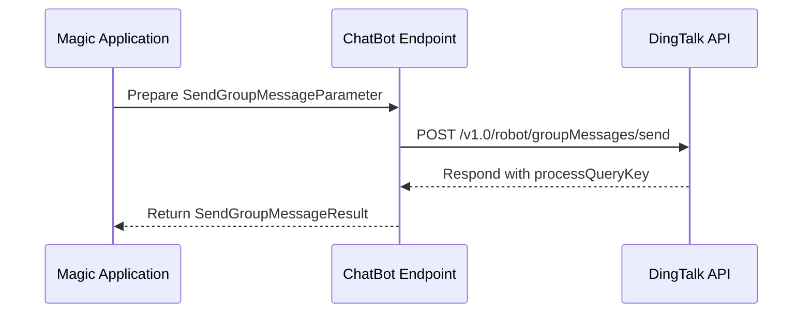

# Integrating with Third-Party Messaging (WeCom, DingTalk, Feishu)

Welcome to the integration guide for connecting Magic with major enterprise messaging platforms. This page provides practical, hands-on instructions and examples to enable cross-platform chatbot interactions, workflow triggers, and seamless team collaboration by integrating Magic with WeCom, DingTalk, and Feishu.

---

## 1. Introduction

Magic is designed to integrate smoothly with leading enterprise messaging apps, enabling your AI agents and automated workflows to interact directly within those communication ecosystems. This integration empowers your teams with AI-driven collaboration and automation embedded inside their daily messaging tools.

This guide focuses on the DingTalk integration as a representative example, showcasing how Magic sends one-on-one and group chat messages, downloads files, and manages conversations.


## 2. Key Integration Scenarios

- **Sending Messages**
  - One-on-one chat messages from bot to users
  - Group chat messages from bot to conversation groups
- **Creating Conversation Groups**
  - Scene groups with customized templates
  - Standard chat groups
- **Handling Attachments**
  - Downloading files shared within chats
- **User Information Retrieval**
  - Linking phone numbers to DingTalk user IDs, enriching chat context


## 3. Prerequisites

Before beginning integration setup:

- Obtain valid access tokens for your DingTalk Open Platform application.
- Register and provision your robot(s) within DingTalk to get Robot Codes.
- Have user IDs and/or conversation IDs ready for bots to send messages.
- Ensure your Magic deployment has network access to DingTalk's API endpoints.
- Prepare JSON message templates for chat content.


## 4. Sending One-on-One Chat Messages

Use Magic’s ChatBot endpoint to send personalized markdown messages directly to individual DingTalk users.

### Steps:

1. **Create a SendOneOnOneChatMessagesParameter object** with:
   - Your `accessToken` from DingTalk Open Platform.
   - The bot's `robotCode`.
   - An array of one or more `userIds` (DingTalk user IDs).
   - A `msgKey` representing the message type (e.g., `sampleMarkdown`).
   - A `msgParam` stringified JSON containing the message title and markdown-formatted text.

2. **Invoke the `sendOneOnOneChatMessages` method** on the `ChatBotEndpoint` with this parameter.

3. **Verify successful sending** by checking the returned result and absence of exceptions.


### Example Code Snippet
```php
$param = new SendOneOnOneChatMessagesParameter($accessToken);
$param->setRobotCode('your-robot-code');
$param->setUserIds(['user-id-1']);
$param->setMsgKey('sampleMarkdown');
$param->setMsgParam(json_encode([
    'title' => 'Greetings from Magic',
    'text' => 'Hello! This is a message with **markdown** support.',
], JSON_UNESCAPED_UNICODE));

$result = $chatBotEndpoint->sendOneOnOneChatMessages($param);
```

### Expected Result
- A successful API response containing a `processQueryKey` indicating message dispatch.
- If the request fails, an exception will be raised.


## 5. Sending Group Messages

Bots can send rich text or markdown messages to DingTalk group chats using conversation IDs.

### Steps:

1. **Prepare a SendGroupMessageParameter** with:
   - Your valid API access token.
   - The `robotCode` of your bot.
   - The `openConversationId` identifying the target group chat.
   - The `msgKey` (e.g., `sampleMarkdown`).
   - A JSON serialized `msgParam` with message content.

2. **Call the `sendGroupMessage` method** on the ChatBot Endpoint.

3. **Handle the response** and confirm successful message sending.


### Example Code Snippet
```php
$param = new SendGroupMessageParameter($accessToken);
$param->setRobotCode('your-robot-code');
$param->setOpenConversationId('group-conversation-id');
$param->setMsgKey('sampleMarkdown');
$param->setMsgParam(json_encode([
    'title' => 'Team Update',
    'text' => '# Hello team, this is an update',
], JSON_UNESCAPED_UNICODE));

$result = $chatBotEndpoint->sendGroupMessage($param);
```

### Expected Result
- Receive confirmation with a `processQueryKey`.
- Invocation failures raise errors.


## 6. Downloading Files Shared in Chats

Bots often need to process file attachments. Magic’s integration supports downloading files shared by users via DingTalk.

### Steps:

1. **Create a DownloadFileParameter** specifying:
   - The `robotCode`.
   - The `downloadCode` from the message content.
   - The API access token.

2. **Use the `downloadFile` method** of the ChatBot Endpoint.

3. **Retrieve a downloadable URL** for accessing the file.


### Example Usage
```php
$param = new DownloadFileParameter($accessToken);
$param->setRobotCode('your-robot-code');
$param->setDownloadCode('download-code-from-chat');

$result = $chatBotEndpoint->downloadFile($param);
$fileUrl = $result->getDownloadUrl();
```

### Expected Outcome
- You will obtain a valid URL to download or process the file.
- Failure triggers a download error exception.


## 7. Creating Conversation Groups

Magic supports the creation of both standard groups and scene groups in DingTalk, useful for structuring conversations with specific identities, owners, members, and templates.

### Creating a Scene Group

- Use `CreateSceneGroupParameter` to specify group title, owner, user list, template ID, and optional permissions.
- Call `createSceneGroup` on the Conversation Endpoint.
- Receive the `openConversationId` on success.

### Creating a Standard Group

- Use `CreateGroupParameter` with group name, owner, user list, and settings.
- Invoke `createGroup` on the Conversation Endpoint.
- Receive the `chatid` of the new group.

### Example
```php
$param = new CreateSceneGroupParameter($accessToken);
$param->setTitle('Project Team Alpha');
$param->setOwnerUserId('owner-userid');
$param->setUserIds('user1,user2,user3');
$param->setTemplateId('template-id');

$result = $conversationEndpoint->createSceneGroup($param);
$openConversationId = $result->getOpenConversationId();
```

### Tips
- Choose Scene Groups if you need advanced templates and role management.
- Use Standard Groups for simpler team chats.


## 8. Best Practices & Tips

- **Validate parameters carefully:** Missing required fields like `robotCode`, `openConversationId`, or `msgParam` cause API errors.
- **Use JSON serialization properly:** Message parameters must be JSON-encoded strings matching the expected DingTalk message formats.
- **Handle exceptions gracefully:** Network errors or API rejections should be logged and trigger retries or user notifications.
- **Leverage caching:** User details and tokens can be cached to reduce API overhead.
- **Manage message size and content:** DingTalk messages have size limits—avoid overly large payloads.


## 9. Troubleshooting

<AccordionGroup title="Common Issues with Integration">
<Accordion title="Message Sending Fails with '发送失败'">
This error indicates missing or invalid parameters, or token expiration.

- Verify `accessToken` validity.
- Ensure all required fields in parameters are set.
- Check API service status and network connectivity.
</Accordion>
<Accordion title="File Download URL is Empty or Invalid">
- Confirm `downloadCode` matches the file.
- Validate that the robot has permissions to access the file.
- Retry after ensuring token freshness.
</Accordion>
<Accordion title="Unexpected Exceptions or Timeouts">
- Network latency can cause timeouts, especially when downloading files.
- Implement retry mechanisms with exponential backoff.
- Check server logs for error details.
</Accordion>
</AccordionGroup>


## 10. Frequently Asked Questions

**Q: How to get RobotCode and OpenConversationId?**

- RobotCode is assigned when you create a bot in DingTalk Open Platform.
- OpenConversationId comes from group creation APIs or DingTalk backend.

**Q: Can I send messages to multiple users at once?**

Yes, for one-on-one chat messages, provide an array of user IDs.

**Q: What message formats are supported?**

Markdown and text formats are common; message keys like `sampleMarkdown` identify the type.


## 11. Next Steps & Related Content

- Explore the [Magic IM Guide](guides/getting-started/ai-im-setup) to activate collaborative AI chat.
- Review [Group Conversation Bots Guide](guides/real-world-examples/group-conversation-bots) for AI-enabled group chats.
- Consult the [API Reference: Send Messages & Conversations](api-reference/im-conv-messaging/send-messages) for detailed endpoint info.
- Deep dive into [Conversation Management](backend/easy-dingtalk/src/OpenDev/Endpoint/Conversation/ConversationEndpoint.php) for full group creation capabilities.


---

## Appendix: Simplified Flow for Sending a Group Message




---

## Useful Links

- [DingTalk Bot Sending Group Message Official Docs](https://open.dingtalk.com/document/orgapp/the-robot-sends-a-group-message)
- [Magic ChatBot Endpoint Source](https://github.com/dtyq/magic/blob/main/backend/easy-dingtalk/src/OpenDev/Endpoint/ChatBot/ChatBotEndpoint.php)
- [Create Scene Group Docs](https://open.dingtalk.com/document/orgapp/create-scene-group)


---

This practical guide equips you to connect Magic with key messaging platforms, unlocking powerful conversational AI capabilities directly in your team communications.


---