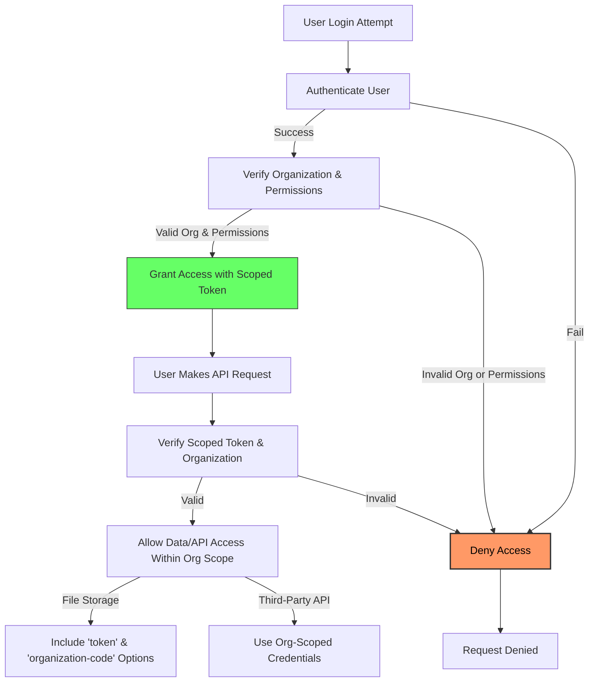

# Securing and Isolating Your AI Deployment

---

## Overview

This guide helps platform administrators and developers secure their Magic AI deployment in multi-tenant environments. It focuses on safeguarding organizational boundaries, managing user permissions effectively, and enforcing strict data isolation to prevent leakage across tenant boundaries. By following this guide, you will enhance your deployment's resilience to unauthorized access and ensure compliance with enterprise security standards.

---

## 1. Understanding Multi-Tenant Security in Magic

Magic is designed to support multiple organizations (tenants) operating within a shared deployment. Each organization’s data, permissions, and workflows must remain strictly isolated for security and privacy.

Key security concerns addressed here include:

- Preventing cross-organization data visibility or modification
- Controlling user and agent permissions scoped to organizational context
- Ensuring secure integration with external services (e.g., messaging platforms, file storage)

---

## 2. Prerequisites

Before configuring security and isolation:

- Ensure Magic is properly installed and running per the [Installation Guide](/getting-started/prerequisites-installation/installation-guide).
- Have administrator access to Magic’s configuration files and management APIs.
- Understand your organizational hierarchy and user roles.
- Set up any external integrations (e.g., DingTalk, file services) with organization-specific credentials.

---

## 3. Managing Organizations and User Permissions

### Step 1: Define Organizations Clearly

In Magic, organizations represent isolated tenant containers. All users, data, and AI agents belong to a defined organization.

- Use the admin console or API to create organizations matching your business units or clients.
- Assign unique identifiers, such as `organization-code`, to enforce scoping.

### Step 2: Assign Users to Organizations

- Users must be explicitly linked to one or more organizations.
- Ensure authentication modules support organization-aware login (see [Authentication Methods](/security/authentication-and-access/authentication-methods)).

### Step 3: Set Permission Levels

- Use Magic’s permission system to assign roles and access controls scoped to each organization.
- Roles include admin, regular user, and AI agent with permissions such as read, write, manage workflows, or manage integrations.

### Step 4: Use Scoped Tokens for API Access

- When generating API tokens or onboarding users, include organization scope.
- Validate tokens on each request to confirm user/agent belongs to the target organization.

<Tip>
Always rotate tokens regularly and restrict scopes to least-privilege necessary.
</Tip>

---

## 4. Ensuring Data Isolation

The core of multi-tenant security lies in robust data isolation.

### Step 1: Enable Strict Data Partitioning

- Magic separates data by `organization-code` internally.
- All data storage, including workflow instances, documents, and messages, is tagged and filtered accordingly.

### Step 2: Guard Access at API and UI Layers

- The platform enforces that users and AI agents can only query or manipulate data within their organization.
- Requests missing valid organizational context or permissions are rejected.

### Step 3: Use Scoped File Storage Access

For any integration with file services (see [Cloud File SDK guide](/deployment/advanced-environment-configuration/storage-and-file-driver-configuration)):

- Pass the organization's token and identifier in every file operation request.
- Validate options such as `token` and `organization-code` when performing file upload, download, deletion, or metadata retrieval.

Here is a typical usage example when uploading a file using the Cloud File SDK:

```php
$filesystem = $cloudFile->get('file_service_test');
$options = [
    'token' => 'your-organization-token',
    'organization-code' => 'your-org-code',
    'cache' => false, // Recommended false for live verification
];
$uploadFile = new UploadFile('/path/to/your/file.txt', 'easy-file');
$credentialPolicy = new CredentialPolicy(['sts' => false]);
$filesystem->uploadByCredential($uploadFile, $credentialPolicy, $options);
```

### Step 4: Audit and Monitor Access

Enable audit logging to record:

- User logins and token usage
- API requests with organization context
- File operations and external service calls

Regularly review logs to detect suspicious activity or potential data leakage attempts.

---

## 5. Configuring Secure Third-Party Integrations

### Using Enterprise Messaging Integrations (e.g., DingTalk)

- Configure per-organization app keys, secrets, and callback configurations.
- Validate the received callback events to ensure they're signed correctly using tokens and AES keys defined for each organization's integration.

Example snippet from Easy DingTalk's callback configuration:

```php
$callbackConfig = [
    'token' => 'organization-specific-token',
    'aes_key' => 'organization-specific-aes-key',
];
$dingCallbackConfig = new DingCallbackConfig($callbackConfig);
```

### Securing Access Tokens

- Access tokens retrieved from third-party integrations are cached with organization scoping.
- Use built-in token management functions that validate and refresh tokens securely.

### Handling Requests with Scoped Credentials

Always include organization-scoped credentials in requests to external services:

```php
$apiOptions = [
    'app_key' => 'org-app-key',
    'app_secret' => 'org-app-secret',
    'callback_config' => $callbackConfig,
];
```

This ensures the platform only interacts with third-party resources within the authorized organization's scope.

---

## 6. Best Practices for Secure Deployment

- **Least Privilege**: Grant only necessary permissions to users and AI agents.
- **Token Management**: Use short-lived tokens and rotate keys frequently.
- **Environment Separation**: Use separate environments for development, testing, and production.
- **Secure Configuration**: Store secrets using environment variables or vaults, avoiding hardcoded values.
- **Network Controls**: Restrict access to the Magic deployment and external services by IP whitelisting and firewall rules.
- **Regular Audits**: Conduct security audits and penetration testing focused on multi-tenant isolation.

---

## 7. Troubleshooting Common Issues

<AccordionGroup title="Common Multi-Tenant Security Issues">
<Accordion title="Users Unable to Access Their Organization's Data">
Ensure the user's authentication token includes the correct organization scope. Verify that the organization code matches the assigned organization in the database.
</Accordion>
<Accordion title="Cross-Organization Data Leakage Detected">
Check that all database queries and API calls include organization filters. Review middleware or API handlers that may omit scoping logic.
</Accordion>
<Accordion title="Third-Party Integration Token Refresh Fails">
Verify organization-specific app secrets and tokens are correctly set and not expired. Confirm your configuration matches those in the third-party platform.
</Accordion>
<Accordion title="File Uploads Fail With Permission Errors">
Confirm the `token` and `organization-code` are properly passed in file operation options. Disable caching during troubleshooting to get real-time feedback.
</Accordion>
</AccordionGroup>

---

## 8. Summary

Implementing the security and isolation practices outlined ensures that your Magic deployment protects organizational data boundaries and user permissions rigorously. Multi-tenant security is foundational to maintaining trust and compliance in enterprise scenarios.

Use this guide to configure, verify, and maintain secure, isolated AI-powered environments that serve multiple clients or internal business units safely.

---

## 9. Next Steps & Related Documentation

- [Authentication Methods](/security/authentication-and-access/authentication-methods) — Deep dive into supported login and auth workflows.
- [Multi-Organization and Tenant Isolation](/security/authentication-and-access/multi-organization-and-tenant-isolation) — Advanced concepts and best practices.
- [Cloud File SDK Configuration](/deployment/advanced-environment-configuration/storage-and-file-driver-configuration) — Detailed file storage integration and security.
- [Third-Party Messaging Integration Guide](/guides/advanced-customization-integration/third-party-messaging-integration) — Setup for DingTalk and other platforms respecting org isolation.
- [System Config Management](/guides/best-practices-optimization/system-config-management) — How to handle secrets and config safely across environments.

---

## 10. Illustration: Multi-Tenant Security Flow



This flow shows the core verification steps ensuring every action respects organizational boundaries.

---