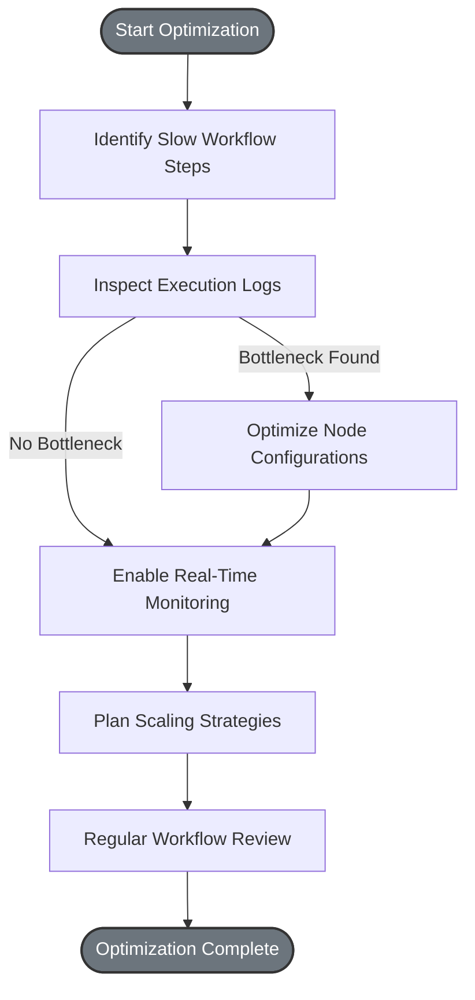

# Optimizing Workflow Performance at Scale

## Workflow Performance Optimization Overview
This guide empowers you to efficiently debug slow workflows, monitor their execution in real time, optimize resource usage, and scale your Magic workflows effectively across large teams and extensive document volumes. By following the best practices outlined here, you will gain the insights and tools necessary to maintain responsive, reliable, and scalable workflow automation.

---

### Who Should Use This Guide?
- Workflow designers handling large or complex flows
- System administrators managing resource allocation and monitoring
- IT and DevOps teams responsible for scaling Magic deployment
- AI developers aiming to improve execution speed and reduce latency

### Prerequisites
- You have existing workflows built and deployed on the Magic platform
- Access to the Magic web UI and monitoring tools
- Basic understanding of workflow execution concepts
- Permissions to view logs and system performance metrics

### What You Will Achieve
- Identify and resolve common bottlenecks causing slow flow execution
- Monitor workflow runs with real-time observability
- Optimize resource consumption within workflows
- Scale workflows across large teams and high document volumes with confidence

### Estimated Time
20-40 minutes for initial optimization; ongoing monitoring recommended

---

## Step-by-Step Guide to Optimizing Workflow Performance

### 1. Identify Slow or Inefficient Workflow Steps
- Navigate to the workflow execution dashboard in the Magic Web UI.
- Locate workflows exhibiting long execution times or frequent delays.
- Drill down into specific nodes with high latency or repeated errors.

**Expected Result:** You will have a clear list of problematic steps impacting overall flow performance.

<Tip>
Use the execution logs accessible from the workflow detail pages to spot slow nodes.
Look for nodes with lengthy response times or heavy retry counts.
</Tip>

---

### 2. Leverage Real-Time Observability and Monitoring
- Enable real-time metrics and logs for your workflow executions.
- Use built-in dashboards or integrate with external monitoring tools as applicable.
- Set up alerts for abnormal latencies or resource spikes.

**Expected Result:** You gain live insights into workflow health, allowing proactive issue detection.

<Note>
Real-time observability is essential in large-scale environments to catch transient bottlenecks before they impact users.
</Note>

---

### 3. Optimize Resource Usage Within Workflows
- Review node configurations for excessive or unnecessary operations.
- Simplify complex branches or lookups to reduce execution overhead.
- Cache reusable data elements across workflow runs if supported.
- Adjust asynchronous vs synchronous execution settings to balance load.

**Expected Result:** Streamlined workflows consume fewer resources and run faster without sacrificing functionality.

---

### 4. Scale Workflows for Large Teams and Document Volumes
- Organize workflows by team ownership with clear permission boundaries.
- Use environment codes or namespaces to segregate workloads.
- Partition high-volume document processing across parallel flows when possible.
- Regularly archive completed workflow logs and outputs to reduce storage impact.

**Expected Result:** Your Magic deployment supports more users and larger document sets efficiently.

<Tip>
Consider deploying multiple workflow execution nodes or services to distribute load horizontally.
Coordinate scaling efforts with your infrastructure team for resource provisioning.
</Tip>

---

### 5. Regularly Review and Update Workflows
- Monitor workflow execution trends over time to anticipate scaling needs.
- Refactor workflows incrementally to implement learned optimizations.
- Keep Magic platform and components up to date to benefit from performance improvements.

**Expected Result:** Your workflows remain effective, scalable, and aligned with evolving enterprise needs.

---

## Common Bottlenecks and How to Mitigate Them

<AccordionGroup title="Bottleneck Mitigation Strategies">
<Accordion title="API Call Latency">
- Problem: External API calls within nodes causing delays.
- Solution: Use asynchronous calls, add retry logic with backoff, and cache frequent responses.
</Accordion>
<Accordion title="Data Volume Overload">
- Problem: Processing large document batches slows execution.
- Solution: Split documents into smaller chunks, process in parallel flows, and archive processed data.
</Accordion>
<Accordion title="Synchronous Node Blocking">
- Problem: Long-running synchronous nodes block subsequent steps.
- Solution: Convert nodes to asynchronous processing where feasible; use event-driven triggers.
</Accordion>
<Accordion title="Excessive Logging and Monitoring Load">
- Problem: Over-logging can degrade performance.
- Solution: Adjust log verbosity based on environment; use sampling or conditional logging.
</Accordion>
</AccordionGroup>

---

## Practical Example: Debugging and Optimizing a Slow Approval Workflow

1. Open the Magic Flow dashboard and identify the approval flow with slow task completion.
2. View execution logs to find that the 'Risk Assessment' node frequently times out.
3. Adjust the node to cache assessment results for repeated requests.
4. Change the node to run asynchronously, allowing parallel processing of submissions.
5. Monitor the flow post-update and observe improved throughput and reduced latency.

---

## Troubleshooting Tips

- **Workflow Suddenly Slows Down:** Check for recent changes or external service outages.
- **No Execution Logs Appear:** Confirm monitoring is enabled and check permission settings.
- **Resource Usage Surges Unexpectedly:** Identify large data inputs or runaway loops; add limits.
- **Workflow Fails at Specific Node:** Review node parameters and external dependencies.

<Warning>
Always test workflow changes in a staging environment before production deployment.
</Warning>

---

## Next Steps and Additional Resources

- Explore the [Building Visual AI Workflows with Magic Flow](/guides/getting-started/workflow-orchestration) to improve your workflow design.
- Learn about [Scaling & High Availability](/deployment/scaling-monitoring-and-resilience/scaling-and-high-availability) for infrastructure considerations.
- Refer to [Monitoring & Logging Overview](/deployment/scaling-monitoring-and-resilience/monitoring-and-logging-overview) to deepen observability skills.
- For custom optimization techniques, see [Custom Tools and Plugins](/guides/advanced-customization-integration/custom-tools-plugins).
- Stay updated with the latest [Performance Optimization Strategies](/concepts/performance-scalability/performance-optimizations).

---

## Summary
Optimizing workflow performance at scale is critical to ensuring Magic delivers timely, reliable AI-driven automation across large user bases and document stores. This guide equips you with tactical steps to identify bottlenecks, leverage observability, streamline workflows, and maintain scalability. Adopt these best practices to unlock sustained efficiency and superior user experience.

---

## Related Documentation
- [Workflow Orchestration Guide](/guides/getting-started/workflow-orchestration)
- [System Configuration Management](/guides/best-practices-optimization/system-config-management)
- [Scaling and High Availability](/deployment/scaling-monitoring-and-resilience/scaling-and-high-availability)
- [Monitoring and Logging Overview](/deployment/scaling-monitoring-and-resilience/monitoring-and-logging-overview)
- [Troubleshooting Common Setup Issues](/getting-started/validation-troubleshooting/common-setup-issues)

## Diagram: Performance Optimization Workflow

