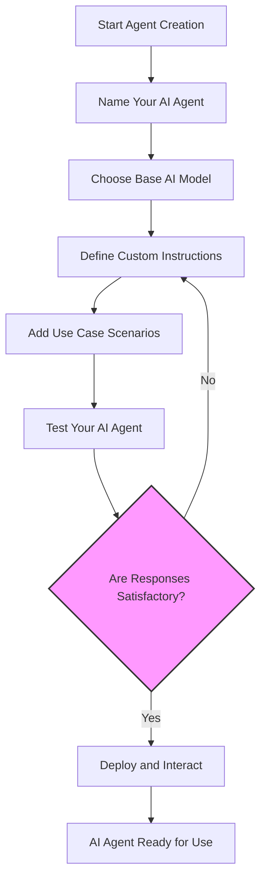

# Creating Your First AI Agent (Super Magic Walkthrough)

Welcome to your hands-on guide for building and customizing your first AI Agent using Super Magic. This walkthrough will empower you to create a versatile AI assistant tailored to solve real-world business challenges through custom instruction sets and practical use cases.

---

## 1. Overview of the Workflow

### What You Will Accomplish
This guide walks you through the entire process of creating an AI Agent from scratch using Super Magic. You will learn how to:

- Build a general-purpose AI Agent
- Customize its behavior with instruction sets
- Interact effectively with your AI Agent
- Apply your agent to solve common business use cases

### Prerequisites
Before you begin, ensure you have:

- Installed and launched Magic platform with core services running
- Access to the Super Magic AI Agent creation interface
- Basic familiarity with AI and Magic’s user interface (see [Quickstart: From Zero to Magic Productivity](https://your-docs-url/guides/getting-started/quickstart-workspace))

### Expected Outcome
By following this guide, you will have a fully functional AI Agent ready to assist with diverse tasks tailored to your organization's business challenges. You will also understand how to modify and extend the agent’s capabilities.

### Estimated Time
Allow 30-45 minutes to complete this walkthrough for a smooth experience.

### Difficulty Level
Beginner to Intermediate — no prior programming experience required.

---

## 2. Step-by-Step Instructions

Follow these steps sequentially to create and customize your AI Agent.

### Step 1: Access the Super Magic Agent Builder

1. Log in to your Magic platform dashboard.
2. Navigate to the **Guides > Getting Started & Core Workflows** section.
3. Select **Creating Your First AI Agent (Super Magic Walkthrough)**.
4. Click on **Start New Agent** to open the AI Agent builder interface.

> **Expected Result:** The AI Agent creation page is displayed, presenting options for naming your agent and configuring its behavior.

---

### Step 2: Name Your AI Agent

1. In the **Agent Name** field, enter a meaningful name that reflects the agent’s purpose (e.g., ‘CustomerSupportBot’ or ‘SalesAssistant’).
2. Confirm the name by clicking **Next** or **Save**.

> **Expected Result:** Your agent is identified clearly in the system for easy management and retrieval.

---

### Step 3: Choose a Base AI Model

1. From the available AI model options, select one that suits your technical requirements and business context.
   - For example, choose ChatGPT for natural conversational skills or an open-source model for privacy-sensitive use.
2. Review the model’s description and capabilities.
3. Confirm your selection to proceed.

> **Decision Point:** If you are unsure which model to pick, start with a well-balanced, general-purpose model recommended by Magic.

---

### Step 4: Define Custom Instructions

This is where you personalize your AI Agent’s behavior.

1. Open the **Custom Instructions** panel.
2. Write clear, directive prompts that guide how the AI should respond.
   - Examples:
     - "Always respond politely and provide detailed explanations."
     - "Prioritize customer privacy and never share sensitive data."
3. Save the instruction set.

> **Best Practice:** Use explicit, natural language to describe what you expect from the AI. Avoid vague or overly technical phrasing.

---

### Step 5: Add Use Case Scenarios

Tailor your agent to real business challenges.

1. Click on **Add Use Case**.
2. Describe scenarios your agent will handle. Examples:
   - Answer FAQs about products or services
   - Schedule meetings based on user availability
   - Generate sales leads from conversational data
3. Link these scenarios to trigger conditions or workflows if available.

> **Expected Result:** Your agent is aware of specific contexts it can assist with, improving relevance and user satisfaction.

---

### Step 6: Test Your AI Agent

1. From the agent interface, select **Test Agent**.
2. Enter sample inputs or queries that reflect your use cases.
3. Evaluate the responses for accuracy, tone, and helpfulness.
4. If needed, go back and refine instructions or scenarios.

> **Verification:** The agent responds as intended, showing understanding aligned with your custom instructions.

---

### Step 7: Deploy and Interact

1. Once confident, click **Deploy Agent** to make it active for end-users.
2. Use the interaction interface or integrate the agent with your communication channels.
3. Monitor agent performance and collect feedback for continuous improvement.

> **Tip:** Start with a limited deployment to a controlled user group for real-world testing.

---

## 3. Real-World Examples

### Example: Customer Support AI

**Agent Name:** SupportHelper

**Custom Instructions:** Respond empathetically, provide step-by-step troubleshooting, escalate complex issues to human agents.

**Use Case:** Answer customer queries about product setup, return policies, and troubleshooting common errors.

**Sample Interaction:**

```plaintext
User: How do I reset my device?
Agent: To reset your device, please hold the power button for 10 seconds until it restarts. Let me know if you need assistance with further steps.
```

---

### Example: Sales Assistant Agent

**Agent Name:** SalesGenie

**Custom Instructions:** Focus on upselling relevant products, capture lead information, and book follow-up meetings.

**Use Case:** Engage website visitors, provide product recommendations, and schedule demos.

**Sample Interaction:**

```plaintext
User: I’m interested in your premium plan.
Agent: Great choice! Our premium plan includes 24/7 support and advanced analytics. Can I help schedule a demo with our sales team?
```

---

## 4. Troubleshooting & Tips

### Common Issues

- **Agent responses are off-topic or vague:** Revisit your custom instruction set to make directives clearer.
- **Agent does not recognize use case scenarios:** Ensure scenarios are properly linked and keywords/triggers are comprehensive.
- **Deployment errors or agent not activating:** Confirm platform status and check your network connection.

### Best Practices

- Keep instructions simple and direct.
- Test frequently at each stage to catch issues early.
- Use incremental deployment to manage risk.

### Performance Considerations

- Choose AI models balancing responsiveness and cost.
- Monitor usage statistics to optimize agent resource allocation.

### Alternative Approaches

- For complex workflows, consider combining multiple agents using Magic’s multi-agent orchestration.
- Explore Magic Flow for visual flow management alongside your AI Agent.

---

## 5. Next Steps & Related Content

- **Explore:** [Building Visual AI Workflows with Magic Flow](https://your-docs-url/guides/getting-started/workflow-orchestration) to add automation around your AI Agent.
- **Extend:** Check [Developing Custom Tools and Plugins](https://your-docs-url/guides/advanced-customization-integration/custom-tools-plugins) to enhance your agent capabilities.
- **Integrate:** Learn about [Third-Party Messaging Integration](https://your-docs-url/guides/advanced-customization-integration/third-party-messaging-integration) to deploy your agent across platforms like DingTalk.
- **Support:** Use [Troubleshooting Common Setup Issues](https://your-docs-url/getting-started/validation-troubleshooting/common-setup-issues) if you encounter errors.

---

# Visual Workflow of AI Agent Creation



---

## Additional Resources

- [Quickstart: From Zero to Magic Productivity](https://your-docs-url/guides/getting-started/quickstart-workspace)
- [Overview: Product Overview](https://your-docs-url/overview/product-intro-and-value/product-overview)
- [Integration Capabilities](https://your-docs-url/overview/architecture-glance/integration-points)

---

Feel free to reach out to the Magic community forums or support channel if you need assistance. Your journey to mastering AI Agent creation starts here – build smart, deliver value!
