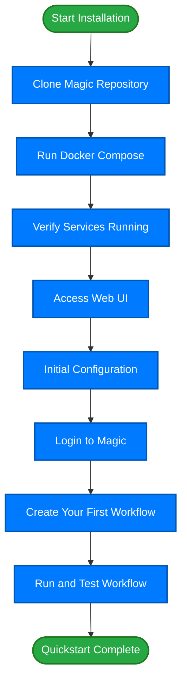

# Quickstart: From Zero to Magic Productivity

Welcome to the Magic platform! This step-by-step quickstart guide is designed to bring you from a fresh setup with no prior installation to launching your very first AI-driven workflow. Whether you're an individual exploring Magic for the first time or a team evaluating its capabilities, this tutorial will walk you through installation, core configuration, connecting an AI model, and executing your initial workflow.

---

## 1. What You Will Achieve

- Install Magic locally using Docker
- Configure essential system settings
- Connect an AI model for intelligent processing
- Create and launch a simple workflow to see Magic in action

## 2. Prerequisites

Before starting, ensure you have:

- A machine meeting [System Requirements](/getting-started/prerequisites-installation/system-requirements)
- Docker and Docker Compose installed and configured
- Basic familiarity with command-line interface (CLI) operations
- Access to the Magic source repository or installation files

<Tip>
If you are new to Docker, refer to the official Docker documentation to install and configure it correctly for your OS.
</Tip>

## 3. Installation Steps

### Step 3.1: Clone the Magic Repository

Download the latest Magic codebase or configuration:

```bash
git clone https://github.com/dtyq/magic.git
cd magic
```

### Step 3.2: Launch Magic Services with Docker Compose

Run the Magic services in the foreground for real-time logs:

```bash
docker-compose up
```

To run it detached (in background):

```bash
docker-compose up -d
```

### Step 3.3: Verify Service Startup

Ensure all containers start without errors.

```bash
docker-compose ps
```

You should see services such as `magic-web`, `magic-api`, `rabbitmq`, etc. running.

### Step 3.4: Access the Magic Web UI

By default, open your browser to:

```
http://localhost:8080
```

You should see the Magic login page.

<Check>
If the page does not load, verify Docker containers are running and that port 8080 is free.
</Check>

## 4. Initial Configuration

### Step 4.1: Environment Variable Setup

- Open `.env.example` in the root directory
- Copy it as `.env`
- Adjust variables as needed (especially ports and external URLs)

Example partial configuration:

```
PORT=8080
MAGIC_EDITION=COMMUNITY
```

### Step 4.2: Configure AI Model Connection

Set the AI model API keys or endpoints based on your provider.

- For OpenAI-compatible models, set keys in your environment or UI configuration

### Step 4.3: Save Configuration

If you change `.env`, restart Magic services:

```bash
docker-compose down && docker-compose up -d
```

## 5. Logging In and First Access

### Step 5.1: Default Credentials

Use the default admin or user credentials provided, or if integrated with third-party login (such as DingTalk), use the corresponding login method.

### Step 5.2: Successful Login

You will land on the Magic workspace/dashboard where you can begin creating workflows and AI assistants.

<Note>
If login fails, check logs for errors and verify your configuration.
</Note>

## 6. Creating Your First Workflow

### Step 6.1: Navigate to the Workflow Section

From the sidebar, select **Workflow** or **Magic Flow**.

### Step 6.2: Start a New Workflow

- Click **Create Workflow**
- Name your workflow (e.g., "Hello Magic")
- Add a simple input node to receive user input
- Add a processing node connected to your configured AI model
- Add an output node to display response

### Step 6.3: Publish and Launch

- Save and publish your workflow
- Trigger the workflow manually or via test input

### Step 6.4: Observe the Output

Ensure the AI model returns a valid response and the workflow completes successfully.

<Tip>
Keep your first workflow simple to confirm end-to-end connectivity and configuration.
</Tip>

## 7. Common Pitfalls & Troubleshooting

- **Docker Container Fails to Start**: Ensure no port conflicts and sufficient system resources.
- **Web UI Not Accessible**: Verify your firewall or proxy settings and check Docker logs.
- **AI Model Connection Issues**: Confirm API keys and endpoint correctness.
- **Login Issues**: Check authentication service status or third-party login configs.

Refer to [Troubleshooting Common Setup Issues](/getting-started/validation-troubleshooting/common-setup-issues) for step-by-step solutions.

## 8. Performance and Optimization Tips

- Use detached Docker mode for production-like setups
- Monitor resource usage using Docker stats
- Scale services if necessary using Docker Compose overrides or Kubernetes

## 9. Next Steps

- Explore [Creating Your First AI Agent (Super Magic Walkthrough)](/guides/getting-started/first-ai-agent) for advanced AI agent setup
- Learn workflow orchestration with [Building Visual AI Workflows with Magic Flow](/guides/getting-started/workflow-orchestration)
- Dive into integrations like DingTalk with [Integrating with Third-Party Messaging (WeCom, DingTalk, Feishu)](/guides/advanced-customization-integration/third-party-messaging-integration)

---

## Appendix: Quick Commands Summary

| Action                      | Command                         |
|-----------------------------|--------------------------------|
| Clone repository             | `git clone https://github.com/dtyq/magic.git` |
| Start Magic services         | `docker-compose up`             |
| Run services in background   | `docker-compose up -d`          |
| View running containers      | `docker-compose ps`             |
| Restart services after config change | `docker-compose down && docker-compose up -d` |

---

### Diagram: Magic Quickstart Workflow Overview



---