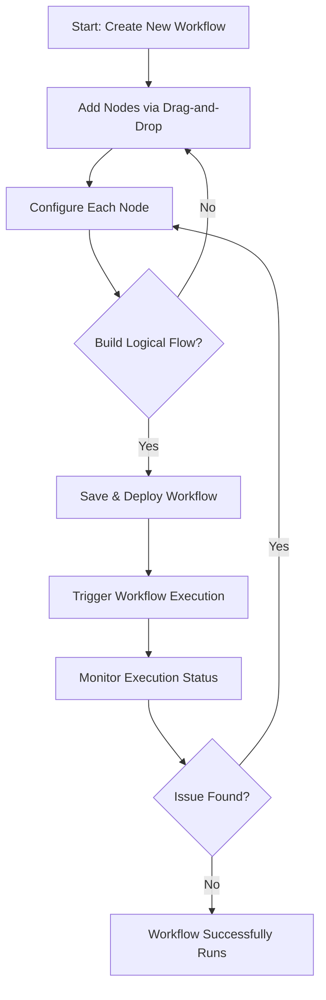

# Building Visual AI Workflows with Magic Flow

## Overview

Magic Flow empowers users to visually design, assemble, and deploy AI-driven workflows using an intuitive drag-and-drop interface. This page guides you through creating effective workflows by placing and configuring nodes, understanding common usage patterns, and monitoring execution status.

Whether you are automating data processing, orchestrating AI-powered decision making, or integrating with other tools, this guide will help you harness the full power of Magic Flow.

---

## Workflow Overview

### What You Will Accomplish

- Model AI workflows visually to automate complex tasks without coding.
- Use drag-and-drop nodes to represent AI operations, data sources, and actions.
- Configure each node to define behavior and connections.
- Deploy the constructed workflow and monitor its execution.

### Prerequisites

- Access to the Magic Flow interface within the Magic platform.
- Basic familiarity with AI concepts and workflow logic.
- Configuration of any external integrations or AI models you intend to use (refer to related guides on setting up AI Agents and integrations).

### Expected Outcome

By the end of this guide, you will have built and deployed a functional visual AI workflow and know how to monitor its execution and troubleshoot common issues.

### Time Estimate

Expect to spend 20–45 minutes depending on the complexity of your workflow.

### Difficulty Level

Intermediate — some prior experience with workflows or AI automation is helpful but not required.

---

## Step-by-Step Instructions

### 1. Accessing Magic Flow

- Log into the Magic platform.
- Navigate to the **Guides > Getting Started & Core Workflows > Building Visual AI Workflows with Magic Flow** or directly access the Magic Flow module.

### 2. Creating a New Workflow

- Click **New Workflow** or **Create Flow**.
- Provide a descriptive name and optional description for your workflow.
- Choose a relevant template or start from a blank canvas.

### 3. Understanding the Drag-and-Drop Interface

- The canvas is your workspace where you visually assemble components.
- On the sidebar, find a palette of available node types such as:
  - Data Input Nodes (file upload, API calls)
  - AI Processing Nodes (LLM, NLP, image analysis)
  - Logic Nodes (conditions, loops)
  - Output Nodes (messages, notifications, exports)

### 4. Adding and Connecting Nodes

- Drag a node from the sidebar and drop it onto the canvas.
- Connect nodes by clicking on connection points and linking to other nodes.
- Ensure data flows logically from start nodes through processing steps to outputs.

### 5. Configuring Nodes

- Click any node on the canvas to open its configuration panel.
- Set required parameters, such as API keys for AI nodes, input data definitions, or message templates.
- Validate mandatory fields before deployment.

### 6. Common Workflow Patterns

- **Sequential Processing:** Nodes connected in a linear flow for step-by-step execution.
- **Conditional Branching:** Use logic nodes to split flows based on data conditions.
- **Parallel Execution:** Nodes branching out to run tasks concurrently, then merged.
- **Loops & Iterations:** Repeat nodes to process collections or retry on failure.

### 7. Saving and Deploying the Workflow

- Click **Save** to preserve changes.
- Choose **Deploy** to activate the workflow.
- Confirm deployment to start real-time execution upon triggers.

### 8. Monitoring Workflow Execution

- Access the **Execution Monitor** tab within Magic Flow.
- View live status, step-by-step progress, and logs for each workflow run.
- Drill down on any node to inspect execution output and errors.

### 9. Editing and Updating

- Modify your workflow any time by returning to the editor.
- Save and redeploy updates to incorporate changes.

---

## Examples & Use Cases

### Example 1: AI-Powered Document Processing Workflow

- Input Node: Upload document file.
- AI Node: Extract key information using LLM.
- Logic Node: Check if required fields are present.
- Output Node: Send results via email notification.

### Example 2: Automated Chatbot Response Flow

- Trigger Node: Incoming chat message.
- AI Node: Process intent and formulate answer.
- Logic Node: Check if escalation required.
- Output Node: Respond in chat or create support ticket.

### Sample Configuration Snippet for an AI Node

```json
{
  "model": "gpt-4",
  "prompt": "Extract summary from the input text",
  "temperature": 0.5
}
```

This configuration directs the AI node to generate a summary of the input.

---

## Troubleshooting & Tips

### Common Issues

- **Node Configuration Errors:** Missing required fields or invalid parameters.
  - *Solution:* Revisit node’s config panel and ensure all mandatory inputs are correctly provided.

- **Workflow Fails on Execution:** Check execution logs for error messages.
  - *Solution:* Use monitor panel to replay failed nodes and identify incorrect data or API issues.

- **Data Flow Breaks:** Nodes not properly connected or data incompatible.
  - *Solution:* Verify connections, confirm data types match input requirements.

### Best Practices

- Start with simple workflows and incrementally add complexity.
- Use descriptive names for nodes and connections.
- Regularly save progress to prevent data loss.
- Employ conditional and looping nodes to handle diverse data paths.

### Performance Considerations

- Avoid large synchronous operations that block workflow execution.
- Use asynchronous nodes and parallel branches where possible.
- Monitor resource utilization in longer-running workflows.

### Alternative Approaches

- For very complex logic, consider decomposing into multiple smaller workflows linked by events.
- Use Magic Flow in combination with Magic IM and Super Magic agents for end-to-end AI solutions.

---

## Next Steps & Related Content

- Explore **Creating Your First AI Agent (Super Magic Walkthrough)** to combine workflows with conversational AI.
- Review **Building a Smart Knowledge Assistant** for advanced AI workflow applications.
- Dive into **Integrating with Third-Party Messaging** to extend workflow triggers and actions.
- Learn about **Optimizing Workflow Performance at Scale** for building efficient automation.

---

## Visual Summary of Magic Flow Workflow



---

<Tip>
For optimal experience, ensure your AI models and external integrations are configured correctly before deploying workflows. This reduces run-time errors and ensures smoother executions.
</Tip>

<Note>
Magic Flow is designed for users of varying technical backgrounds. Start simple, experiment visually, and scale your workflows as your confidence and needs grow.
</Note>

<Warning>
Avoid deploying incomplete or untested workflows in production to prevent automated errors and unexpected behavior.
</Warning>

---

# End of Guide

---

## Appendix

### Glossary
- **Node:** A block performing an individual step in a workflow.
- **Canvas:** Visual workspace for placing nodes.
- **Deployment:** Activating a workflow to be live and operational.
- **Execution Monitor:** Tool to view running workflow instances and troubleshoot.

### Helpful Shortcuts
- Double-click canvas to quickly add default node.
- Use right-click context menu to duplicate or delete nodes.

### Resources
- [Magic Platform Product Overview](https://magic.example.com/overview/product-intro-and-value/product-overview)
- [Quickstart: From Zero to Magic Productivity](https://magic.example.com/guides/getting-started/quickstart-workspace)
- [Creating Your First AI Agent](https://magic.example.com/guides/getting-started/first-ai-agent)
- [Integration Capabilities](https://magic.example.com/overview/architecture-glance/integration-points)


---

For further assistance, consult the Magic community or support channels accessible from your platform dashboard.
