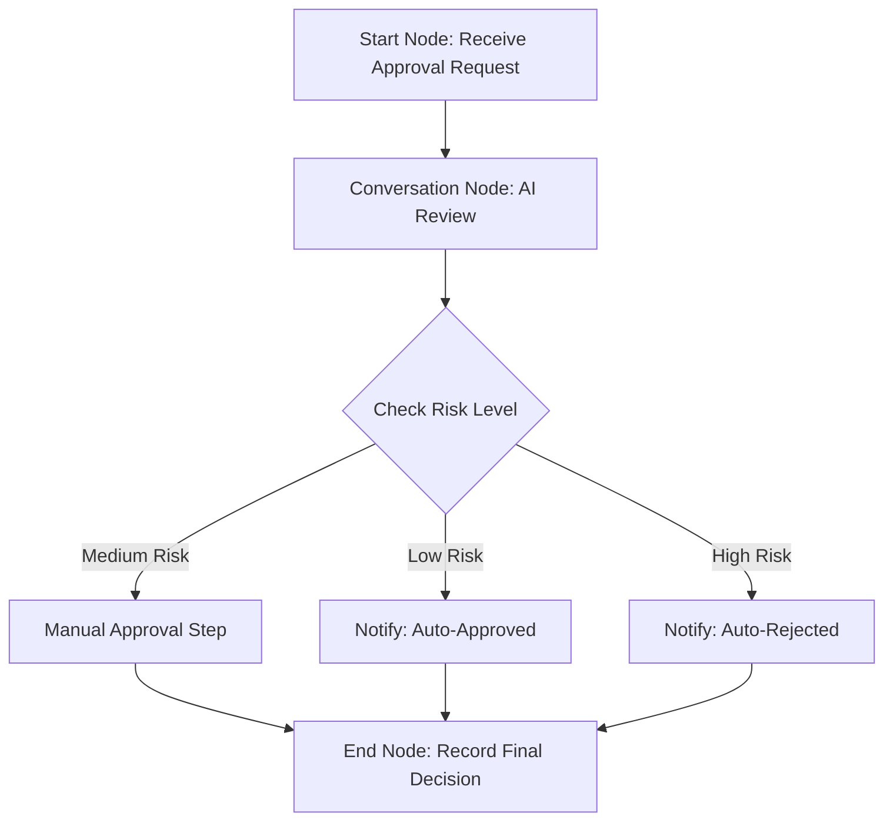

# Automating Approvals with Magic Flows

## Overview
This guide takes you through the process of designing and deploying Magic Flows to automate approval workflows efficiently. By leveraging integration with Magic's Knowledge, Conversation, and Notification nodes, you will build end-to-end approval automation that reduces manual effort, improves accuracy, and enables intelligent decision-making.

Magic Flows enable you to orchestrate AI-powered approvals that can intake submission data, apply AI review logic, manage routing, and notify stakeholders — all orchestrated visually and interactively.

---

## 1. Understanding the Approval Automation Workflow

### What You Will Achieve
- Automate approval submission intake & validation
- Leverage AI for intelligent risk assessment and decision support
- Route approvals dynamically based on rules & conditions
- Notify stakeholders effectively through chat and messaging
- Capture and output approval outcomes for further processing

### Prerequisites
- Access to Magic Flow with permission to create and deploy workflows
- Familiarity with basic workflow nodes, including Start Node and End Node
- Basic understanding of approval business processes
- Access to Magic IM or integrated enterprise chat platform

### Time Commitment
Setting up your first automated approval flow can take 30-60 minutes depending on complexity.

### Difficulty Level
Intermediate. Some experience with Magic Flow and approval processes is helpful.

---

## 2. Workflow Design: Core Components

- **Start Node**: Entry point where the approval request initiates. Configured to receive custom parameters such as approval form data.
- **Knowledge Node**: Optional; used to enrich or validate input data from enterprise knowledge bases.
- **Conversation Node**: AI-powered node to conduct risk assessment, data validation, or auxiliary questioning.
- **Condition Branch Node**: Applies routing logic based on AI risk levels or business rules.
- **Notification Node**: Sends messages or alerts to approvers and stakeholders.
- **End Node**: Defines outputs such as final approval results, risk levels, or audit data.

---

## 3. Step-by-Step Instructions to Build an Automated Approval Workflow

<Steps>
<Step title="Add and Configure Start Node">
Add a Start Node to your workflow canvas.

- By default, the Start Node triggers when an approval request is made (e.g., user submits a form).
- Customize the Start Node inputs to accept necessary parameters like `template_code`, `form_data`, and `department_id`.
- Use the 'Custom System Inputs' section to define any additional input parameters relevant to your approval process.

Expected Result: The workflow successfully receives approval request data and triggers the flow.
</Step>

<Step title="Integrate Knowledge Node for Data Enrichment or Validation">
- Add a Knowledge Node if your approval requires checking against company policies or knowledge bases.
- Configure queries or retrieval parameters to fetch relevant compliance data or prior cases.

Expected Result: The workflow can get contextual or reference data to aid decision-making.
</Step>

<Step title="Add Conversation Node to Perform AI-Driven Approval Assessment">
- Insert a Conversation Node after data intake.
- Configure the node to use your AI assistant for intelligent review.
- Design prompts that instruct the AI to:
  - Review submitted information for validity and risk.
  - Flag potential issues (e.g., conflicts, policy violations).
  - Suggest approval, rejection, or request clarifications.

Expected Result: AI evaluates the submission, returning risk assessments or recommendations.
</Step>

<Step title="Leverage Condition Branch Node for Routing Decisions">
- Based on the AI's risk output (e.g., Low Risk, Medium Risk, High Risk), use Condition Branch Node to route the approval accordingly:
  - Low Risk: Auto-approve or route for fast-tracking
  - Medium Risk: Route to manual approver for review
  - High Risk: Reject automatically or escalate

Expected Result: Dynamic approval flow paths based on real-time risk evaluation.
</Step>

<Step title="Configure Notification Nodes to Inform Approvers and Requestors">
- Use Notification Nodes to send messages:
  - Inform approvers of pending approval with relevant details.
  - Notify requestors of approval status.
- Connect to Magic IM or integrated chat platforms to enable immediate, contextual communication.

Expected Result: Timely notifications and messages ensure stakeholders remain informed.
</Step>

<Step title="Set Up End Node to Output Approval Results">
- Add an End Node to capture the final decision and data.
- Configure output parameters such as:
  - `approval_status` (approved/rejected/pending)
  - `risk_level`
  - `comments` or `rejection_reasons`
- Use expressions or variable references from prior nodes.

Expected Result: Workflow cleanly outputs decision and related data for downstream use.
</Step>
</Steps>

---

## 4. Example: Simplified Approval Flow

This diagram represents a core flow where:
- Approval requests start at the Start Node.
- The AI Conversation Node assesses risk.
- Condition Branch routes the approvals.
- Notifications inform users.
- End Node finalizes the workflow.

---

## 5. Best Practices and Tips

- **Clear Parameter Naming:** Use consistent, descriptive names for input/output parameters to avoid confusion.
- **Test Trigger Conditions:** Carefully define and test Start Node triggers to align workflow start with business events.
- **Use AI Confidence Levels:** Leverage AI confidence scores to define routing (e.g., automatic vs manual).
- **Provide User Feedback:** Notify users promptly for approval progress and AI-suggested clarifications.
- **Modularize Subprocesses:** Separate common approval subflows as reusable subprocesses called via Start Nodes.
- **Monitor Performance:** Use Magic Flow monitoring tools to track workflow execution and identify bottlenecks.

---

## 6. Troubleshooting Common Issues

<AccordionGroup title="Troubleshooting Approval Workflow Issues">
<Accordion title="Why aren't custom parameters taking effect in the Start Node?">
- Confirm parameter names are spelled correctly and case-sensitive.
- Ensure data types match expected parameter types.
- Required parameters must be provided when triggering.
- Reference parameters correctly in downstream nodes using the `${parameter_name}` syntax.
</Accordion>

<Accordion title="My workflow isn't triggering despite correct conditions">
- Verify the workflow is published and enabled.
- Check the Start Node trigger time and conditions for accuracy.
- Confirm system permissions allow workflow execution.
</Accordion>

<Accordion title="How to handle multiple start scenarios in one approval workflow?">
- Use Condition Branch Nodes right after the Start Node to differentiate paths.
- Alternatively, design multiple subprocesses with dedicated Start Nodes for varied entry points.
- Include Wait Nodes if awaiting multiple triggers in sequence.
</Accordion>

<Accordion title="Output parameters from End Node not displaying in results">
- Check that parameter names are correct and referenced properly.
- Validate expression syntax in parameter value fields.
- Confirm the workflow executes through the expected path reaching the End Node.
- Verify variable scope and data availability within the End Node.
</Accordion>
</AccordionGroup>

---

## 7. Next Steps and Related Content

- After building your approval Magic Flow, explore testing and deployment in the Magic Flow GUI.
- Learn more about configuring custom AI assistants for advanced approval logic.
- Integrate external notification services for richer alerting.
- Explore Magic IM integration to engage approvers in real-time messaging contexts.
- For complex approvals, see guides on subprocess and tool calls to break down workflows.

### Related Documentation
- [Start Node](https://docs.magic.com/en/tutorial/basic/node/start-node.md): Key to triggering workflows
- [End Node](https://docs.magic.com/en/tutorial/basic/node/end-node.md): Defining workflow outputs
- [Guide to Using Magic Approval Assistant](https://docs.magic.com/en/tutorial/best-practice/guide-to-using-the-magic-approval-assistant.md): How AI assists with approval processing
- [Building Visual AI Workflows](https://docs.magic.com/guides/getting-started/workflow-orchestration.mdx): Comprehensive workflow creation and management

---

<Tip>
For best results, start with a simple approval flow and incrementally incorporate AI risk evaluation and notification. Validate parameters carefully and preview workflow execution paths before deployment.
</Tip>

---

## 8. Summary
Automating approvals with Magic Flows empowers enterprises to streamline their business processes through AI-driven logic, dynamic routing, and integrated notifications. This guide equips you with practical steps to build robust approval workflows that align with real business needs and improve efficiency.

---

*Happy automating!*