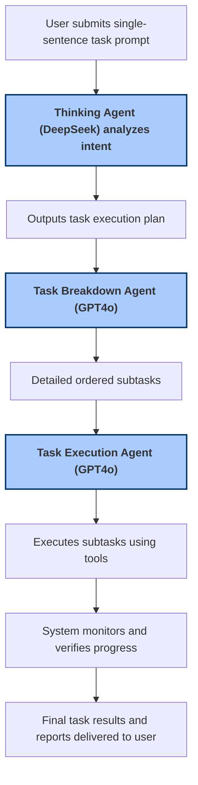

# Solving Complex Tasks with Multi-Agent Super Magic

## Overview
This guide walks you through how Super Magic’s multi-agent system enables autonomous planning, delegation, and execution of complex, multi-step tasks efficiently and effectively. Using real-world scenarios like document analysis, investment research, and workflow automation, you'll see how multiple AI agents collaborate seamlessly to convert a single instruction into detailed actions and completed results.

---

## 1. What You Will Achieve
- Understand how to leverage multiple agents working in concert to solve complex tasks with minimal user input
- Learn the sequential stages from intent understanding, task breakdown, to task execution
- Explore example workflows and best practices for task design and monitoring

## 2. Who This Guide is For
This guide is crafted for users aiming to harness Super Magic’s multi-agent capabilities to automate multi-step workflows, including:
- Project managers seeking AI-assisted project supervision
- Analysts automating research workflows
- Developers and business users building delegated AI task flows

## 3. Prerequisites
Before you begin, ensure you have:
- Access to Super Magic platform with multi-agent features enabled
- Familiarity with basic platform navigation and agent concepts (see Getting Started guides)
- Optional: An existing workspace and project to run your tasks

---

## 4. How Super Magic's Multi-Agent System Works

At its core, Super Magic uses a system of specialized AI agents coordinated to accomplish complex goals autonomously:

- **Thinking Agent (DeepSeek)**: Interprets the user’s single-sentence instruction, outputs an execution plan
- **Task Breakdown Agent (GPT4o)**: Decomposes the plan into detailed manageable steps
- **Task Execution Agent (GPT4o)**: Performs each step sequentially using appropriate tools and APIs

This workflow reflects how a human manager would approach complex instructions — understand intent, plan tasks, delegate work, and follow through.

---

## 5. Step-by-Step Workflow

### Step 1: Initiate the Complex Task
- Input a single-sentence instruction clearly describing your goal. For example, "Analyze last quarter's sales reports and prepare an investment summary."
- Submit this task prompt to the system via the user interface or API.

**Expected outcome:** The system recognizes your intent and starts task planning.

### Step 2: Intent Analysis by Thinking Agent
- The DeepSeek model examines the prompt deeply, identifying the user’s core objectives and required toolsets.
- The system decides whether to proceed with task breakdown or jump to execution based on complexity.

**Expected outcome:** A task execution plan outlining major task components.

### Step 3: Task Breakdown
- The GPT4o Task Breakdown Agent divides the execution plan into detailed, ordered subtasks.
- Each subtask is structured to be independently actionable and clear.

**Expected outcome:** A stepwise task list ready for execution.

### Step 4: Task Execution
- The GPT4o Task Execution Agent carries out each subtask, potentially using specialized tools such as document processing, data retrieval, or script automation.
- Tools are dynamically loaded and invoked as needed to complete subtasks.

**Expected outcome:** Subtasks are executed successfully with intermediate outputs stored.

### Step 5: Monitoring and Verification
- Super Magic observes task progress and validates outcomes.
- Results and logs are stored for review or further action.

**Expected outcome:** You receive a comprehensive report of the completed complex task.

---

## 6. Real-World Scenarios

### Scenario 1: Document Analysis
You provide a prompt like "Summarize and highlight key legal clauses from contract docs."
- Thinking Agent plans document ingestion and summarization phases.
- Task Breakdown Agent creates subtasks: file conversion, clause extraction, summary generation.
- Task Execution Agent runs these steps, managing file attachments and outputs.

### Scenario 2: Investment Research
Input: "Research emerging tech stocks and generate portfolio recommendations."
- The agents plan stepwise research: market analysis, financial data retrieval, report writing.
- Multi-agent system autonomously executes the workflow.

### Scenario 3: Workflow Automation
Prompt: "Automate weekly project status updates with data from current tasks."
- Task planning, retrieval of project data, composition of status reports, and distribution are delegated to agents.

---

## 7. Best Practices
- **Be Clear and Concise:** Precisely define the goal in your single-sentence instruction to improve task interpretation.
- **Use Stepwise Complexity:** For very extensive workflows, consider breaking instructions into smaller chunks.
- **Monitor Attachments:** Upload all necessary supporting documents upfront for accurate processing.
- **Review Logs:** Always verify intermediate outputs in the workspace to ensure correctness.

---

## 8. Troubleshooting

### Common Issues
- **Task Fails to Start:** Check that your prompt meets minimum length and clarity requirements.
- **Agent Execution Delays:** Ensure platform resources are sufficient and the sandbox is in running state.
- **Incomplete Outputs:** Verify that all necessary tool integrations are properly configured.

### Tips
- Use the platform’s task status and sandbox monitoring features to diagnose issues.
- If needed, re-initialize your task or sandbox via the UI or API.

---

## 9. Under the Hood: Key APIs and Services

While this guide focuses on user intent and workflows, for integration purposes the key backend processes include:
- **TaskAPI deliverMessage:** Submits messages/tasks into the multi-agent system.
- **HandleTaskMessageAppService:** Validates, initializes, and coordinates task lifecycle including agent communication.
- **SandboxAgentService:** Manages sandbox environments where agents perform their work.

For API details, see [Task API Reference](/api-reference/super-agent/tasks) and [Sandbox Agent Service](/concepts/architecture-overview/sandbox-agent).

---

## 10. Diagram: Multi-Agent Workflow

---

## 11. Next Steps
- Try creating your own multi-step tasks with the Super Magic UI or API.
- Explore detailed tutorials on configuring agents, workflows, and tool plugins.
- Review related guides on [Building a Smart Knowledge Assistant](/guides/real-world-examples/knowledge-assistant) and [Automating Workflows with Magic Flow](/guides/getting-started/workflow-orchestration).

---

## References & Related Documentation
- [Executing Complex Tasks with One Sentence](https://docs.letsmagic.cn/tutorial/best-practice/complex-tasks-in-one-sentence.md) — foundational guide on the multi-agent flow
- [Super Agent API Reference](https://docs.letsmagic.cn/api-reference/super-agent/tasks) — APIs for task message delivery and management
- [Magic Flow Orchestration](https://docs.letsmagic.cn/guides/getting-started/workflow-orchestration) — for building custom flows
- [Integration Capabilities](https://docs.letsmagic.cn/overview/architecture-glance/integration-points) — details on tool and external system integration

---

<Tip>
Maximize success by crafting clear single-sentence instructions that reflect your real-world objectives precisely. The multi-agent system thrives on well-defined intents.
</Tip>

<Note>
Multi-agent orchestration is resource-intensive—monitor system status regularly to manage task load and sandbox health.
</Note>

<Warning>
Agent task interruptions or invalid inputs can cause task suspensions. Always verify environment readiness before starting complex tasks.
</Warning>
