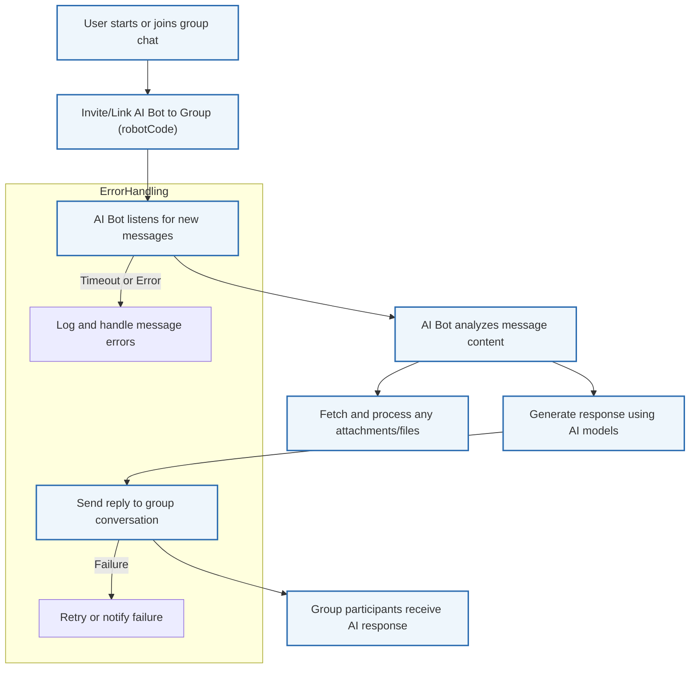

# Empowering Group Collaboration with AI Bots

Enhance your organization's group chat experience by integrating AI agents that collaborate seamlessly within Magic IM and third-party messaging platforms like DingTalk. This guide walks you through enabling AI bots in group conversations, managing chat topics, sharing documents in real-time, and configuring permissions to respect organizational boundaries.

---

## 1. Introduction

AI bots can transform group chats into intelligent collaboration hubs by providing real-time assistance, sharing knowledge documents, and maintaining context-aware discussions. Magic empowers you to embed AI agents directly into group chats within Magic IM and widely used enterprise messaging platforms, streamlining teamwork and accelerating decision-making.


## 2. Prerequisites

Before you start integrating AI bots into group chats, ensure the following:

- You have access to Magic IM with configured AI agents.
- Permissions to manage group chats within the desired messaging platform (e.g., DingTalk).
- Proper API credentials and robot codes for your AI bots.
- Understanding of basic group chat management concepts within your platform.


## 3. What You Will Achieve

By following this guide, you will:

- Integrate AI agents into group conversations to assist users.
- Manage group topics and conversation segmentation.
- Enable seamless real-time document sharing handled by AI.
- Configure organizational boundaries and permissions for secure communication.


## 4. Integrating AI Bots into Group Chats

### 4.1 Creating AI-Enabled Group Chats

Magic supports creating two types of groups:

- **Regular Groups**: Simple group chats with customizable settings.
- **Scene Groups**: Context-aware groups designed for specific collaboration scenarios.

**Steps to create a group with AI Bot integration:**

<Steps>
<Step title="Define Group Parameters">
Gather essential group information such as group name, owner user ID, initial members, and templates if applicable.
</Step>
<Step title="Create Regular Group">
Use the Magic Conversation API to create a regular group chat by passing required parameters. This generates a chat ID to link your AI bot.
</Step>
<Step title="Create Scene Group (Optional)">
For advanced context management, create a scene group using Magic’s scene group API, enabling richer topic management and AI interaction capabilities.
</Step>
<Step title="Register AI Bot with Group">
Associate your AI agent’s robot code with the created group chat to enable messaging.
</Step>
</Steps>

### Code Example: Creating a Scene Group

```php
use Dtyq\EasyDingTalk\OpenDev\Parameter\Conversation\CreateSceneGroupParameter;

$param = new CreateSceneGroupParameter($accessToken);
$param->setTitle('Project Alpha Collaboration');
$param->setOwnerUserId('owner_user_id_here');
$param->setUserIds('user1,user2,user3');
$param->setTemplateId('template-id-if-applicable');

$openConversationId = $magicConversationEndpoint->createSceneGroup($param);
```

### 4.2 Adding AI Bots to Existing Groups

To add an AI agent to an existing group chat:

- Retrieve the group’s conversation ID.
- Link the AI bot’s `robotCode` to this conversation.
- Ensure the bot has access permissions and is configured to listen to messages.


## 5. Managing Group Chat Topics and Permissions

### 5.1 Topic Management

Maintain organization by segmenting discussions with topic management features:

- Assign topics to conversations or scene groups for better context.
- Use Magic’s AI agent capabilities to track and handle conversation threads logically.

### 5.2 Permission Configuration

Secure communication with organizational boundaries:

- Define who can invite AI bots to groups.
- Control the bot’s visibility and interaction scope within multi-tenant environments.
- Leverage Magic’s built-in permission controls to ensure compliance and data privacy.


## 6. Real-Time Document Sharing

AI agents enable smart document sharing within conversations:

- Share files or images easily by uploading or linking through chat.
- Magic’s AI interprets file contexts, making them discoverable via chat queries.
- Bots can download and reference shared attachments in responses.

**Example:**

- When an AI bot receives a message with embedded images or rich text, it automatically fetches file URLs and includes them as attachments in its message object.


## 7. Sending Messages via AI Bots

Magic abstracts message sending through unified methods:

- **One-on-One Chats:** AI bots send private messages using user identifiers.
- **Group Chats:** AI bots send messages to group conversations using conversation IDs.

Steps for sending messages:

1. Prepare the message with content and optional formatting.
2. Use the appropriate API parameters including `robotCode`, user IDs, or conversation IDs.
3. Send the message ensuring error handling for timeouts or network issues.


## 8. Troubleshooting Common Issues

<AccordionGroup title="Common Group Chat and AI Bot Issues">
<Accordion title="Bot Does Not Respond in Group Chat">
- Verify the `robotCode` is correctly linked to the group.
- Check API tokens and permissions.
- Confirm the bot has subscribing/listening rights for group messages.
</Accordion>
<Accordion title="File Sharing Not Working with AI Bot">
- Ensure files are accessible via the provided `downloadCode`.
- Confirm the bot has the capability to download and reference attachments.
- Check for network or gateway timeouts during download.
</Accordion>
<Accordion title="Message Sending Timeout or Failure">
- Network latency with file downloads can cause timeouts.
- Implement retries or asynchronous message sending.
- Review API rate limits and error logs.
</Accordion>
</AccordionGroup>


## 9. Best Practices

- Use scene groups when topic segmentation and complex context handling are required.
- Cache user and department information to optimize bot response times.
- Limit bot permissions based on organizational roles to maintain security.
- Regularly review chat logs and API usage to identify performance bottlenecks or errors.


## 10. Next Steps

- Explore the [Magic IM Setup Guide](https://magic-docs/guides/getting-started/ai-im-setup) for detailed instructions on enabling Magic IM features.
- Learn to build custom AI agents with the [First AI Agent Guide](https://magic-docs/guides/getting-started/first-ai-agent).
- Advance to managing collaborative workflows with [Magic Flow Orchestration](https://magic-docs/guides/getting-started/workflow-orchestration).
- See real-world use cases in the [Smart Knowledge Assistant Guide](https://magic-docs/guides/real-world-examples/knowledge-assistant).

---

## Appendix: Sample Message Sending with AI Bot to Group Chat

```php
use Dtyq\EasyDingTalk\OpenDev\Parameter\ChatBot\SendGroupMessageParameter;

$param = new SendGroupMessageParameter($accessToken);
$param->setRobotCode('your_robot_code_here');
$param->setOpenConversationId('open_conversation_id_here');
$param->setMsgKey('sampleMarkdown');
$param->setMsgParam(json_encode([
    'title' => 'Team Update',
    'text' => 'Hello team, here is the latest project update...'
], JSON_UNESCAPED_UNICODE));

$result = $chatBotEndpoint->sendGroupMessage($param);
if ($result) {
    echo 'Message sent successfully';
} else {
    echo 'Failed to send message';
}
```


---

## Diagram: AI Bot Integration Workflow in Group Chats



---

For more assistance, visit the [Getting Help & Resources](https://magic-docs/getting-started/validation-troubleshooting/resources-and-support) page.


---