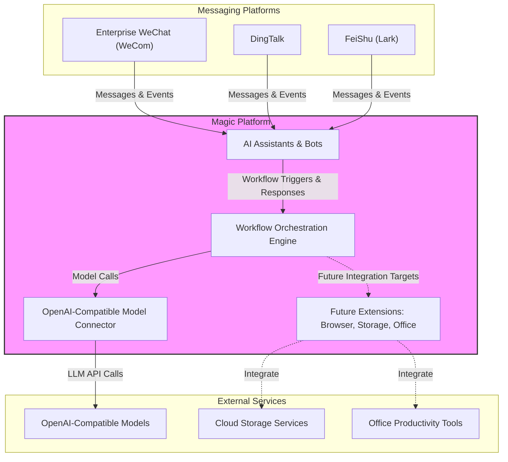

# Integration Capabilities

Discover how Magic seamlessly connects your AI productivity platform with the external systems that matter most for your workflows. This page surveys the current and planned integration layers including popular enterprise messaging platforms, OpenAI-compatible model support, and the vision for extending into browsers, cloud storage, and office tools. Understanding these integration capabilities equips you to unlock Magic's full potential by bridging AI with your existing ecosystem.

---

## Why External Integrations Matter

Modern enterprises rely on a diverse set of platforms — messaging apps, cloud services, AI models, productivity suites — each critical to daily operations. Magic recognizes this reality and embraces a layered integration philosophy that lets you keep your preferred tools while enriching their capabilities with AI. Instead of reinventing these services, Magic provides smooth connections that empower AI workflows, intelligent assistants, and collaborative tools within your existing environment.

Whether you want your AI assistants to respond in enterprise chat apps, or orchestrate workflows backed by external LLMs, Magic’s integrations are built to be flexible, extendable, and enterprise-ready.

---

## Built-In Messaging Integrations

Magic currently supports direct integration with the most widely used enterprise messaging platforms in Asia, enabling AI-powered chatbots and assistants to work directly where your teams communicate.

- **Enterprise WeChat (WeCom)**: Connect Magic AI assistants to WeCom, allowing conversational workflows to engage one-on-one chats and perform automation tasks. Note that due to platform limitations, group chat AI conversations and rich media rendering might have some constraints.

- **DingTalk**: Magic supports DingTalk bot integration, enabling natural language AI conversations and workflow triggers within DingTalk groups and direct messages.

- **FeiShu (Lark)**: Magic bots can be configured in FeiShu to receive message events, reply dynamically, and access user/contact information for smarter interactions.

These integrations involve configuring callback URLs, managing permissions, and setting up bot credentials. Magic simplifies these steps with guided setup workflows, ensuring your AI assistants communicate flawlessly and securely.

<Callout>
  <Info>
    Because Magic treats messaging platforms as first-class integration points, you can create intelligent chat experiences that blend AI’s power with trusted enterprise communication tools.
  </Info>
</Callout>

---

## Support for OpenAI-Compatible Models

Magic opens the door to powerful AI models by supporting access to OpenAI API-compatible large language models (LLMs). This flexibility lets you leverage popular and custom model providers interchangeably within your workflows:

- **Plug and play connection**: Connect to any LLM service presenting an OpenAI-compatible API, including private and public models.

- **Unified configuration**: Manage model keys, selection, and prompt settings centrally inside Magic without additional client-side complexity.

- **Extensible to visual models**: Magic also supports AI models featuring visual understanding, bolstering your AI workflows with multi-modal intelligence.

Integrating external AI models enriches Magic’s AI assistants, workflow triggers, and subprocesses, accelerating intelligent automation on your terms.

---

## Future Extensibility Layers

Magic’s modular design and integration philosophy embrace continued extensibility across multiple layers:

- **Browser Extensions**: Planned expansion includes embedding Magic AI capabilities into browsers for in-context AI suggestions, summarizations, and seamless workflow initiation.

- **Cloud Storage Integration**: Future connectors aim to import documents and data directly from popular cloud storage services, enriching your knowledge bases and automated workflows.

- **Office Tools Integration**: Magic envisions deep integrations with document editing and collaborative office platforms to support AI-assisted content creation and real-time workflow integration.

This strategy ensures Magic remains adaptable to evolving enterprise ecosystems, positioning your organization to leverage AI wherever work happens.

---

## Layered Integration Philosophy

Magic’s integration capabilities are designed in logical layers to separate concerns and ease adoption:

1. **Communication Layer**: Direct, secure connections with messaging and chat platforms deliver AI engagement where users communicate daily.

2. **Model Layer**: Flexible AI model connectivity ensures the best AI capabilities integrate into Magic workflows regardless of provider.

3. **Data & Productivity Layer**: By extending integrations to cloud storage and office tools, Magic ensures AI automation works directly on the data and documents your teams rely on.

This clear layering lets you adopt integrations incrementally, adding complexity only when needed without disrupting existing processes.

---

## Real-World Examples

### Scenario 1: AI Assistant in Corporate Chat
Configure Magic to deploy AI assistants as bots inside DingTalk or WeCom. Employees ask questions or trigger workflows via chat, and the assistant responds instantly with actionable intelligence.

### Scenario 2: Workflow with External LLM
Trigger complex workflows that compose responses with external OpenAI-compatible LLMs, customizing prompt parameters and model choices dynamically within Magic’s visual workflow editor.

### Scenario 3: Document Import from Cloud Storage (Future)
Plan for upcoming Magic connectors to automatically ingest documents from your cloud drives into enterprise knowledge bases, enabling better AI recall and automation.

<Note>
Check out the [Integration Points](https://your.documentation/overview/architecture-glance/integration-points) page for deeper insights on how Magic’s APIs facilitate these connections.
</Note>

---

## Getting Started with Integrations

1. **Select your integration target** — Choose an enterprise chat platform, model provider, or both.
2. **Follow platform-specific setup guides** — These include credential configuration, permission management, and callback URL registration.
3. **Test connections with sample workflows or AI assistants** — Validate that your integration responds to events and messages correctly.
4. **Expand gradually** — Add multi-model support, data sources, or productivity tools integrations as your AI workflows mature.

For detailed instructions and platform-specific integration guides, visit the relevant chapters in the documentation.

---

By embracing Magic’s powerful integration capabilities, your organization bridges AI into the daily tools and data your teams use — amplifying productivity, collaboration, and innovation.

---

## Diagram: Magic Integration Overview

---

## Troubleshooting Tips

- **Integration Failures**: Verify callback URLs, credentials, and permission scopes. Errors often stem from misconfigured webhook URLs or missing API keys.

- **Message Delivery Delays**: Check platform rate limits and ensure bots have appropriate permissions and are not disabled.

- **Model Connection Issues**: Validate API keys and endpoint URLs for OpenAI-compatible models. Confirm network connectivity from Magic deployment.

- **Rich Media Limits on WeCom**: Understand platform constraints on message length and media types for AI message replies.

- **Future Features Not Available**: Extensions like browser integration or cloud storage connectors may be under active development and require updates.

---

## Next Steps

To start leveraging Magic’s integration capabilities:

- Review and configure messaging integrations in the Getting Started guides under the [Enterprise Messaging Setup](https://your.documentation/guides/getting-started/ai-im-setup).

- Explore OpenAI-compatible model integration in the [Custom LLM Integration](https://your.documentation/guides/advanced-customization-integration/custom-llm-integration) section.

- Stay tuned to forthcoming updates on browser extensions, cloud storage connectors, and office tools integration.

Visit related documentation pages to learn more about Magic’s ecosystem:

- [Product Matrix & Component Overview](https://your.documentation/overview/architecture-glance/product-matrix)
- [System Architecture Diagram](https://your.documentation/overview/architecture-glance/system-architecture-diagram)
- [Integration Points](https://your.documentation/overview/architecture-glance/integration-points)

Together, these enable you to fully harness Magic as the hub for AI-powered enterprise productivity.
