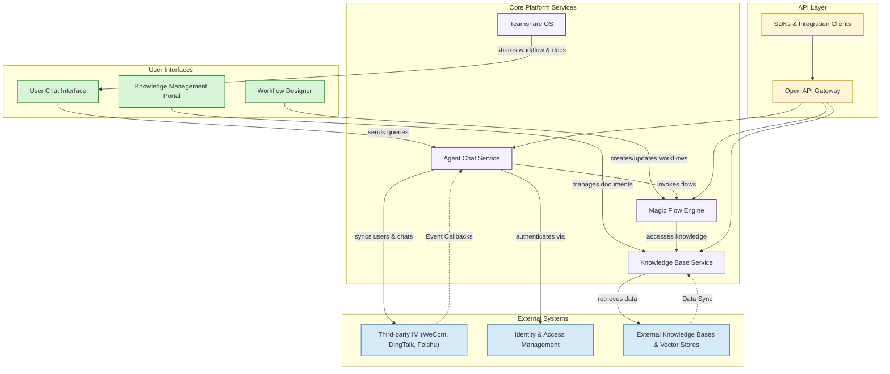

# Architecture Diagram

## Visualizing Magic’s Core Architecture

Understanding the overall architecture of Magic at a glance is essential to grasp how its components connect, communicate, and orchestrate AI-powered workflows. This high-level architecture diagram provides an immediate mental model of how Magic’s main components, entry points, and integrations interact, empowering newcomers to quickly orient themselves within the platform’s ecosystem.

Magic is designed as a unified AI productivity platform integrating several key modules, including agent chat, workflow orchestration, and knowledge management — all tied together by robust APIs and integration points.

---

## Architecture Overview

At its core, Magic blends user-facing applications, core services, and external integration layers. Data flows continuously between these layers, enabling end users to effortlessly engage with AI-driven workflows and collaborative knowledge processes.

Key architectural groups:

- **AI Productivity Components**: The user-facing modules providing interactive capabilities such as chat agents and workflow orchestration.
- **Core Services & APIs**: Back-end services support execution, management, and integration.
- **External Integrations**: Connectors to external messaging systems, identity providers, and knowledge bases.




---

## Understanding the Diagram

### User Interaction Layer
- **User Chat Interface**: The main client where end-users communicate with AI agents.
- **Workflow Designer**: A graphical interface for building and managing AI workflows, allowing users to define multi-step automation visually.
- **Knowledge Management Portal**: Where knowledge documents and resources are curated, searched, and shared.

### Core Platform Services
- **Magic Flow Engine**: Executes workflows created by users or agents, seamlessly integrating multiple AI and API calls.
- **Agent Chat Service**: Powers AI chatbots and assistant agents, orchestrating conversations and queries.
- **Knowledge Base Service**: Manages indexing, retrieval, and versioning of enterprise knowledge content.
- **Teamshare OS**: Facilitates collaboration, allowing teams to share workflows, chat contexts, and documents.

### API Layer
- **Open API Gateway**: The secure entry point for external and internal API requests, routing them to appropriate services.
- **SDKs & Integration Clients**: Libraries available in multiple programming languages to streamline platform integration into custom apps.

### External Integrations
- **Third-party IM Platforms**: Magic connects to popular messaging platforms such as WeCom, DingTalk, and Feishu to extend AI conversation capabilities directly into familiar communication channels.
- **Enterprise Identity Systems**: Used for authentication and access control, ensuring secure usage.
- **External Knowledge Bases**: Integration points to connect to external document repositories or vector search engines augmenting Magic’s knowledge capabilities.

---

## Practical Use Case Flow
Imagine an employee sends a question through the Magic chat interface integrated into DingTalk:

1. The message is captured by the **Agent Chat Service**.
2. The agent identifies the need for a workflow to fetch relevant data and triggers a **Magic Flow**.
3. The flow engine executes defined steps, querying the **Knowledge Base Service** and external sources.
4. Data is aggregated and returned to the chat agent, which formats the answer.
5. The response appears in the user’s chat interface.

Meanwhile, all these interactions are logged and can be monitored or further enhanced by other team members using the Workflow Designer or Knowledge Portal.

---

## Tips for Exploring Further
- Start your exploration by reviewing the **Product Matrix & Component Overview** to understand individual product roles.
- For implementation, see detailed **Integration Capabilities** to learn how Magic connects with external systems.
- Dive into the **Core Concepts** to understand the foundational models used within the architecture.

<Note>
This diagram purposefully omits very low-level technical details to focus on conceptual clarity and user-centered workflows.
</Note>

---

## Next Steps
- Explore the [Product Matrix & Component Overview](/overview/architecture-glance/product-matrix) page to understand each module in detail.
- Review the [Integration Capabilities](/overview/architecture-glance/integration-points) to prepare for connecting Magic with your environment.
- Start building and testing with the [Quickstart guide](/guides/getting-started/quickstart-workspace) to see the architecture in action.


---

For developers interested in API flows, Magic's backend exposes a robust Open API that interacts with core services such as MagicFlow, which can be monitored and managed programmatically. This seamless bridging between user experiences and backend services is the essence of Magic’s modular yet integrated platform approach.


---

## References
- [Product Overview](/overview/product-intro-and-value/product-overview) — Executive summary of platform capabilities
- [Value Proposition & Key Benefits](/overview/product-intro-and-value/value-proposition) — Why Magic matters
- [Core Concepts](/overview/key-concepts-and-terminology/core-concepts) — Terminology and fundamental ideas
- [API Reference: Workflow Automation & Magic Flow APIs](/api-reference/workflow-automation/flow-crud) — For detailed API integration


---

## Source Code Snippet

Here is a brief PHP excerpt illustrating how the OpenDevFactory registers endpoints representing parts of the platform's external API integration:

```php
class OpenDevFactory extends FactoryAbstract
{
    protected function getEndpoints(): array
    {
        return [
            AccessTokenEndpoint::class,
            DingCallbackEndpoint::class,
            DepartmentEndpoint::class,
            UserEndpoint::class,
            CalendarEndpoint::class,
            ChatBotEndpoint::class,
            ConversationEndpoint::class,
        ];
    }
}
```

This pattern exemplifies the modular design of Magic’s backend API structure, facilitating extensibility and maintainability.

---