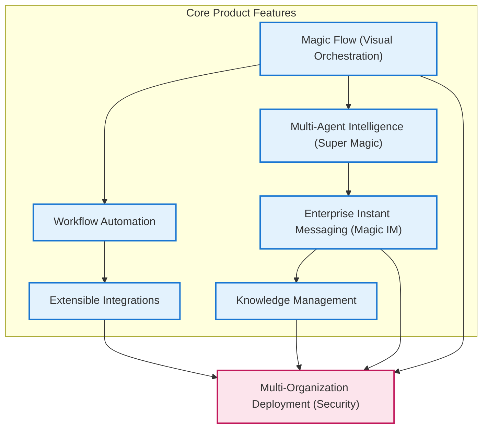

# Feature Summary

## Unlocking Magic’s Flagship Features at a Glance

Magic integrates a powerful suite of features designed to streamline AI-driven enterprise productivity. This concise overview highlights the essential capabilities across Magic’s core modules—enabling users to harness visual orchestration, intelligent collaboration, seamless communication, knowledge empowerment, intelligent automation, extensible integration, and robust multi-organization security.

---

## Visual Flow Orchestration with Magic Flow

Design and automate complex AI workflows with an intuitive drag-and-drop interface. Magic Flow lets users build visual pipelines that connect AI agents, external tools, and data sources, simplifying the orchestration of sophisticated, multi-step processes.

- **Visual Editor**: Create workflows with nodes representing AI models, tooling, or actions.
- **Customizable Logic**: Add branching, conditional paths, and looping.
- **Real-Time Monitoring**: Track workflow executions live with detailed logs.

*Example:* An HR team automates candidate screening by chaining resume parsing AI agents with internal approval flows—all visually orchestrated without coding.

---

## Collaborative Multi-Agent Intelligence (Super Magic)

Magic’s multi-agent system empowers multiple AI agents to collaborate intelligently towards complex goals. Each agent performs specialized roles, enhancing problem-solving with collective AI teamwork.

- **Agent Roles**: Assign diverse responsibilities (research, summarization, fact-checking).
- **Synchronized Collaboration**: Agents communicate and coordinate in real time.
- **Task Decomposition**: Break down complicated queries into manageable subtasks.

*Example:* A marketing team deploys agents to analyze market trends, draft campaign ideas, and validate messaging, all syncing seamlessly in Super Magic conversations.

---

## Enterprise Instant Messaging (Magic IM)

Empower your organization with an integrated chat platform that supports rich AI interactions alongside traditional messaging.

- **Seamless AI Chat**: Engage conversational agents in personal or group chats.
- **Enterprise-Grade Security**: Built-in authentication and permissions.
- **Cross-Platform Support**: Integrates with major tools and ensures message continuity.

*Example:* A project team uses Magic IM to instantly collaborate with AI assistants during brainstorming sessions without switching apps.

---

## Centralized Knowledge Management

Harness organizational knowledge effectively through Magic’s integrated knowledge base, allowing teams to store, retrieve, and evolve critical documents and insights.

- **Versioned Documentation**: Manage document versions and updates securely.
- **Smart Search**: Quickly find relevant knowledge using AI-enhanced indexing.
- **Collaborative Editing**: Enable teams to co-author and review content.

*Example:* Customer support agents access up-to-date product documentation instantly, powered by AI search within Magic’s knowledge repository.

---

## Intelligent Workflow Automation

Automate routine and critical business processes with embedded AI logic using Magic’s workflow engine.

- **Trigger-Based Actions**: Launch flows based on events or data changes.
- **Conditional Branching**: Configure steps depending on context or data.
- **Extensible Tooling**: Integrate third-party services and custom tools.

*Example:* Finance teams automate invoice approvals by combining AI-powered data extraction with configured business rules for contract compliance.

---

## Extensible Integration Ecosystem

Magic supports seamless integration with major enterprise systems, external AI providers, and custom extensions to adapt to evolving business needs.

- **Messaging Platforms Integration**: Connect with WeCom, DingTalk, FeiShu.
- **AI Model Support**: Use OpenAI-compatible and custom AI models.
- **Extensible Plugins**: Add custom tools and workflow nodes without disrupting core operations.

*Example:* An enterprise integrates Magic directly into their existing communication stack, extending AI-powered productivity without complex migrations.

---

## Secure Multi-Organization Deployment

Robust support for multi-tenant data isolation and secure access control ensures your organizational boundaries and data privacy are maintained.

- **Role-Based Permissions**: Granular access control for users and agents.
- **Tenant Isolation**: Separate data stores per organization.
- **Audit Logging**: Trace changes and workflow executions for compliance.

*Example:* A global consulting firm deploys Magic across multiple clients, ensuring strict data boundaries and secure collaborative AI workflows.

---

## Why Feature Summary Matters

This page distills Magic’s flagship features into actionable concepts and highlights user-facing benefits. It prepares you to explore detailed guides and practical steps that help you tailor Magic to your enterprise workflows with confidence.

---

## Next Steps: Where to Go From Here

- Visit [Product Overview](/overview/product-intro-and-value/product-overview) for the full platform introduction.
- Explore [Value Proposition & Key Benefits](/overview/product-intro-and-value/value-proposition) to align features with your goals.
- Dive into [Guides](/guides/getting-started/quickstart-workspace) for hands-on tutorials and workflow tutorials.

---

<CardGroup cols={3}>
<Card title="Visual AI Workflows with Magic Flow">
Automate complex AI tasks seamlessly with drag-and-drop flow design.
</Card>
<Card title="Collaboration with Super Magic">
Multiply AI productivity with coordinated multi-agent teamwork.
</Card>
<Card title="Enterprise Chat & AI Integration">
Engage AI assistants directly within your messaging channels.
</Card>
</CardGroup>

<CardGroup cols={3}>
<Card title="Knowledge Management">
Centralize, search, and share your organization's critical knowledge.
</Card>
<Card title="Workflow Automation">
Streamline business processes with intelligent triggers and integrations.
</Card>
<Card title="Extensible & Secure Deployment">
Integrate widely and keep your data safe across multiple organizations.
</Card>
</CardGroup>

<Note>
This summary serves as your gateway to unlocking Magic's capabilities. Each feature interlocks with others to deliver a unified, extensible AI productivity system tailored for modern enterprises.
</Note>

---

## Troubleshooting & Tips

- **Start Simple:** Begin by experimenting with Magic Flow’s visual editor before progressing to multi-agent orchestration.
- **Leverage Integrations:** Ensure your environment is connected to external platforms for full productivity benefits.
- **Review Permissions:** Check user roles and tenant boundaries early to avoid access issues.
- **Explore Use Cases:** Refer to real-world scenarios to discover feature combinations that solve specific business problems.

---

## Visual Overview of Feature Interactions

---

## References & Related Documentation

- [Product Overview](/overview/product-intro-and-value/product-overview)
- [Value Proposition & Key Benefits](/overview/product-intro-and-value/value-proposition)
- [Target Audiences & Use Cases](/overview/product-intro-and-value/target-audiences)
- [Integration Capabilities Overview](/overview/architecture-glance/integration-points)
- [System Architecture Diagram](/overview/architecture-glance/system-architecture-diagram)

---

Harness Magic’s flagship features to accelerate your enterprise AI journey today.

