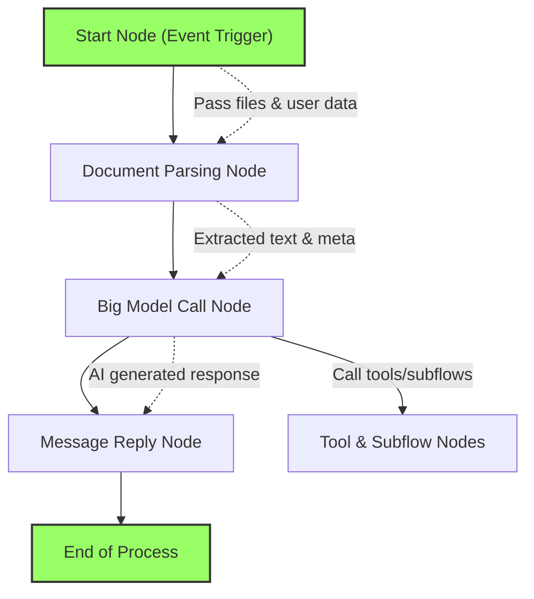

# How Magic Orchestrates AI Work

Magic’s workflow orchestration empowers users to create intelligent agents through visual programming and smart automation. This page narrates the end-to-end journey users embark on—from creating AI agents, orchestrating flows, to managing documents and collaborating in teams—all integrated within Magic's ecosystem.

---

## Introduction: Transforming Ideas Into Automated AI Workflows

In Magic, orchestrating AI work means building workflows that seamlessly connect AI models, tools, data, and human interactions into intelligent assistants and automated processes. Users no longer need deep programming skills; instead, they visually assemble nodes, define variables, and manage knowledge to sculpt AI that understands and acts.

Magic's orchestration combines the agility of no-code flow design with the power of AI-driven decision-making and data integration.

---

## The User Journey: From Agent Creation to Team Collaboration

The core user journey through the orchestration path in Magic unfolds as follows:

### 1. Create Intelligent Agents

- **Define AI Assistants:** Users start by designing AI agents that serve specific purposes, such as customer support bots, knowledge assistants, or operational helpers.
- **Configure AI Models and Tools:** Agents leverage underlying AI models (like GPT variants) and integrate external or internal tools to extend their capabilities.

### 2. Orchestrate Visual Flows

- **Build Workflows with Nodes:** Using Magic’s intuitive visual flow editor, users drag and connect nodes representing actions such as message replies, big model calls, code execution, HTTP requests, or knowledge retrieval.
- **Handle Complex Logic:** Conditional branches, loops, and subflows enable sophisticated logic orchestration, breaking down complex tasks into manageable steps.
- **Manage Variables:** Inputs, outputs, and environment variables connect nodes dynamically, allowing flexible data passage and state management.

### 3. Manage Documents & Knowledge

- **Document Parsing:** Magic can process attached or linked documents, breaking down content into structured, searchable snippets.
- **Knowledge Bases:** Integrated vector-based knowledge stores help agents retrieve relevant information dynamically during conversations or workflows.

### 4. Collaborate in Teams

- **Versioning and Drafts:** Real-time saving with version lists allows continuous collaboration while avoiding data loss.
- **Publishing and Approval:** Teams can publish agents and flows, optionally undergoing approval workflows for enterprise governance.
- **Shared Resources:** Team knowledge bases and toolkits provide a shared ecosystem for reusability and efficiency.

---

## Core Orchestration Components

| Component           | Purpose                                                        |
|---------------------|----------------------------------------------------------------|
| **Nodes**           | Building blocks of workflows; each node performs a discrete action such as AI model invocation, data handling, or response delivery.
| **Variables**       | Connectors for data between nodes; include environment, session, and output variables for flexible workflow logic.
| **Flows**           | Complete sequences of connected nodes representing a business or technical process.
| **Agents**          | Intelligent assistants orchestrated through flows to interact with users or other systems.
| **Tools & Subflows**| Modular and reusable functional sets called within flows or by agents to encapsulate certain capabilities.
| **Knowledge Bases** | Vector stores and document repositories enabling semantic search and retrieval for AI responses.

---

## Step-by-Step User Flow Example: Building a Smart AI Assistant

1. **Create a new agent:** Name and describe the AI assistant.
2. **Add a start trigger node:** Define how the agent activates (e.g., user message received).
3. **Attach a document parsing node:** Automatically extract and structure content from user-uploaded files.
4. **Add a large model call node:** Generate responses using configured AI, with context from parsed documents.
5. **Define response delivery:** Use a message reply node to send answers back to users.
6. **Test and debug:** Run step-by-step tests and adjust nodes or flows.
7. **Save drafts and publish:** Share the assistant within your team or enterprise.

---

## Best Practices for Effective Orchestration

- **Start Small:** Begin by creating simple flows to understand node behavior before adding complexity.
- **Use Variables Wisely:** Name variables clearly and limit scope to avoid confusion.
- **Divide Workflows:** Break large processes into subflows or tools to keep flows manageable.
- **Leverage Knowledge Bases:** Integrate relevant knowledge sources for more accurate and contextual AI answers.
- **Collaborate and Review:** Use version lists and drafts to coordinate with team members and maintain workflow quality.
- **Test Thoroughly:** Employ Magic Flow’s testing tools and debug features to identify issues early.

---

## Troubleshooting Common Orchestration Scenarios

<AccordionGroup title="Troubleshooting Flow Issues">
<Accordion title="Node Execution Doesn’t Trigger">
Verify that the start node trigger is correctly configured (e.g., message received or time trigger), and ensure the flow is enabled.
</Accordion>
<Accordion title="Data Not Passing Between Nodes">
Check variable bindings and data mappings; ensure output keys match inputs on downstream nodes.
</Accordion>
<Accordion title="AI Model Response Is Unexpected or Empty">
Review prompt configurations and memory loading settings; check knowledge base connectivity if integrated.
</Accordion>
<Accordion title="Version Rollback Problems">
Confirm version rollback actions explicitly, noting that memory states are not restored with version changes.
</Accordion>
</AccordionGroup>

---

## Visualizing Magic’s AI Orchestration Flow

This diagram illustrates a simplified orchestration: starting from a trigger, parsing documents, invoking AI, and replying to users—all nodes cooperating to deliver intelligent automated responses.

---

## Getting Started Quick Preview

1. Navigate to Magic’s AI Assistant section to create a new agent.
2. Open the visual flowbuilder and add a start trigger.
3. Insert nodes such as document parsing and AI calling.
4. Connect the nodes logically and configure parameters.
5. Save your work regularly; use drafts and version list features.
6. Test the assistant with sample inputs.
7. Publish and share your assistant within your organization.

For more detailed instructions, see the [Quickstart: From Zero to Magic Productivity](../guides/getting-started/quickstart-workspace) and [Creating Your First AI Agent](../guides/getting-started/first-ai-agent) guides.

---

## Summary

How Magic Orchestrates AI Work bridges the gap between user intentions and powerful AI-driven automation through visual workflow orchestration, enabling creation of intelligent assistants that process knowledge, interact naturally, and execute multi-step tasks in teams. By mastering flows, nodes, variables, and agents, users unlock the full potential of Magic’s ecosystem in boosting productivity and enhancing collaboration.

---

> Ready to dive deeper? Check out related documentation on [Core Concepts](../key-concepts-and-terminology/core-concepts), [Product Matrix & Component Overview](../architecture-glance/product-matrix), and practical [Workflow Tutorials](../../tutorial/quick-start/build-a-bot/Key concepts.md).

---