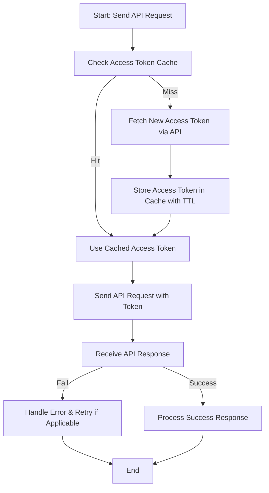

# Best Practices & Performance Tips for Magic SDKs

Optimizing your usage of Magic SDKs is crucial to unlocking scalable, maintainable, and secure integrations. This guide consolidates strategic recommendations and practical patterns to help you build robust applications that perform reliably under real-world production workloads.

---

## 1. Efficient Request Batching

### Why Batch?
Batching multiple operations into a single request minimizes network overhead, reduces latency, and lowers the risk of hitting rate limits.

### How to Implement
- Collect related API calls within a narrow time window.
- Use SDK methods supporting batch parameters or compose batch requests at the service API layer.

### Example
If sending multiple chatbot messages, aggregate recipient user IDs and send a bulk message instead of individual calls.

<Tip>
Ensure the API supports batching; otherwise, excessive batching can complicate error handling and partial failures.
</Tip>

---

## 2. Connection Pooling and HTTP Client Configuration

### Use Persistent Connections
Configure your HTTP client to reuse TCP connections. This reduces connection setup overhead and improves throughput.

### Recommended Settings
- Enable keep-alive.
- Set reasonable timeouts and max connection pool size appropriate for your load.

### SDK Integration
Magic SDK relies on PSR-18 HTTP clients, most commonly Guzzle. Configure Guzzle client options:

```php
$client = new \GuzzleHttp\Client([
    'base_uri' => 'https://api.magicplatform.com',
    'timeout'  => 5.0,
    'keep_alive' => true,
    'pool_size' => 10,
]);
```

<Tip>
Tweak connection pool parameters to balance concurrency and resource consumption.
</Tip>

---

## 3. Robust Rate Limit Handling

### Understand Rate Limits
Magic APIs enforce per-app and per-user rate limits to protect overall platform stability.

### Best Practices
- Implement retry logic with exponential backoff when receiving rate limit errors.
- Cache tokens securely to avoid unnecessary token refresh calls.
- Monitor rate limit headers if exposed and throttle requests proactively.

### Example Retry Logic Pattern
```php
$maxRetries = 3;
for ($attempt=1; $attempt <= $maxRetries; $attempt++) {
    try {
        $response = $sdkClient->sendRequest($request);
        break; // Success
    } catch (BadRequestException $e) {
        if ($e->getCode() === 429 && $attempt < $maxRetries) {
            sleep(pow(2, $attempt)); 
            continue;
        }
        throw $e; // Propagate other errors
    }
}
```

<Warning>
Do not ignore rate limit responses; hitting them repeatedly leads to degraded user experience.
</Warning>

---

## 4. Strategic Data Caching

### Cache Access Tokens and Responses
- Magic SDK caches access tokens by default—leverage this to avoid redundant authentication calls.
- Consider caching frequently used read-only API responses where applicable.

### Cache Invalidation
Ensure your cache TTL (time to live) respects token expiry and data freshness requirements.

### Using Magic SDK Cache
Magic SDK integrates PSR-16 cache interfaces; leverage shared cache implementations like Redis or Memcached for distributed apps.

<Tip>
Sensitive tokens should only be cached securely with encryption and proper access controls.
</Tip>

---

## 5. Advanced Configuration for Production

### Environment-Specific Settings
- Manage app keys, secrets, and endpoints via secure environment variables or configuration management systems.
- Keep development and production configurations isolated to prevent leakage.

### Logging and Monitoring
- Enable SDK logging to trace API call details and timing.
- Integrate logs with centralized monitoring tools for real-time alerting.

### Timeout and Retry Tuning
Adjust HTTP client timeouts and retry counts based on your service-level goals and backend responsiveness.

---

## 6. Common Pitfalls and How to Avoid Them

- **Ignoring configuration errors:** Always validate app keys and endpoint types before initiating requests.
- **Not handling empty or invalid responses:** Use SDK exception handling to catch and respond to failed API calls gracefully.
- **Over-caching tokens without invalidation:** Be aware of token expiry times to avoid unauthorized errors.

---

## 7. Troubleshooting Tips

- Confirm API credentials and endpoint types via SDK configuration.
- Use SDK's built-in exception classes (e.g., `BadRequestException`, `InvalidConfigException`) for clear error causes.
- Enable debug logging to trace failed requests and response details.

<AccordionGroup title="Common Issues and Solutions">
<Accordion title="Access Token Fetch Fails">
Verify that `app_key` and `app_secret` are correctly configured and non-empty. Token caching keys depend on these to invalidate expired tokens.
</Accordion>
<Accordion title="Rate Limit Exceeded">
Implement exponential backoff retries and monitor usage to prevent continuous throttling.
</Accordion>
<Accordion title="Invalid Response Format">
Ensure your HTTP client complies with PSR-18 and that JSON responses are properly parsed.
</Accordion>
</AccordionGroup>

---

## 8. Summary and Next Steps

Armed with these best practices, you can build Magic SDK integrations that are resilient and scalable. For advanced usage, consider batch operations, distributed cache setups, and integration with your CI/CD pipelines.

Explore these related resources to deepen your expertise:

- [SDK Configuration Options](/sdks/configuration-auth/sdk-configuration-options)
- [Error Handling & Debugging](/sdks/troubleshooting-bestpractices/error-handling-debugging)
- [Quickstart Examples](/sdks/usage-patterns/quickstart-examples)

---

## Appendix

### Code Snippet: Securely Selecting an App Configuration
```php
use Dtyq\EasyDingTalk\OpenDev\Endpoint\OpenDevEndpoint;

class YourEndpoint extends OpenDevEndpoint
{
    public function initializeApp(string $appName): void
    {
        $this->selectApp($appName);
    }
}
```

This pattern ensures the SDK loads correct app credentials before sending requests.


### Diagram: Request Flow with Access Token Caching


This diagram highlights how token caching and reuse reduce unnecessary authentication calls, improving efficiency.

---

For further assistance or contribution, visit the [Easy DingTalk GitHub repository](https://github.com/dtyq/magic).

---