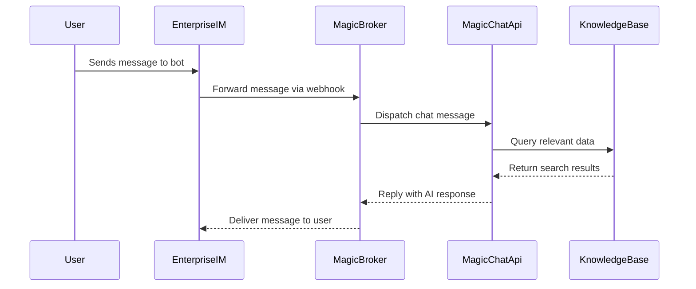

# Common Integration Patterns

Unlock the power of Magic's AI platform by leveraging **battle-tested, domain-specific integration patterns**. This guide walks you through the most recurring and high-impact use cases where Magic's AI chat, workflow orchestration, and enterprise integrations come alive—answering the critical question: *How do I connect Magic AI to my own app, automate my business flows, and link to enterprise IM and knowledge bases?*

---

## 1. Connecting Magic AI Chat to Your Application

Seamlessly embed advanced AI chat capabilities into your existing apps or services. Magic provides robust SDKs and APIs designed to manage conversations, handle messaging, and enrich user experience with AI-powered assistants.

### Key Use Cases
- Embedding one-on-one or group chatbots inside your CRM or internal tools
- Providing AI assistant support via chat interfaces on web or mobile
- Syncing chat conversations with backend databases or analytics systems

### Integration Workflow
1. **Initialize the Client** with your credentials and environment settings.
2. **Authenticate User Sessions** using API keys or OAuth tokens.
3. **Create or Retrieve Conversations** to associate chats with users or groups.
4. **Send and Receive Messages** asynchronously or in streaming mode.
5. **Handle Attachments and Metadata** to support file sharing and rich content.
6. **Manage Topics and Threads** within conversations for organized dialogs.

### Sample Architecture
- Frontend UI integrated with Magic's chat SDK for live messaging.
- Middleware services handling authentication and routing.
- Backend storing conversation logs and user profiles.

<CodeGroup>
```typescript
import { ChatApi } from 'magic-sdk';

const chatClient = new ChatApi({ apiKey: 'YOUR_API_KEY' });

// Log in or authenticate as a user
await chatClient.login('user-auth-token');

// Create a new conversation or get an existing one
const conversation = await chatClient.createConversation('user', 'user-id-123');

// Send a message
await chatClient.chat(
  EventType.Chat,
  {
    message: {
      type: 'text',
      text: {
        content: 'Hello Magic AI!'
      },
      topic_id: 'topic123',
      app_message_id: 'msgid-xyz-001'
    },
    conversation_id: conversation.id
  },
  0
);
```
</CodeGroup>

### Best Practices
- Always manage message IDs to deduplicate and handle retries gracefully.
- Use topic-based messaging to structure conversations for better context.
- Employ attachments sparingly and validate file types and sizes.

---

## 2. Automating Business Workflows with Magic Flow

Magic Flow enables powerful **visual orchestration of AI-driven workflows** across diverse business domains. Integrate AI logic as part of your business processes to automate approvals, data retrieval, multi-agent coordination, and more.

### Core Patterns
- **Trigger Flows on Chat Events:** Use conversational inputs to start workflows that can perform background logic.
- **Invoke AI Assistants in Flows:** Connect to your AI agents to provide contextual replies or take user actions.
- **Integrate with Enterprise Data:** Query knowledge bases, databases, or third-party APIs seamlessly within the flow.
- **Branching & Loops:** Automate complex decision trees and repeated tasks.

### Typical User Journey
1. User sends a chat message or initiates a workflow trigger.
2. Magic Flow processes input, calls AI, and interacts with data stores.
3. The workflow returns a response, updates state, or sends a notification.
4. Follow-up actions or human approvals are managed within the same flow.

### Example Scenario: Automated Approval Flow
- Receive request via chat
- Extract intent and parameters
- Query relevant documents
- Apply business rules
- Notify approvers
- Log decision and return result

### Related SDK Entry Points
- Workflow creation and updates via Magic Flow SDK
- Triggering flows programmatically from chat messages
- Managing flow state, variables, and outputs

---

## 3. Connecting Enterprise IM and Knowledge Bases

Extend Magic’s AI power into your existing **enterprise messaging platforms like DingTalk, Feishu, and WeCom**, as well as internal knowledge repositories.

### Messaging Integration Patterns
- **One-on-one Chatbots:** Use Magic to send and receive messages from individual users via bots.
- **Group Chat Bots:** Join group discussions, manage topics, and participate actively with AI.
- **Attachment Handling:** Download and process files sent through these platforms.

### Knowledge Base Integration
- Connect Magic’s AI assistants with vectorized enterprise knowledge bases for semantic search.
- Enable AI responses enriched by company documents and data.
- Automate knowledge updates through workflows.

### Sample Workflow


---

## 4. Troubleshooting Common Integration Challenges

### Unauthenticated Calls
- Ensure API Keys or OAuth tokens are valid and injected correctly.
- Use provided SDK authentication methods to refresh or rotate tokens.

### Message Ordering and Duplication
- Use **app_message_id** to uniquely identify messages.
- Handle out-of-order sequences gracefully—SDKs provide helpers for this.

### Attachment Issues
- Verify attachment URLs are publicly accessible and within size limits.
- Confirm supported MIME types.

### Workflow Invocation Failures
- Review flow logs and API response error codes.
- Validate input parameters match flow node requirements.

---

## 5. Useful Links

- [Magic SDK Usage Examples](https://docs.magic.com/sdks/usage-patterns/most-common-use-cases)
- [Authentication & Authorization](https://docs.magic.com/api-reference/auth-rate-limits/api-authentication)
- [Messaging API Reference](https://docs.magic.com/api-reference/im-conv-messaging/send-messages)
- [Third-Party Messaging Integration Guide](https://docs.magic.com/guides/advanced-customization-integration/third-party-messaging-integration)
- [Workflow Automation Documentation](https://docs.magic.com/api-reference/workflow-automation/flow-crud)

---

By following these integration patterns, you can unlock Magic’s full potential quickly, enabling AI-driven interactions, complex workflows, and seamless enterprise communication across your business landscape.


---

<Callout title="Need help or want to extend integrations?"><Info>
Explore Magic’s event system and advanced customization guides to tailor AI workflows and interactions exactly to your enterprise needs.
</Info></Callout>
