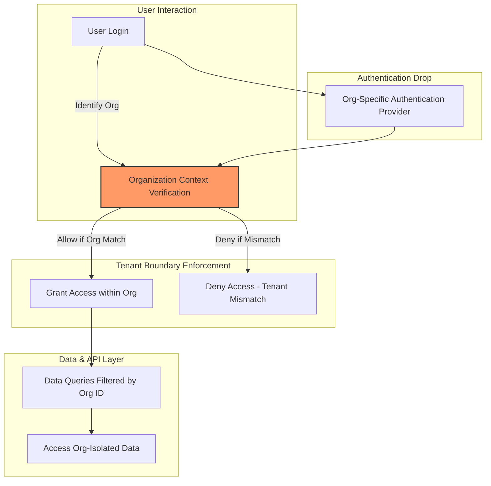

# Multi-Organization and Tenant Isolation

Securing your Magic platform deployment starts with understanding how your data, users, and processes coexist safely across multiple organizations. This guide explains Magic's approach to enforcing robust multi-organization and tenant isolation, helping you onboard new tenants securely, separate organizational assets effectively, and enforce organization-specific authentication policies.

---

## 1. Understanding Tenant Isolation in Magic

Magic is designed as a multi-tenant AI productivity platform that enables organizations to operate independently within the same deployment. Tenant isolation ensures that data, user identities, configurations, and access permissions are strictly separated by organization boundaries to protect confidentiality and maintain data security.

### Why Tenant Isolation Matters

Imagine onboarding multiple companies onto a shared Magic instance. Without rigorous separation, one company could accidentally or maliciously access another's sensitive workflows, documents, or chat conversations. Tenant isolation guarantees that each organization's assets and users remain fully isolated, preventing unauthorized access and data leakage.

### Core Mechanisms for Isolation

- **Data Isolation:** All data storage — including knowledge bases, AI workflows, message histories, files, and metadata — is logically partitioned by organization.
- **User and Access Separation:** Users authenticate and operate within their organization's context only. Cross-organization access is denied by default.
- **Configuration Boundaries:** Policies such as authentication methods, permission roles, and integrations are scoped to each organization.

<Tip>
Tenant isolation is a foundational security control that simplifies compliance and reduces risk in multi-tenant deployments.
</Tip>

---

## 2. Safe Onboarding and Organization Setup

Onboarding organizations securely is critical to enforcing tenant isolation from the start.

### Steps to Safely Onboard a New Organization

1. **Create a Dedicated Organizational Record:** Each organization must have a unique identity within Magic, establishing a secure namespace.
2. **Assign Scoped User Accounts and Permissions:** Users must be linked to their organization with roles that limit access to their tenant boundary only.
3. **Configure Organization-Specific Authentication:** Set authentication mechanisms such as Single Sign-On (SSO), API keys, or OAuth tokens specific to the organization.
4. **Deploy Isolated Resources:** Assign knowledge bases, workflows, and file storage logically scoped to the organization.

<Steps>
<Step title="Create Organization Record">
Use the admin interface or API to define the organization's profile and unique identifiers.
</Step>
<Step title="Configure User Access">
Add or import users scoped only to the new organization.
</Step>
<Step title="Enable Organization Authentication Policies">
Set OAuth, SSO providers, or API keys unique to the org.
</Step>
<Step title="Provision Assets">
Create separate knowledge bases, workflows, and storage buckets designated for this organization.
</Step>
</Steps>

---

## 3. Data and Asset Separation

Maintaining strict boundary lines between organizations means each tenant retains their own isolated copies of all key assets.

### What Gets Isolated?

- **Users and Permissions:** Each organization's users and their role bindings are unique and not shared.
- **Knowledge Bases and Documents:** Stored knowledge documents and version histories are partitioned per tenant.
- **AI Workflows:** Flows and visual nodes belong exclusively to one organization’s workspace.
- **Messaging and Conversations:** Chat data remains within organizational confines.
- **File Storage:** Files and attachments linked to an org are stored and accessed separately.

### How Magic Implements Separation

From the moment data is created, Magic associates it with an organization ID. All queries, API calls, and UI views filter data to the current tenant’s scope. Underlying storage and databases enforce isolation via schema partitioning or logical tagging.

<Warning>
Do not attempt to share or cross-query data across organizations without explicit design verification. This will compromise isolation guarantees.
</Warning>

---

## 4. Managing Organization-Specific Authentication Policies

Each organization can enforce its own authentication schemes and access control policies.

### Supported Authentication Models

- **Single Sign-On (SSO):** Configure OAuth or SAML providers (e.g., DingTalk, WeCom, Lark) per organization.
- **API Keys and Tokens:** Organizations can create and rotate API keys independently.
- **Account/Password:** Standard username and password mechanisms isolated to the organization.

### Best Practices

- **Use Dedicated Identity Providers:** Assign external identity providers per tenant for stronger governance.
- **Enable Multi-Factor Authentication (MFA):** Whenever possible, enforce MFA on organizational accounts.
- **Implement Role-Based Access Control (RBAC):** Manage granular permissions scoped to org roles.

---

## 5. Troubleshooting Common Tenant Isolation Issues

Even with strict controls, users may encounter cross-organization access errors or misconfigurations.

<AccordionGroup title="Troubleshooting Tenant Isolation">
<Accordion title="User Access Denied or Unexpected Permissions">
Confirm that the user belongs to the correct organization and that role assignments within the org are accurate. Check if the user session or token was properly scoped at login.
</Accordion>
<Accordion title="Data Appears to Leak Across Organizations">
Inspect database partitioning or filters to ensure queries always include the organization ID. Audit API calls to verify tenant context is respected.
</Accordion>
<Accordion title="Organization Authentication Not Working as Expected">
Verify organization-specific OAuth or SSO configuration, including callback URLs and provider credentials. Check token issuance and mapping to tenant IDs.
</Accordion>
</AccordionGroup>

<Tip>
Regularly audit organization boundaries by simulating cross-tenant user actions and reviewing logs.
</Tip>

---

## 6. Summary

Magic's multi-organization and tenant isolation framework forms a strong security perimeter by logically and operationally dividing users, data, and configuration.

By following prescribed onboarding workflows, enforcing organization-specific authentication policies, and maintaining strict data separation, you protect your deployment from inadvertent or malicious tenant cross-access.

For secure enterprise AI deployments, tenant isolation is non-negotiable and foundational to your overall security posture.

---

## Additional Resources

- [Authentication Methods](/security/authentication-and-access/authentication-methods): Detailed guide on supported authentication schemes
- [Access Control and Authorization Models](/security/authentication-and-access/access-control-and-authorization): RBAC and permission management best practices
- [Secure Deployment & Isolation Best Practices](/guides/best-practices-optimization/secure-deployment): Practical advice for securing multi-organization deployments
- [Third-Party Messaging Integration](/guides/advanced-customization-integration/third-party-messaging-integration): Configuration of messaging platforms per organization
- [Security Architecture Overview](/concepts/security-permission-design/security-architecture): High-level multi-layer defense and tenant isolation design

---

## Visual Overview: Tenant Isolation Flow

This flow illustrates how the login process enforces organization context, how data access is scoped, and how separate authentication providers function per organization.

<Source url="https://github.com/dtyq/magic" branch="main" paths={[{"path":"security/authentication-and-access/multi-organization-and-tenant-isolation.mdx","range":"1-150"}]} />

---
