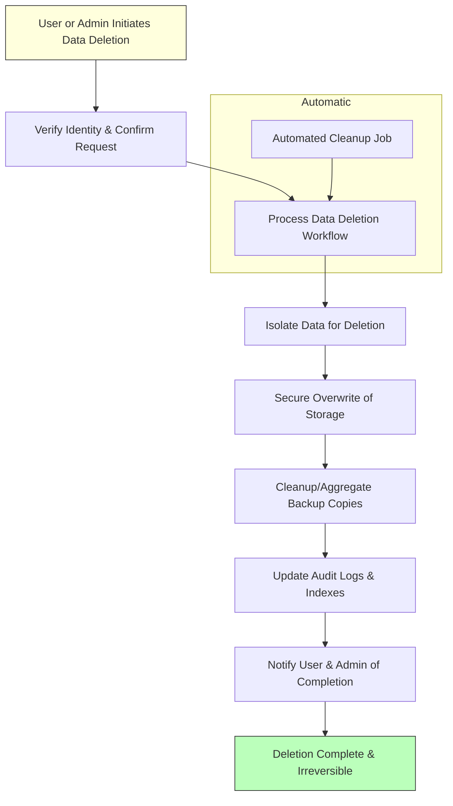

# Privacy Controls and Data Deletion

## Introduction

In today’s environment, safeguarding user privacy and securely managing personal data are paramount responsibilities. This guide focuses explicitly on **user privacy controls** within the Magic platform, detailing how users can manage their account data, control message retention, and execute secure data deletion processes that ensure irreversible erasure. It also covers compliance measures that govern both user-initiated and automated data cleanup.

Understanding these controls empowers you to maintain trust, meet regulatory obligations such as GDPR, and protect sensitive user information throughout its lifecycle.

---

## 1. User Privacy Controls Overview

Magic provides intuitive privacy settings that put control in the hands of each user and administrator. The following key features ensure comprehensive management and protection of personal data:

- **Account Deletion:** Allows users or administrators to initiate permanent removal of their account and all associated data.
- **Message Retention Settings:** Configure how long messages and conversation history are stored before automatic cleanup.
- **Secure Data Erasure:** Processes are in place to guarantee that once data is deleted, it cannot be recovered.

### 1.1 Why Privacy Controls Matter

User privacy controls serve multiple purposes:

- Empower users to control their digital footprint.
- Ensure compliance with data protection regulations.
- Reduce risk in case of data breaches by minimizing retained sensitive data.
- Provide transparency and build organizational trust.

<Tip>
Regularly reviewing and configuring privacy settings helps your organization stay ahead in data governance and security.
</Tip>

---

## 2. Managing Account Deletion

Account deletion is the most critical privacy action. It must be secure, complete, and irreversible.

### 2.1 How to Delete a User Account

To delete an account, users or administrators can follow these steps:

<Steps>
<Step title="Initiate Deletion Request">
Submit an account deletion request via the user settings interface or administrator portal.
</Step>
<Step title="Confirm Identity">
Confirm your identity via multi-factor authentication or verification mechanisms to prevent accidental or unauthorized deletions.
</Step>
<Step title="Process Deletion">
Upon confirmation, Magic executes the deletion workflow:
- User profile and credentials removal.
- Erasure of messages, conversation history, and personal files.
- Revocation of authentication tokens.
</Step>
<Step title="Completion Notification">
You will receive confirmation once deletion is complete and irreversible.
</Step>
</Steps>

### 2.2 Important Considerations

- Account deletion affects all associated data permanently — it cannot be undone.
- Retained backups or logs beyond deletion follow strict retention and anonymization policies outlined in compliance documentation.

<Warning>
Do not initiate account deletion unless you are certain all necessary data access is complete.
</Warning>

---

## 3. Message Retention and Data Lifecycle

Managing how long user-generated content is stored directly influences privacy and compliance.

### 3.1 Configuring Message Retention

Administrators can set retention policies with parameters such as:

- **Retention Period:** Define days, weeks, or months messages remain available.
- **Scope:** Specify which message types (individual, group chats, attachments) the policy applies to.
- **Archiving vs. Deletion:** Choose whether messages are archived securely or permanent deleted after retention window.

### 3.2 How Retention Settings Affect Users

- Users receive notifications about retention policies upon account creation.
- Messages past retention are automatically deleted or archived according to policy.
- Deleted data is processed with secure erase methods.

<Tip>
Set retention periods aligned with your organization’s regulatory requirements and internal data governance policies.
</Tip>

---

## 4. Secure and Irreversible Data Deletion Processes

Magic is designed to ensure that deleted data cannot be recovered, protecting user privacy and adhering to data protection laws.

### 4.1 Deletion Workflow

1. **Mark Data for Deletion:** Once flagged, data is isolated from active systems.
2. **Overwrite Storage Locations:** Data areas are overwritten using secure erase standards.
3. **Remove from Backups:** Retention policy governs when backup copies are purged or anonymized.
4. **Update Indexes and Logs:** System indexes and logs delete or mask information related to deleted data.

### 4.2 Automatic Data Cleanup

System background jobs routinely scan for data meeting deletion criteria based on configured policies and trigger secure erase flows.

<Info>
Automated cleanup complements user-driven deletion to maintain minimal residual data footprint.
</Info>

### 4.3 Verifying Deletion

Users and administrators can request deletion audit logs to verify data purge operations.

---

## 5. Compliance and Privacy Assurance

### 5.1 Regulatory Alignment

Magic’s privacy and data deletion mechanisms are designed to facilitate compliance with:

- General Data Protection Regulation (GDPR)
- Other relevant local data privacy laws

### 5.2 User Rights and Access

Magic supports requests for:

- Data access and export.
- Rectification and blocking.
- Erasure and objection.

### 5.3 Transparency and Reporting

Regular audits and reporting capabilities are built to monitor privacy adherence and support compliance documentation.

<Note>
Consult your legal and compliance teams to align Magic’s privacy settings with specific organizational policies.
</Note>

---

## 6. Troubleshooting Common Privacy Control Issues

<AccordionGroup title="Troubleshooting Privacy Controls">
<Accordion title="Account Deletion Fails to Initiate">
- Ensure user authentication is correctly completed.
- Check for active sessions or administrative restrictions.
- Review system logs for deletion process errors.
</Accordion>
<Accordion title="Messages Not Deleting as per Retention Policy">
- Verify retention settings are correctly configured and applied.
- Confirm background cleanup jobs are running.
- Investigate storage or permission anomalies preventing deletion.
</Accordion>
<Accordion title="Requesting Deletion Verification Logs">
- Use the administrative interface to generate audit reports.
- Check permissions to ensure access to audit logs is granted.
- Contact support if logs are incomplete.
</Accordion>
</AccordionGroup>

---

## 7. Best Practices & Recommendations

- **Regularly Review Privacy Settings:** Align policies with evolving regulations and business needs.
- **Educate Users:** Inform users about privacy controls and responsibilities.
- **Monitor Deletion Workflows:** Set up alerts and reports to flag failures.
- **Implement Least Privilege Access:** Restrict data access to only necessary roles.
- **Maintain Documentation:** Keep both user and admin guides up to date regarding privacy features.

---

## Related Documentation

- [Data Encryption and Storage](security/data-protection-and-privacy/data-encryption-and-storage)
- [Authentication Methods](security/authentication-and-access/authentication-methods)
- [Access Control and Authorization Models](security/authentication-and-access/access-control-and-authorization)
- [Compliance Requirements and Data Governance](security/compliance-vulnerability-reporting/compliance-overview)
- [Network Exposure & Access Control](deployment/security-hardening-and-compliance/network-exposure-and-access-control)

---

## Summary Diagram: User Data Deletion Flow

